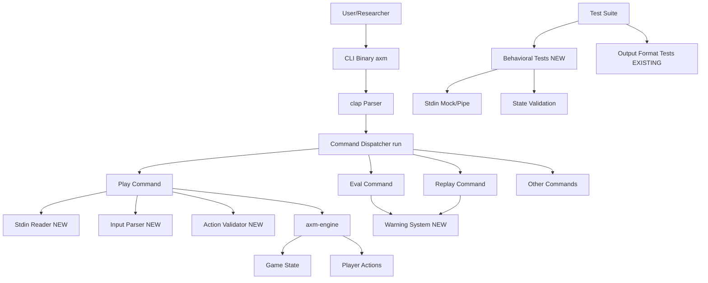
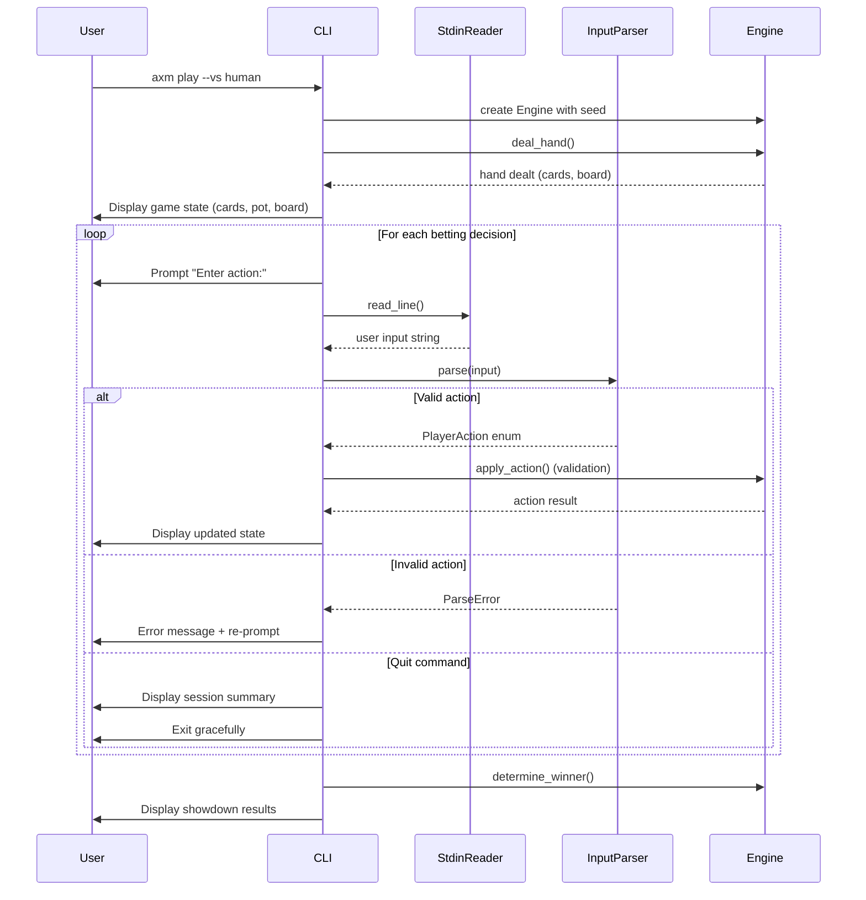
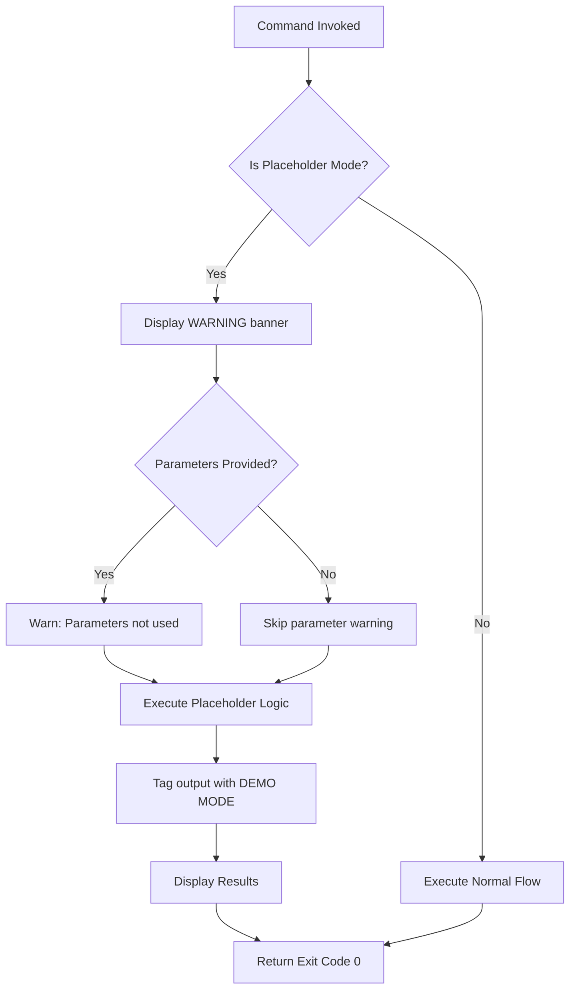
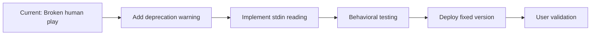

# Design Document: CLI Audit Fixes

## Overview

This feature addresses critical gaps in CLI command implementations identified during the comprehensive audit documented in `docs/CLI_IMPLEMENTATION_STATUS.md`. The audit revealed one broken command (play --vs human), multiple partial/placeholder implementations (play --vs ai, eval, replay), and non-existent commands advertised in help text (serve, train). The design implements a phased approach to fix critical issues, improve user experience through proper warnings, and establish testing standards to prevent future regressions.

**Purpose**: This feature delivers functional CLI commands with accurate documentation to poker researchers and developers.

**Users**: Poker researchers conducting manual testing, developers building on CLI infrastructure, and end users executing commands will benefit from corrected implementations and clear status indicators.

**Impact**: Changes the current misleading command behavior by implementing proper stdin handling for interactive play, adding placeholder warnings to prevent result misinterpretation, removing false command advertisements, and establishing behavioral testing standards.

### Goals

- Fix broken human play mode to enable interactive testing workflows
- Clearly mark placeholder implementations to prevent user confusion
- Remove non-existent commands from help text and documentation
- Establish behavioral testing patterns to prevent future implementation drift
- Improve documentation accuracy across all CLI commands

### Non-Goals

- Full AI opponent implementation (Phase 3 - optional, requires AI infrastructure availability)
- Complete visual replay functionality (deferred to future enhancement)
- Game engine API refactoring for progressive betting rounds (future architectural improvement)
- Advanced CLI UX features (readline support, command history, tab completion)

## Architecture

### Existing Architecture Analysis

The CLI architecture follows a command-dispatch pattern built on clap's derive macros:

**Current Structure**:
- `Commands` enum defines all command variants with parameters
- `run()` function contains a large match statement dispatching to command handlers
- Commands are advertised via `COMMANDS` constant array (separate from enum)
- Testing uses environment variable bypass (`AXM_TEST_INPUT`) that masks actual behavior

**Existing Domain Boundaries**:
- **Engine crate** (`axm-engine`): Pure game logic, deterministic, no I/O
- **CLI crate** (`axm_cli`): User interface, file I/O, command parsing
- **Web crate** (`axm_web`): HTTP server, separate binary

**Integration Points**:
- CLI creates `Engine` instances and calls `deal_hand()` for card dealing
- CLI reads/writes JSONL hand histories for data persistence
- Web server is separate binary (`axm-web-server`), not integrated into CLI

**Technical Debt Addressed**:
- **COMMANDS Array Drift**: Array includes non-existent commands, causing help text to lie
- **Stub Implementations**: Commands exist but don't perform advertised operations
- **Test Quality Gap**: Tests validate output format but not actual behavior (blocking, state changes, parameter usage)

### Architecture Pattern & Boundary Map

**Selected pattern**: Command Pattern (Existing) with enhanced validation and testing layers



**Architecture Integration**:
- **Selected pattern**: Command Pattern - Preserves existing clap-based dispatch architecture, adds validation and warning layers
- **Domain boundaries**:
  - **CLI Layer** (modified): Input handling, validation, user interaction, warnings
  - **Engine Layer** (unchanged): Game logic, card dealing, hand evaluation
  - **Test Layer** (new): Behavioral validation, integration testing with piped I/O
- **Existing patterns preserved**:
  - Commands enum with clap derive macros
  - Synchronous I/O (no async/tokio changes)
  - Engine as pure library with no I/O
  - JSONL file-based data persistence
- **New components rationale**:
  - **Stdin Reader**: Fixes broken human play mode by implementing actual input reading
  - **Input Parser**: Validates and converts user text to PlayerAction enum
  - **Warning System**: Provides consistent placeholder notifications across commands
  - **Behavioral Tests**: Validates actual behavior (blocking, parsing, state) not just output format
- **Steering compliance**:
  - Maintains Rust-first architecture with strict type safety
  - No new external dependencies for Phase 1-2
  - Follows existing test adjacency pattern (integration tests in `tests/`)
  - Preserves offline-first operation (no external API calls)

### Technology Stack

| Layer | Choice / Version | Role in Feature | Notes |
|-------|------------------|-----------------|-------|
| CLI Parsing | clap 4.x (derive) | Command definition and argument parsing | No changes, use existing |
| Input Reading | std::io::BufRead | Stdin reading for interactive play | Standard library, blocking I/O |
| Testing | std::process::Command + Stdio::piped() | Integration tests for stdin behavior | Standard library, no new deps |
| Game Logic | axm-engine (local crate) | Card dealing, hand evaluation | No API changes for Phase 1-2 |
| Data Validation | serde_json | Parse JSONL for replay command | Existing dependency |

**Rationale**: All required functionality exists in standard library or current dependencies. No new crates needed for Phase 1-2 implementation, maintaining project's "boring technology" principle.

## System Flows

### Human Play Mode Flow (Requirement 1)



**Key Decisions**:
- Blocking stdin read is correct behavior for turn-based poker
- Input validation happens before engine interaction to fail fast
- Quit command ('q') allows graceful exit mid-hand
- Error handling re-prompts without terminating the session

### Placeholder Warning Flow (Requirements 2, 3, 4)



**Flow Decisions**:
- Warnings display on stderr to separate from actual command output
- Exit code remains 0 (success) to avoid breaking existing scripts
- Output tagging (e.g., "[DEMO MODE]") provides permanent record in logs

## Requirements Traceability

| Requirement | Summary | Components | Interfaces | Flows |
|-------------|---------|------------|------------|-------|
| 1 | Fix Broken Human Play Mode | StdinReader, InputParser, PlayCommandHandler | stdin input, PlayerAction validation | Human Play Mode Flow |
| 2 | Mark AI Play Mode | PlayCommandHandler, WarningSystem | warning output | Placeholder Warning Flow |
| 3 | Fix Replay Functionality | ReplayCommandHandler, WarningSystem | JSONL parsing, file I/O | (simple, no flow needed) |
| 4 | Fix Eval Command | EvalCommandHandler, WarningSystem | warning output | Placeholder Warning Flow |
| 5 | Remove Serve Command | COMMANDS array modification, HelpText | help text generation | (config change, no flow) |
| 6 | Remove Train Command | COMMANDS array modification, HelpText | help text generation | (config change, no flow) |
| 7 | Update Documentation | Documentation files | markdown files | (docs update, no flow) |
| 8 | Add Behavioral Tests | BehavioralTestSuite | piped stdin, state validation | (test execution, no runtime flow) |
| 9 | Prevent Future Issues | CommandChecklist, CIValidation | enum/array sync check | (dev process, no runtime flow) |
| 10 | CLI UX Consistency | WarningSystem, ErrorFormatting | stderr output, exit codes | Placeholder Warning Flow |

## Components and Interfaces

### Summary Table

| Component | Domain/Layer | Intent | Req Coverage | Key Dependencies (P0/P1) | Contracts |
|-----------|--------------|--------|--------------|--------------------------|-----------|
| StdinReader | CLI Input | Read and buffer user input from stdin | 1 | std::io::BufRead (P0) | Service |
| InputParser | CLI Input | Parse user text into validated PlayerAction | 1 | axm-engine::PlayerAction (P0) | Service |
| PlayCommandHandler | CLI Commands | Orchestrate interactive gameplay loop | 1, 2 | StdinReader (P0), Engine (P0), WarningSystem (P1) | Service |
| WarningSystem | CLI Output | Display consistent placeholder warnings | 2, 3, 4, 10 | std::io::Write (P0) | Service |
| ReplayCommandHandler | CLI Commands | Count/validate JSONL hand records | 3 | serde_json (P0), WarningSystem (P1) | Service |
| EvalCommandHandler | CLI Commands | Placeholder AI comparison | 4 | WarningSystem (P0) | Service |
| CommandRegistry | CLI Metadata | Synchronize COMMANDS array with enum | 5, 6, 9 | Commands enum (P0) | State |
| BehavioralTestSuite | Test Infrastructure | Validate actual command behavior | 8 | std::process::Command (P0), Stdio (P0) | Service |

### CLI Input Layer

#### StdinReader

| Field | Detail |
|-------|--------|
| Intent | Provide reliable blocking read operations from stdin for interactive commands |
| Requirements | 1 |

**Responsibilities & Constraints**:
- Read line-buffered input from stdin (blocking until user presses Enter)
- Handle EOF gracefully (return None when stdin closes)
- Trim whitespace from input lines
- No state management - stateless read operation

**Dependencies**:
- Inbound: PlayCommandHandler calls read_input (P0)
- External: std::io::stdin, BufRead trait (P0)

**Contracts**: Service [X]

##### Service Interface

```rust
/// Reads a line of input from stdin, blocking until available.
/// Returns None on EOF or read error.
fn read_stdin_line(stdin: &mut impl BufRead) -> Option<String>;
```

**Preconditions**:
- stdin handle is valid and readable
- Caller is prepared to block until input arrives

**Postconditions**:
- Returns trimmed string if input available
- Returns None on EOF or error
- No side effects on global state

**Invariants**:
- Stateless operation - can be called repeatedly
- Blocking behavior is guaranteed (by std::io contract)

**Implementation Notes**:
- **Integration**: Function signature accepts `impl BufRead` to enable testing with mock readers
- **Validation**: Checks for empty strings after trimming, treats as invalid input
- **Risks**: Blocking call will hang if stdin is closed unexpectedly; caller must handle EOF case

#### InputParser

| Field | Detail |
|-------|--------|
| Intent | Convert user text input into validated PlayerAction enum variants |
| Requirements | 1 |

**Responsibilities & Constraints**:
- Parse strings like "fold", "call", "bet 100", "raise 50"
- Return strongly typed PlayerAction enum
- Validate syntax but not game rules (that's engine's job)
- Recognize quit commands ("q", "quit")

**Dependencies**:
- Inbound: PlayCommandHandler calls parse_action (P0)
- External: axm-engine::PlayerAction (P0)

**Contracts**: Service [X]

##### Service Interface

```rust
/// Result type for parsing operations
enum ParseResult {
    Action(PlayerAction),
    Quit,
    Invalid(String),  // error message
}

/// Parse user input string into a PlayerAction
/// Returns ParseResult indicating success, quit, or error
fn parse_player_action(input: &str) -> ParseResult;
```

**Preconditions**:
- Input is a trimmed, non-empty string

**Postconditions**:
- Returns Action variant with valid PlayerAction for recognized commands
- Returns Quit for quit commands
- Returns Invalid with descriptive error message for unrecognized input

**Invariants**:
- Pure function - no side effects
- Case-insensitive matching (accept "FOLD", "fold", "Fold")
- Bet/raise amounts must be positive integers

**Implementation Notes**:
- **Integration**: Use simple string matching with `match` or `if` chains for clarity
- **Validation**: Regex or split-based parsing for "bet 100" / "raise 50" patterns
- **Risks**: User may enter unexpected formats; comprehensive error messages guide users to correct syntax

### CLI Commands Layer

#### PlayCommandHandler (Modified)

| Field | Detail |
|-------|--------|
| Intent | Execute interactive poker gameplay with human or AI opponent |
| Requirements | 1, 2 |

**Responsibilities & Constraints**:
- Main game loop orchestration for play command
- Call StdinReader for user input in human mode
- Display game state (cards, pot, board) before each action
- Show placeholder warnings in AI mode
- Maintain session statistics (hands played, results)

**Dependencies**:
- Inbound: run() function dispatches to this handler (P0)
- Outbound: StdinReader::read_stdin_line (P0 for human mode), InputParser::parse_player_action (P0 for human mode), Engine::deal_hand (P0), WarningSystem::display_warning (P1 for AI mode)
- External: axm-engine::Engine (P0)

**Contracts**: Service [X]

##### Service Interface

```rust
/// Execute the play command with specified parameters
/// Returns exit code (0 = success, non-zero = error)
fn execute_play_command(
    vs: Vs,
    hands: u32,
    seed: Option<u64>,
    level: u8,
    stdin: &mut impl BufRead,
    out: &mut impl Write,
    err: &mut impl Write,
) -> i32;
```

**Preconditions**:
- Valid Vs enum variant (Human or Ai)
- hands > 0
- level in valid range (1-4)
- stdin/out/err handles are writable

**Postconditions**:
- Executes specified number of hands or until user quits
- Displays game state and prompts for each decision
- Returns 0 on success, 2 on error
- Session statistics written to out

**Invariants**:
- Engine state remains consistent across hands
- Stack sizes obey conservation laws
- User can quit at any point with 'q' command

**Implementation Notes**:
- **Integration**: Refactor existing play command handler to accept BufRead/Write traits for testability
- **Validation**: Input validation via InputParser, action validation via engine rules
- **Risks**: Engine API doesn't support progressive betting rounds; simplified implementation plays complete hands without intermediate betting

#### WarningSystem

| Field | Detail |
|-------|--------|
| Intent | Display consistent, prominent warnings for placeholder implementations |
| Requirements | 2, 3, 4, 10 |

**Responsibilities & Constraints**:
- Format and display warning messages to stderr
- Provide consistent "WARNING:" prefix for grep-ability
- Support parameter usage warnings (when params are ignored)
- Tag command output with demo/placeholder indicators

**Dependencies**:
- Inbound: Called by PlayCommandHandler (P1), ReplayCommandHandler (P1), EvalCommandHandler (P0)
- External: std::io::stderr, Write trait (P0)

**Contracts**: Service [X]

##### Service Interface

```rust
/// Display a warning message to stderr
fn display_warning(err: &mut impl Write, message: &str);

/// Display parameter ignored warning
fn warn_parameter_unused(err: &mut impl Write, param_name: &str);

/// Add demo mode tag to output line
fn tag_demo_output(line: &str) -> String;
```

**Preconditions**:
- err handle is writable
- message is non-empty

**Postconditions**:
- Warning written to stderr with "WARNING:" prefix
- No effect on stdout or exit codes
- Returns formatted string for demo tagging

**Invariants**:
- Warnings always go to stderr (never stdout)
- Consistent formatting across all placeholder commands

**Implementation Notes**:
- **Integration**: Simple helper functions, no state required
- **Validation**: None needed, formatting only
- **Risks**: Users may pipe stderr to /dev/null and miss warnings; acceptable trade-off for script compatibility

#### ReplayCommandHandler (Modified)

| Field | Detail |
|-------|--------|
| Intent | Count and validate JSONL hand records, display accurate status |
| Requirements | 3 |

**Responsibilities & Constraints**:
- Read JSONL file and count valid hand records
- Display accurate message: "Counted: N hands" (not "Replayed")
- Show warning that visual replay is not implemented
- Remove unused --speed parameter

**Dependencies**:
- Inbound: run() dispatches to this handler (P0)
- Outbound: WarningSystem::display_warning (P1)
- External: serde_json for validation (P0), file I/O (P0)

**Contracts**: Service [X]

##### Service Interface

```rust
/// Execute replay command (currently counting only)
/// Returns exit code (0 = success, 2 = error)
fn execute_replay_command(
    input: &str,
    out: &mut impl Write,
    err: &mut impl Write,
) -> i32;
```

**Preconditions**:
- input is a valid file path
- File contains JSONL data (one JSON object per line)

**Postconditions**:
- Counts valid hand records (ignoring empty lines)
- Displays warning about missing replay functionality
- Outputs "Counted: N hands" to stdout
- Returns 0 on success, 2 on file errors

**Invariants**:
- Count includes only valid JSON lines
- Empty lines and parse errors are skipped

**Implementation Notes**:
- **Integration**: Modify existing replay command to add warning and change output message
- **Validation**: Use serde_json::from_str to validate each line
- **Risks**: Large files may be slow to parse; acceptable for current use case

#### EvalCommandHandler (Modified)

| Field | Detail |
|-------|--------|
| Intent | Placeholder AI comparison with prominent warnings |
| Requirements | 4 |

**Responsibilities & Constraints**:
- Accept --ai-a and --ai-b parameters (for API compatibility)
- Display prominent warning that results are random
- Generate random results (current behavior preserved)
- Tag output to indicate placeholder status

**Dependencies**:
- Inbound: run() dispatches to this handler (P0)
- Outbound: WarningSystem::display_warning (P0)
- External: rand crate for random results (P0)

**Contracts**: Service [X]

##### Service Interface

```rust
/// Execute eval command (placeholder implementation)
/// Returns exit code (0 = success, 2 = error)
fn execute_eval_command(
    ai_a: String,
    ai_b: String,
    hands: u32,
    seed: Option<u64>,
    out: &mut impl Write,
    err: &mut impl Write,
) -> i32;
```

**Preconditions**:
- ai_a and ai_b are non-empty strings
- hands > 0

**Postconditions**:
- Displays warning about random results
- Warns that AI parameters are not used
- Generates random win counts
- Tags final output with "[RANDOM RESULTS - NOT REAL AI COMPARISON]"
- Returns 0 (success)

**Invariants**:
- Warning always displays first before any output
- Exit code 0 maintained for backward compatibility

**Implementation Notes**:
- **Integration**: Add warning calls at command start
- **Validation**: None needed, placeholder behavior
- **Risks**: Users may miss warnings; acceptable given clear tagging in output

### CLI Metadata Layer

#### CommandRegistry

| Field | Detail |
|-------|--------|
| Intent | Ensure COMMANDS array stays synchronized with Commands enum |
| Requirements | 5, 6, 9 |

**Responsibilities & Constraints**:
- Maintain COMMANDS array listing all implemented commands
- Exclude non-existent commands (serve, train)
- Provide source of truth for help text generation

**Dependencies**:
- Inbound: Help text generator uses COMMANDS (P0)
- External: Commands enum definition (P0)

**Contracts**: State [X]

##### State Management

**State model**:
```rust
const COMMANDS: &[&str] = &[
    "play", "replay", "sim", "eval", "stats", "verify",
    "deal", "bench", "rng", "cfg", "doctor",
    "export", "dataset",
    // Removed: "serve" (not integrated)
    // Removed: "train" (not implemented)
];
```

**Persistence**: Static constant in lib.rs

**Consistency**: CI check validates array matches enum variants

**Implementation Notes**:
- **Integration**: Simple constant array modification
- **Validation**: Add CI test to verify Commands enum variants are subset of COMMANDS array
- **Risks**: Manual synchronization still required; mitigated by CI check

### Test Infrastructure Layer

#### BehavioralTestSuite

| Field | Detail |
|-------|--------|
| Intent | Validate actual command behavior, not just output format |
| Requirements | 8 |

**Responsibilities & Constraints**:
- Test stdin blocking behavior (command waits for input)
- Test input parsing and state changes
- Test parameter usage (verify params affect behavior)
- Provide examples for future command tests

**Dependencies**:
- Inbound: CI test runner executes suite (P0)
- External: std::process::Command (P0), Stdio::piped (P0), test framework (P0)

**Contracts**: Service [X]

##### Service Interface

```rust
#[test]
fn play_human_blocks_waiting_for_stdin() {
    // Spawns command with piped stdin
    // Verifies process is still running after delay
    // Sends input and verifies completion
}

#[test]
fn play_human_parses_valid_actions() {
    // Sends various valid actions
    // Verifies correct PlayerAction parsing
}

#[test]
fn play_human_handles_invalid_input() {
    // Sends invalid action
    // Verifies error message and re-prompt
}

#[test]
fn eval_displays_placeholder_warning() {
    // Runs eval command
    // Verifies WARNING appears in stderr
}

#[test]
fn replay_parameter_unused_warning() {
    // Runs replay with --speed
    // Verifies warning about unused parameter (if implemented)
}
```

**Preconditions**:
- axm binary is built and available in target directory
- Test has permission to spawn child processes

**Postconditions**:
- Tests pass if behavior matches expectations
- Tests fail with clear diagnostic messages
- No side effects on system (tests use temp files)

**Invariants**:
- Tests are hermetic (no shared state)
- Tests can run in parallel
- Tests clean up temporary resources

**Implementation Notes**:
- **Integration**: Add to `rust/cli/tests/integration/` directory
- **Validation**: Use assert macros with clear failure messages
- **Risks**: Tests may be flaky on slow systems; add reasonable timeouts (5-10 seconds)

## Data Models

### Domain Model

**Input Command Domain**:
- **PlayerAction** (existing in engine): Value object representing poker actions (Fold, Check, Call, Bet, Raise, AllIn)
- **ParseResult** (new): Discriminated union for parse outcomes (Action, Quit, Invalid)
- **WarningType** (new): Enum for warning categories (Placeholder, UnusedParameter, MissingFeature)

**Business Rules**:
- User input "q" or "quit" always results in graceful exit
- Invalid actions trigger re-prompt, not termination
- Placeholder commands must display warnings before any output

**Invariants**:
- ParseResult::Action contains valid PlayerAction enum
- Quit command takes precedence over invalid input parsing
- Warning messages always include "WARNING:" prefix

### Data Contracts & Integration

**Command Line Arguments** (existing, no changes):
```rust
#[derive(Subcommand)]
enum Commands {
    Play { vs: Vs, hands: Option<u32>, seed: Option<u64>, level: Option<u8> },
    Replay { input: String },  // Remove speed parameter
    Eval { ai_a: String, ai_b: String, hands: u32, seed: Option<u64> },
}
```

**stdin Input Format** (new contract):
```
# Valid inputs (case-insensitive):
fold
check
call
bet <amount>      # example: "bet 100"
raise <amount>    # example: "raise 50"
q                 # quit
quit              # quit
```

**Warning Output Format** (new contract):
```
WARNING: <message text>
```
- Always written to stderr
- Consistent format for grep filtering
- Must appear before any command output

## Error Handling

### Error Strategy

**User Errors**:
- Invalid action syntax → Display error message, re-prompt (don't exit)
- File not found → Display error, exit with code 2
- EOF on stdin → Treat as quit, exit gracefully with code 0

**System Errors**:
- IO errors (read/write failures) → Display error to stderr, exit with code 2
- Engine errors (deck empty, invalid state) → Display error, exit with code 2

**Business Logic Errors**:
- Action violates game rules → Not handled in CLI (engine validates)
- Invalid bet amount → Parsed as Invalid, triggers re-prompt

### Error Categories and Responses

**User Errors (Input)**:
- Invalid action → "Invalid action. Valid: fold, check, call, bet <amount>, raise <amount>, q"
- Unknown command → "Unrecognized input. Type 'q' to quit."
- Empty input → Ignore, re-prompt

**System Errors (IO)**:
- stdin read failure → "Failed to read input", exit code 2
- File open error → "Failed to read {path}: {error}", exit code 2

**Business Logic Errors**:
- Placeholder execution → Display warning, continue execution, exit code 0
- Parameter ignored → Display warning on stderr, continue execution

### Monitoring

**Error Tracking**:
- All errors written to stderr for script capture
- Exit codes: 0 (success), 2 (error), 130 (interrupted)
- Placeholder warnings logged to stderr for audit trail

**Logging**:
- Session statistics printed to stdout (hands played, results)
- Warnings printed to stderr (separates from actual data)
- No additional logging infrastructure required for this feature

## Testing Strategy

### Unit Tests

- **InputParser**:
  - Parse valid actions (fold, check, call, bet 100, raise 50)
  - Parse quit commands (q, quit, case variations)
  - Return Invalid for unrecognized input
  - Handle edge cases (negative amounts, missing amounts, extra whitespace)
- **WarningSystem**:
  - Format warning messages with correct prefix
  - Tag output with demo indicators
  - Write to stderr (not stdout)

### Integration Tests

- **play --vs human**:
  - Verify command blocks waiting for stdin (process still running after 100ms)
  - Send valid input, verify action processed and game progresses
  - Send invalid input, verify error message and re-prompt
  - Send quit command, verify graceful exit with statistics
  - Test EOF handling (stdin closes unexpectedly)
- **play --vs ai**:
  - Verify placeholder warning displays on stderr
  - Verify "ai: check" message appears (current behavior)
  - Verify demo mode tag in output
- **eval**:
  - Verify placeholder warning displays prominently
  - Verify parameter unused warnings appear
  - Verify output tagged with random results warning
- **replay**:
  - Verify output says "Counted: N hands" (not "Replayed")
  - Verify warning about missing visual replay
  - Verify unused parameter removed from signature (or warned if kept)
- **help text**:
  - Verify "serve" does not appear in command list
  - Verify "train" does not appear in command list
  - Verify all listed commands exist in Commands enum

### E2E Tests

- **End-to-End Workflow**:
  - Researcher runs `axm play --vs human --hands 1`
  - Enters valid poker actions throughout a complete hand
  - Receives correct game state display after each action
  - Sees final showdown results
  - Verifies session completes successfully
- **Error Recovery**:
  - User enters invalid action multiple times
  - System continues to prompt without crashing
  - User successfully enters valid action after errors
- **Quit Workflow**:
  - User starts play session
  - User enters 'q' mid-hand
  - System displays statistics and exits gracefully

### Test Quality Standards

**Behavioral Test Checklist** (for new commands):
- [ ] Test verifies actual behavior, not just output presence
- [ ] Test uses real stdin/stdout (piped or mocked appropriately)
- [ ] Test validates state changes occur (not just messages printed)
- [ ] Test covers error paths and edge cases
- [ ] Test is hermetic (no shared state, can run in parallel)

## Optional Sections

### Migration Strategy

**Phase 1: Quick Wins** (Low Risk)
- Remove "serve" and "train" from COMMANDS array
- Add placeholder warnings to eval, replay, play --vs ai
- Update documentation with implementation status
- **Validation**: Manual testing of help text, warning display
- **Rollback**: Simple revert, no data migration

**Phase 2: Human Play Fix** (Medium Risk)


- Add stdin reading loop to play command handler
- Implement input parser with validation
- Add behavioral tests for blocking behavior
- **Validation**: Integration tests verify blocking, manual testing with researchers
- **Rollback**: Feature flag to use old behavior if needed (env var)

**Phase 3: AI Implementation** (Optional, High Risk)
- Deferred pending AI infrastructure availability
- Would require engine API changes or AI service integration
- Not covered in this design document

**Phase 4: Testing Infrastructure** (Low Risk)
- Add behavioral test examples to test suite
- Document testing patterns in TESTING.md
- Add CI check for Commands enum/array sync
- **Validation**: CI pipeline passes all new checks
- **Rollback**: Remove CI check, keep test examples

## Supporting References

### Exit Code Reference

| Code | Meaning | When Used |
|------|---------|-----------|
| 0 | Success | Command completed successfully (even placeholder commands) |
| 2 | Error | File errors, validation errors, system errors |
| 130 | Interrupted | User terminated with Ctrl+C (existing behavior) |

### PlayerAction Syntax Reference

| User Input | Parsed To | Validation |
|------------|-----------|------------|
| fold | PlayerAction::Fold | Always valid |
| check | PlayerAction::Check | Valid if no bet to call |
| call | PlayerAction::Call | Valid if bet exists |
| bet 100 | PlayerAction::Bet(100) | Amount > 0, <= stack |
| raise 50 | PlayerAction::Raise(50) | Amount >= min_raise, <= stack |
| q, quit | ParseResult::Quit | Always valid |
| (anything else) | ParseResult::Invalid | Error message returned |

### Warning Message Templates

```rust
// Placeholder implementation warning
"WARNING: AI opponent is a placeholder that always checks. Use for demo purposes only."

// Parameter unused warning
"WARNING: Parameter --{param_name} is not used by the current implementation."

// Missing feature warning
"WARNING: {feature_name} not yet implemented. This command provides limited functionality."

// Random results warning
"WARNING: This is a placeholder returning random results. AI parameters are not used. For real simulations, use 'axm sim' command."
```
