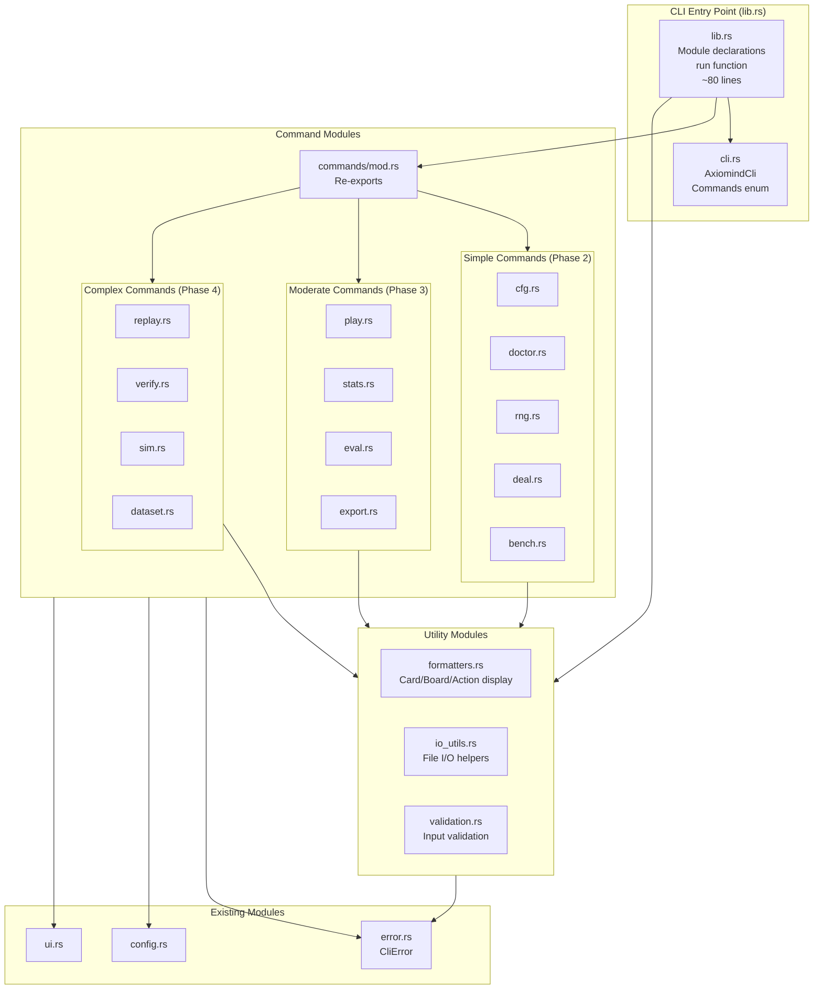
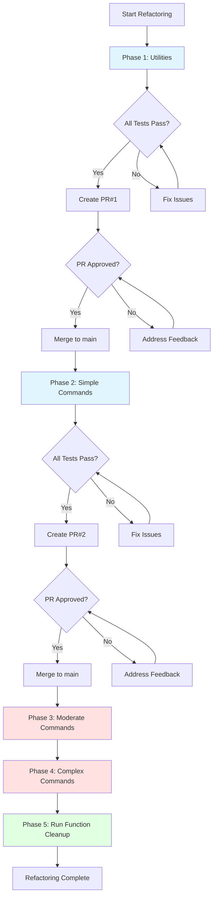
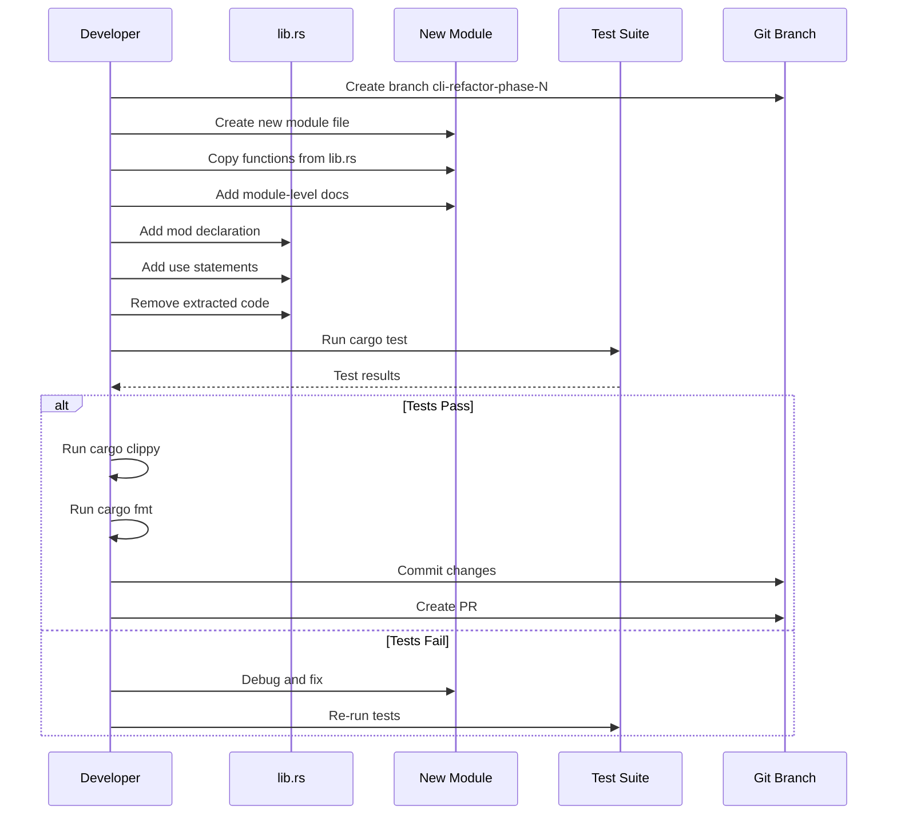

# Technical Design Document: CLI Library Refactoring

## Overview

This feature refactors the monolithic `rust/cli/src/lib.rs` file (4,434 lines) into a modular structure organized by functional domains. The refactoring addresses GitHub issue #59 by extracting utilities, command handlers, and supporting logic into dedicated modules while preserving all existing functionality, tests, and CLI interfaces.

**Purpose**: This refactoring delivers improved maintainability, testability, and developer productivity to the Axiomind CLI development team by separating concerns and reducing cognitive load.

**Users**: CLI developers and maintainers will benefit from clearer code organization, easier navigation, and reduced merge conflicts during parallel development.

**Impact**: Transforms the current single-file implementation into a multi-module architecture without changing any public APIs, command-line interfaces, or observable behavior. All 26 existing integration tests will continue to pass without modification.

### Goals

- Reduce `lib.rs` from 4,434 lines to under 100 lines (module declarations and main run function only)
- Extract utilities, formatters, validation, and I/O functions into dedicated modules
- Organize 13 command handlers into individual command modules under `commands/` directory
- Maintain 100% backward compatibility with existing CLI interface and public API
- Preserve all existing tests and ensure zero test failures after each phase
- Execute refactoring in 5 incremental phases with separate PRs for review safety
- Establish clear module boundaries following Rust best practices and project conventions

### Non-Goals

- Changing command-line arguments, flags, or user-facing behavior
- Adding new features or commands beyond the refactoring scope
- Modifying the underlying game engine or data formats
- Altering error handling patterns or error message content
- Performance optimization (maintain existing performance characteristics)
- Changing test frameworks or adding new test types

## Architecture

### Existing Architecture Analysis

**Current State**:
- Single monolithic file: `rust/cli/src/lib.rs` (4,434 lines)
- Mixed organization: utilities, formatters, validators, command handlers, and main run function
- Inline command handlers within the main `run()` function's match arms (2,000+ lines)
- Nested helper functions within command handlers
- Shared utilities scattered throughout the file
- Three existing modules: `config.rs`, `error.rs`, `ui.rs`

**Current Patterns to Preserve**:
- `Result<(), CliError>` return type for all command handlers
- Dependency injection of output streams (`&mut dyn Write` for stdout/stderr)
- `clap` derive macros for CLI argument parsing (`AxiomindCli`, `Commands` enum)
- Error propagation using `?` operator with `CliError` conversions
- Exit code conventions: 0 (success), 2 (errors), 130 (interruptions)
- Module-level documentation with `//!` and function doc comments with `///`

**Existing Module Structure**:
```
rust/cli/src/
├── lib.rs              (4,434 lines - REFACTOR TARGET)
├── main.rs             (minimal wrapper)
├── config.rs           (configuration management)
├── error.rs            (CliError type + BatchValidationError<T> - Phase 1 addition)
└── ui.rs               (terminal UI utilities)
```

**Existing Module Updates**:

During Phase 1, `error.rs` will be enhanced with a new shared type:

```rust
// Existing: CliError enum (unchanged)
#[derive(Debug)]
pub enum CliError {
    Io(std::io::Error),
    Config(String),
    InvalidInput(String),
    Engine(String),
    Interrupted,
}

// NEW: Generic batch validation error type
/// Generic error type for batch validation operations.
/// Used by commands that process multiple items and need to collect errors with context.
#[derive(Debug)]
pub struct BatchValidationError<T> {
    pub item_context: T,
    pub message: String,
}

impl<T: std::fmt::Display> std::fmt::Display for BatchValidationError<T> {
    fn fmt(&self, f: &mut std::fmt::Formatter<'_>) -> fmt::Result {
        write!(f, "{}: {}", self.item_context, self.message)
    }
}
```

**Rationale for Phase 1 Addition**: Adding `BatchValidationError<T>` in Phase 1 establishes the pattern early, allowing Phase 3-4 command extractions to immediately use it without requiring error.rs changes mid-phase.

**Technical Constraints**:
- No `unwrap()`, `expect()`, or `panic!()` calls allowed (verified by existing tests)
- Must maintain deterministic RNG behavior for reproducibility
- Must preserve environment variable handling (`axiomind_SIM_FAST`, `axiomind_DATASET_STREAM_THRESHOLD`)
- Must maintain exact error messages for test compatibility

### Architecture Pattern & Boundary Map

**Selected Pattern**: **Functional Decomposition by Domain with Command Pattern**

**Rationale**:
- Each command operates independently with minimal shared state
- Clear separation between utility functions (formatters, validators, I/O) and business logic (commands)
- Command Pattern allows clean extraction without coupling between commands
- Aligns with existing `Commands` enum structure and `clap` subcommand pattern

**Architecture Diagram**:



**Domain Boundaries**:

| Domain | Responsibility | Boundary Definition |
|--------|----------------|---------------------|
| **Entry Point** | Argument parsing, command dispatch | `lib.rs` contains only `run()` function and module declarations; delegates all logic to modules |
| **CLI Types** | Clap structures | `cli.rs` owns `AxiomindCli` and `Commands` enum; used only for parsing |
| **Utilities** | Pure functions for formatting, I/O, validation | Stateless helpers with no command-specific logic; reusable across all commands |
| **Commands** | Business logic per subcommand | Each command module owns its handler function, nested helpers, and command-specific types |
| **Support** | Cross-cutting concerns | `error.rs`, `config.rs`, `ui.rs` remain unchanged; used by all modules |

**New Components Rationale**:

1. **cli.rs**: Separates CLI structure from business logic; enables easier CLI definition updates without touching command implementations
2. **formatters.rs**: Centralizes card/board display logic used by multiple commands (play, deal, replay, sim)
3. **io_utils.rs**: Provides file I/O helpers (`read_text_auto`, `ensure_parent_dir`) for commands dealing with JSONL/SQLite
4. **validation.rs**: Consolidates input parsing and validation logic shared across interactive commands
5. **commands/ directory**: Organizes 13 command handlers by complexity (simple → moderate → complex) for incremental extraction

**Steering Compliance**:

- **Domain-Driven Separation** (structure.md): Clear boundaries between utilities, commands, and support modules
- **Type Safety** (tech.md): Preserved `Result<(), CliError>` pattern with explicit error types throughout
- **Rust Best Practices**: `snake_case` modules, module-level docs, standard import organization
- **Testing Adjacency** (structure.md): Module-level tests will be co-located in each extracted module
- **No Circular Dependencies**: Unidirectional flow (Entry → Commands → Utilities → Support)

### Technology Stack

| Layer | Choice / Version | Role in Feature | Notes |
|-------|------------------|-----------------|-------|
| Language | Rust stable (edition 2021) | Source language | No unsafe code; use existing compiler and toolchain |
| CLI Parsing | `clap` 4.x (derive macros) | Command-line argument parsing | Existing dependency; `AxiomindCli` and `Commands` enum remain unchanged in structure |
| Error Handling | `thiserror` (via CliError) | Error propagation | Existing `CliError` type in `error.rs`; no new error variants needed |
| Testing | Cargo test framework | Validation per phase | 26 existing integration tests in `rust/cli/tests/`; inline unit tests for extracted modules |
| Module System | Rust standard modules | Code organization | Use `mod.rs` pattern for `commands/` directory; `pub use` for re-exports |

**Key Dependencies** (no changes):
- `axiomind-engine`: Game logic (unchanged)
- `axiomind_ai`: AI opponents (unchanged)
- `rusqlite`: SQLite operations (unchanged)
- `rand`, `rand_chacha`: RNG (unchanged)

**Tooling for Validation**:
- `cargo fmt`: Code formatting (pre-commit hook)
- `cargo clippy -- -D warnings`: Linting (zero warnings required)
- `cargo test --package axiomind_cli`: Test execution

## System Flows

### Phase Execution Flow



**Key Decisions**:
- **Incremental Approach**: Each phase is independently testable and reviewable to minimize risk
- **Test-First Validation**: Zero test failures required before creating PR
- **Gated Progression**: PR approval gates prevent accumulating technical debt
- **Complexity Ordering**: Simple → Complex ensures foundational modules stabilize first

### Module Extraction Pattern (Phases 1-4)



## Requirements Traceability

| Requirement | Summary | Components | Interfaces | Phase |
|-------------|---------|------------|------------|-------|
| 1 | Utility Function Extraction | `formatters.rs`, `io_utils.rs`, `validation.rs` | Pure functions with explicit types | Phase 1 |
| 2 | Simple Command Extraction | `commands/{cfg,doctor,rng,deal,bench}.rs` | Command handlers returning `Result<(), CliError>` | Phase 2 |
| 3 | Moderate Command Extraction | `commands/{play,stats,eval,export}.rs` | Command handlers with utility dependencies | Phase 3 |
| 4 | Large Inline Command Extraction | `commands/{replay,verify,sim,dataset}.rs` | Command handlers with nested helpers | Phase 4 |
| 5 | Run Function Refactoring | `lib.rs` (simplified), `cli.rs` | Main entry point and CLI structures | Phase 5 |
| 6 | Test Preservation | All modules + existing tests | No interface changes | All Phases |
| 7 | Module Structure | All new modules | `snake_case` files, `mod.rs` re-exports | All Phases |
| 8 | Incremental Review | Git branches, PRs | Version control workflow | All Phases |
| 9 | Documentation | Module-level `//!` comments | Doc comments on public functions | All Phases |
| 10 | Error Handling | `CliError` usage throughout | `Result<(), CliError>` pattern | All Phases |

## Components and Interfaces

### Component Summary

| Component | Domain/Layer | Intent | Req Coverage | Key Dependencies (P0/P1) | Contracts |
|-----------|--------------|--------|--------------|--------------------------|-----------|
| `lib.rs` | Entry Point | Module declarations and dispatch | 5, 7, 10 | All modules (P0) | Service |
| `cli.rs` | CLI Types | Clap structures for parsing | 5, 7 | `clap` (P0) | State |
| `formatters.rs` | Utilities | Card/board/action display | 1, 7, 9 | `axiomind_engine` (P0) | Service |
| `io_utils.rs` | Utilities | File I/O helpers | 1, 7, 10 | `std::fs`, `std::io` (P0) | Service |
| `validation.rs` | Utilities | Input parsing and validation | 1, 7, 10 | `axiomind_engine` (P0) | Service |
| `commands/mod.rs` | Commands | Re-export command handlers | 2, 3, 4, 7 | All command modules (P0) | Service |
| `commands/cfg.rs` | Commands (Simple) | Configuration display | 2, 6, 9, 10 | `config` (P0), `ui` (P1) | Service |
| `commands/doctor.rs` | Commands (Simple) | Environment diagnostics | 2, 6, 9, 10 | `config` (P0), `ui` (P1) | Service |
| `commands/rng.rs` | Commands (Simple) | RNG verification | 2, 6, 9, 10 | `rand_chacha` (P0) | Service |
| `commands/deal.rs` | Commands (Simple) | Single hand dealing | 2, 6, 9, 10 | `axiomind_engine` (P0), `formatters` (P1) | Service |
| `commands/bench.rs` | Commands (Simple) | Performance benchmarking | 2, 6, 9, 10 | `axiomind_engine` (P0) | Service |
| `commands/play.rs` | Commands (Moderate) | Interactive gameplay | 3, 6, 9, 10 | `axiomind_ai` (P0), `formatters` (P1), `validation` (P1) | Service |
| `commands/stats.rs` | Commands (Moderate) | Statistics aggregation | 3, 6, 9, 10 | `io_utils` (P1), SQLite parsing (P0) | Service |
| `commands/eval.rs` | Commands (Moderate) | AI policy evaluation | 3, 6, 9, 10 | `axiomind_ai` (P0), `axiomind_engine` (P0) | Service |
| `commands/export.rs` | Commands (Moderate) | Format conversion | 3, 6, 9, 10 | `io_utils` (P1), `rusqlite` (P0) | Service |
| `commands/replay.rs` | Commands (Complex) | Hand replay | 4, 6, 9, 10 | `axiomind_engine` (P0), `formatters` (P1), `validation` (P1) | Service |
| `commands/verify.rs` | Commands (Complex) | Game rule validation | 4, 6, 9, 10 | `axiomind_engine` (P0), `io_utils` (P1) | Service |
| `commands/sim.rs` | Commands (Complex) | Large-scale simulation | 4, 6, 9, 10 | `axiomind_ai` (P0), `axiomind_engine` (P0), env vars (P1) | Service |
| `commands/dataset.rs` | Commands (Complex) | ML dataset generation | 4, 6, 9, 10 | `axiomind_engine` (P0), `io_utils` (P1), env vars (P1) | Service |

**Criticality Levels**:
- **P0** (Blocking): Core dependency required for compilation; breaking changes block phase completion
- **P1** (High-Risk): Functional dependency; changes may cause test failures or behavior changes
- **P2** (Informational): Optional or indirect dependency

### Entry Point

#### lib.rs (Simplified)

| Field | Detail |
|-------|--------|
| Intent | Central module registry and main run function (dispatch only) |
| Requirements | 5, 7, 10 |
| Owner / Reviewers | CLI maintainers |

**Responsibilities & Constraints**:
- Declare all modules with `mod` statements
- Re-export public API items with `pub use` (maintain backward compatibility)
- Contain only the `run()` function that parses arguments and dispatches to command modules
- Target: under 100 lines total (currently 4,434 lines)

**Dependencies**:
- Inbound: `main.rs` calls `run()` (P0)
- Outbound: All command modules via `commands::*` (P0)
- Outbound: `cli` module for `AxiomindCli` and `Commands` enum (P0)
- Outbound: `error` module for `CliError` (P0)

**Contracts**: [x] Service

##### Service Interface

```rust
/// Main entry point for CLI execution.
/// Parses arguments and dispatches to appropriate command handler.
pub fn run<I, S>(args: I, out: &mut dyn Write, err: &mut dyn Write) -> i32
where
    I: IntoIterator<Item = S>,
    S: AsRef<OsStr>,
{
    // Parse args using AxiomindCli
    // Match on Commands enum
    // Delegate to command handler
    // Convert Result<(), CliError> to exit code
}
```

**Preconditions**:
- `args` contains valid UTF-8 command-line arguments
- `out` and `err` are valid writable streams

**Postconditions**:
- Returns exit code: 0 (success), 2 (error), 130 (interrupted)
- All command output written to `out` or `err`
- No panics; all errors converted to `CliError`

**Invariants**:
- No command handler called directly; all go through command modules
- Module declaration order matches dependency graph (utilities before commands)

**Implementation Notes**:
- **Integration**: Update imports when each module is created; verify compilation after each phase
- **Validation**: Run full test suite after each extraction; ensure exit code behavior unchanged
- **Risks**: Circular dependency if command modules try to import from `lib.rs`; mitigate by ensuring all shared code in utilities

#### cli.rs

| Field | Detail |
|-------|--------|
| Intent | Clap CLI structure definitions (AxiomindCli, Commands enum, Vs enum) |
| Requirements | 5, 7 |
| Owner / Reviewers | CLI maintainers |

**Responsibilities & Constraints**:
- Define `AxiomindCli` struct with `#[derive(Parser)]`
- Define `Commands` enum with all 13 subcommands using `#[derive(Subcommand)]`
- Move `Vs` enum from lib.rs (only used by play command, but defined at top level for clap)
- No business logic; pure data structures

**Dependencies**:
- Inbound: `lib.rs` imports these types (P0)
- Outbound: `clap` crate (P0)

**Contracts**: [x] State

##### State Management

**State Model**:
```rust
#[derive(Parser)]
pub struct AxiomindCli {
    #[clap(subcommand)]
    pub command: Commands,
}

#[derive(Subcommand)]
pub enum Commands {
    Cfg,
    Play { /* args */ },
    Replay { input: String, speed: Option<u64> },
    Stats { input: String },
    Verify { input: String },
    Doctor,
    Eval { /* args */ },
    Bench,
    Deal { seed: Option<u64> },
    Rng { seed: Option<u64> },
    Sim { /* args */ },
    Export { /* args */ },
    Dataset { /* args */ },
}

#[derive(ValueEnum, Clone)]
pub enum Vs {
    Ai,
    Human,
}
```

**Persistence & Consistency**: Stateless; only used for parsing

**Concurrency Strategy**: None (single-threaded CLI)

**Implementation Notes**:
- **Integration**: Extract in Phase 5; update lib.rs imports; no command module changes needed
- **Validation**: Verify CLI help output unchanged; check argument parsing tests
- **Risks**: Low; pure structure move with no logic changes

### Utilities

#### formatters.rs

| Field | Detail |
|-------|--------|
| Intent | Format poker game elements (cards, boards, actions) for terminal display |
| Requirements | 1, 7, 9 |
| Owner / Reviewers | CLI maintainers |

**Responsibilities & Constraints**:
- Provide pure functions for formatting `Card`, `Suit`, `Rank`, `Board`, `PlayerAction`
- Support Unicode card symbols with ASCII fallback via `supports_unicode()` detection
- No I/O or state; all functions take inputs and return `String`

**Dependencies**:
- Inbound: Command modules (play, deal, replay, sim) (P1)
- Outbound: `axiomind_engine::cards` types (P0)
- Outbound: `std::env` for terminal detection (P0)

**Contracts**: [x] Service

##### Service Interface

```rust
/// Check if terminal supports Unicode card symbols
pub fn supports_unicode() -> bool;

/// Format a Suit as a Unicode symbol or ASCII letter
pub fn format_suit(suit: &Suit) -> String;

/// Format a Rank as a character (A, K, Q, J, T, 2-9)
pub fn format_rank(rank: &Rank) -> String;

/// Format a Card as "{Rank}{Suit}"
pub fn format_card(card: &Card) -> String;

/// Format a Board (0-5 cards) as space-separated cards
pub fn format_board(cards: &[Card]) -> String;

/// Format a PlayerAction as human-readable string
pub fn format_action(action: &axiomind_engine::player::PlayerAction) -> String;
```

**Preconditions**:
- All input references are valid (non-null)
- Board slice contains 0-5 cards (caller responsibility)

**Postconditions**:
- Returns non-empty string for all inputs
- Unicode output only if `supports_unicode()` returns true
- Consistent format across all calls

**Invariants**:
- No side effects; functions are referentially transparent
- No panics on valid engine types

**Implementation Notes**:
- **Integration**: Phase 1 extraction; update imports in command modules that use these functions
- **Validation**: Extract existing inline tests from lib.rs to `#[cfg(test)]` module in formatters.rs
- **Risks**: Terminal detection may behave differently on some platforms; mitigate by preserving exact existing logic

#### io_utils.rs

| Field | Detail |
|-------|--------|
| Intent | File I/O utilities for reading JSONL, text files, and ensuring directories |
| Requirements | 1, 7, 10 |
| Owner / Reviewers | CLI maintainers |

**Responsibilities & Constraints**:
- Provide `read_stdin_line()` for interactive input (blocking read with EOF handling)
- Provide `read_text_auto()` for reading compressed (.zst) or plain text files
- Provide `ensure_parent_dir()` for creating parent directories before file writes
- Handle errors via `Result<T, CliError>` or `Result<T, String>`

**Dependencies**:
- Inbound: Commands dealing with files (stats, verify, export, dataset, replay) (P1)
- Outbound: `std::fs`, `std::io`, `std::path` (P0)
- Outbound: `zstd` crate for decompression (P0)
- Outbound: `error::CliError` (P0)

**Contracts**: [x] Service

##### Service Interface

```rust
/// Read a line from stdin, blocking until input available.
/// Returns None on EOF or read error.
pub fn read_stdin_line(stdin: &mut dyn BufRead) -> Option<String>;

/// Read text file with automatic .zst decompression detection.
/// Returns file contents as String.
pub fn read_text_auto(path: &str) -> Result<String, CliError>;

/// Ensure parent directory exists for given path, creating if needed.
/// Returns Ok(()) on success, Err with message on failure.
pub fn ensure_parent_dir(path: &std::path::Path) -> Result<(), String>;
```

**Preconditions**:
- `path` arguments are valid UTF-8 paths
- Caller has read/write permissions for relevant directories

**Postconditions**:
- `read_text_auto`: Returns full file contents or I/O error
- `ensure_parent_dir`: Parent directory exists after success
- No partial operations; atomic success or failure

**Invariants**:
- No buffering beyond standard library defaults
- Errors propagated without suppression

**Implementation Notes**:
- **Integration**: Phase 1 extraction; multiple commands depend on these utilities
- **Validation**: Test with existing integration tests that use file I/O (stats, verify)
- **Risks**: Zstd decompression behavior must match existing; verify with compressed test files

#### validation.rs

| Field | Detail |
|-------|--------|
| Intent | Parse and validate user input for interactive commands |
| Requirements | 1, 7, 10 |
| Owner / Reviewers | CLI maintainers |

**Responsibilities & Constraints**:
- Provide `parse_player_action()` for parsing user input into `PlayerAction`
- Provide `validate_speed()` for replay speed validation
- Provide `validate_dealing_meta()` for dealing metadata validation
- Return structured results (`ParseResult` enum) with clear error messages

**Dependencies**:
- Inbound: Interactive commands (play, replay) (P1)
- Outbound: `axiomind_engine::player::PlayerAction` (P0)
- Outbound: `error::CliError` (P0)

**Contracts**: [x] Service

##### Service Interface

```rust
/// Result type for parsing player actions from user input
#[derive(Debug, PartialEq)]
pub enum ParseResult {
    Action(axiomind_engine::player::PlayerAction),
    Quit,
    Invalid(String),
}

/// Parse user input string into PlayerAction or special commands.
/// Accepts: "f"/"fold", "c"/"call"/"check", "bet X", "raise X", "all-in", "q"/"quit"
pub fn parse_player_action(input: &str) -> ParseResult;

/// Validate replay speed value (milliseconds).
/// Returns Ok(speed) if valid, Err with message if invalid.
pub fn validate_speed(speed: Option<u64>) -> Result<u64, String>;

/// Validate dealing metadata for game setup.
/// Ensures blinds, positions, and initial stacks are consistent.
pub fn validate_dealing_meta(/* args */) -> Result<(), String>;
```

**Preconditions**:
- Input strings are valid UTF-8 (guaranteed by Rust string type)

**Postconditions**:
- `parse_player_action`: Always returns valid `ParseResult`; never panics on malformed input
- `validate_speed`: Accepts positive integers; rejects 0 or overflow values
- Clear error messages for all invalid cases

**Invariants**:
- No side effects; pure validation logic
- Error messages match existing CLI output (for test compatibility)

**Implementation Notes**:
- **Integration**: Phase 1 extraction; used by play and replay commands
- **Validation**: Preserve exact parsing logic and error messages to maintain test compatibility
- **Risks**: Input parsing is user-facing; any change in error messages will break integration tests

### Commands (Simple - Phase 2)

Commands in this category are self-contained with minimal dependencies. Each follows the same pattern:

```rust
pub fn handle_COMMAND_command(out: &mut dyn Write, err: &mut dyn Write) -> Result<(), CliError> {
    // Command implementation
}
```

#### commands/cfg.rs

| Field | Detail |
|-------|--------|
| Intent | Display current configuration settings |
| Requirements | 2, 6, 9, 10 |

**Contracts**: [x] Service

```rust
pub fn handle_cfg_command(out: &mut dyn Write, err: &mut dyn Write) -> Result<(), CliError>;
```

**Implementation Notes**:
- **Integration**: Extract from lib.rs lines ~3240-3275; update `Commands::Cfg` match arm to call this function
- **Validation**: Verify output format matches existing tests
- **Risks**: Low; no dependencies on extracted utilities

#### commands/doctor.rs

| Field | Detail |
|-------|--------|
| Intent | Run environment diagnostics (RNG, file I/O, config validation) |
| Requirements | 2, 6, 9, 10 |

**Contracts**: [x] Service

```rust
pub fn handle_doctor_command(out: &mut dyn Write, err: &mut dyn Write) -> Result<(), CliError>;
```

**Implementation Notes**:
- **Integration**: Extract from lib.rs; includes inline `run_doctor()` helper
- **Validation**: Run `axiomind doctor` and verify all diagnostic checks pass
- **Risks**: Low; self-contained diagnostic logic

#### commands/rng.rs

| Field | Detail |
|-------|--------|
| Intent | Verify RNG properties (distribution, determinism) |
| Requirements | 2, 6, 9, 10 |

**Contracts**: [x] Service

```rust
pub fn handle_rng_command(seed: Option<u64>, out: &mut dyn Write) -> Result<(), CliError>;
```

**Implementation Notes**:
- **Integration**: Extract from lib.rs lines ~3425-3435; preserves RNG seeding logic
- **Validation**: Test with and without explicit seed; verify deterministic output
- **Risks**: Low; pure RNG testing with no external dependencies

#### commands/deal.rs

| Field | Detail |
|-------|--------|
| Intent | Deal a single poker hand and display cards |
| Requirements | 2, 6, 9, 10 |
| Dependencies | `formatters::format_card` (P1), `axiomind_engine` (P0) |

**Contracts**: [x] Service

```rust
pub fn handle_deal_command(seed: Option<u64>, out: &mut dyn Write) -> Result<(), CliError>;
```

**Implementation Notes**:
- **Integration**: Extract from lib.rs lines ~3389-3423; depends on formatters module from Phase 1
- **Validation**: Test card formatting output matches expected format
- **Risks**: Low; depends on Phase 1 formatters (must complete Phase 1 first)

#### commands/bench.rs

| Field | Detail |
|-------|--------|
| Intent | Benchmark hand evaluation performance |
| Requirements | 2, 6, 9, 10 |

**Contracts**: [x] Service

```rust
pub fn handle_bench_command(out: &mut dyn Write) -> Result<(), CliError>;
```

**Implementation Notes**:
- **Integration**: Extract from lib.rs lines ~3363-3387; includes timing logic
- **Validation**: Run benchmark; verify output format and performance metrics
- **Risks**: Low; self-contained with engine-only dependencies

### Commands (Moderate - Phase 3)

#### commands/play.rs

| Field | Detail |
|-------|--------|
| Intent | Interactive poker gameplay against AI or human opponents |
| Requirements | 3, 6, 9, 10 |
| Dependencies | `formatters` (P1), `validation` (P1), `axiomind_ai` (P0), `axiomind_engine` (P0) |

**Contracts**: [x] Service

```rust
pub fn handle_play_command(
    vs: Vs,
    hands: Option<u32>,
    speed: Option<u64>,
    out: &mut dyn Write,
    err: &mut dyn Write,
    stdin: &mut dyn BufRead,
) -> Result<(), CliError>;
```

**Implementation Notes**:
- **Integration**: Extract from lib.rs lines ~1848-1869 and nested helpers; includes `execute_play_command()` and `play_hand_with_two_ais()` helpers
- **Validation**: Run integration tests in `test_play.rs` and `test_play_session.rs`
- **Risks**: Medium; complex interactive flow with AI integration and input validation

**Module-Specific Types**:
```rust
/// Opponent type for play command (moved from cli.rs)
#[derive(ValueEnum, Clone)]
pub enum Vs {
    Ai,
    Human,
}
```

#### commands/stats.rs

| Field | Detail |
|-------|--------|
| Intent | Aggregate statistics from JSONL hand history files |
| Requirements | 3, 6, 9, 10 |
| Dependencies | `io_utils::read_text_auto` (P1), SQLite parsing (P0) |

**Contracts**: [x] Service

```rust
pub fn handle_stats_command(
    input: String,
    out: &mut dyn Write,
    err: &mut dyn Write,
) -> Result<(), CliError>;
```

**Implementation Notes**:
- **Integration**: Extract from lib.rs lines ~2240-2243 and inline `run_stats()` helper
- **Validation**: Run `test_stats.rs` integration tests with sample JSONL files
- **Risks**: Medium; depends on Phase 1 io_utils for file reading

#### commands/eval.rs

| Field | Detail |
|-------|--------|
| Intent | Evaluate AI policies head-to-head across multiple hands |
| Requirements | 3, 6, 9, 10 |
| Dependencies | `axiomind_ai` (P0), `axiomind_engine` (P0) |

**Contracts**: [x] Service

```rust
pub fn handle_eval_command(
    hands: u32,
    seed: Option<u64>,
    out: &mut dyn Write,
) -> Result<(), CliError>;
```

**Implementation Notes**:
- **Integration**: Extract from lib.rs lines ~2681-2694 and helpers (`handle_eval_command()`, `print_eval_results()`)
- **Validation**: Run `test_eval.rs` integration tests
- **Risks**: Medium; includes `EvalStats` struct and statistical analysis logic

**Module-Specific Types**:
```rust
struct EvalStats {
    hands: u32,
    p0_wins: u32,
    p1_wins: u32,
    splits: u32,
    p0_chips: i64,
    p1_chips: i64,
}
```

#### commands/export.rs

| Field | Detail |
|-------|--------|
| Intent | Convert hand histories to various formats (CSV, JSON, SQLite) |
| Requirements | 3, 6, 9, 10 |
| Dependencies | `io_utils` (P1), `rusqlite` (P0) |

**Contracts**: [x] Service

```rust
pub fn handle_export_command(
    input: String,
    output: String,
    format: ExportFormat,
    out: &mut dyn Write,
    err: &mut dyn Write,
) -> Result<(), CliError>;
```

**Implementation Notes**:
- **Integration**: Extract from lib.rs lines ~2896-2908 and helper `export_sqlite()`
- **Validation**: Run `test_export.rs` integration tests with all export formats
- **Risks**: Medium; involves file I/O and SQLite operations

### Commands (Complex - Phase 4)

#### commands/replay.rs

| Field | Detail |
|-------|--------|
| Intent | Replay previously recorded hands with configurable speed |
| Requirements | 4, 6, 9, 10 |
| Dependencies | `formatters` (P1), `validation::validate_speed` (P1), `io_utils::read_text_auto` (P1) |

**Contracts**: [x] Service

```rust
pub fn handle_replay_command(
    input: String,
    speed: Option<u64>,
    out: &mut dyn Write,
    err: &mut dyn Write,
) -> Result<(), CliError>;
```

**Implementation Notes**:
- **Integration**: Extract from lib.rs lines ~1870-2239 (large inline command handler)
- **Validation**: Run `test_replay.rs` integration tests
- **Risks**: High; large implementation with timing logic and JSONL parsing

#### commands/verify.rs

| Field | Detail |
|-------|--------|
| Intent | Validate game rules and hand history integrity |
| Requirements | 4, 6, 9, 10 |
| Dependencies | `axiomind_engine` (P0), `io_utils::read_text_auto` (P1) |

**Contracts**: [x] Service

```rust
pub fn handle_verify_command(
    input: String,
    out: &mut dyn Write,
    err: &mut dyn Write,
) -> Result<(), CliError>;
```

**Implementation Notes**:
- **Integration**: Extract from lib.rs lines ~2244-2676; includes `ValidationError` struct and validation helpers
- **Validation**: Run `test_validation.rs` integration tests
- **Risks**: High; complex validation logic with custom error type

**Module-Specific Types**:
```rust
use crate::error::BatchValidationError;

// Type alias for verify-specific batch errors
type VerifyError = BatchValidationError<usize>;  // usize = hand index

fn collect_validation_errors(hands: &[Hand]) -> Vec<VerifyError> {
    let mut errors = Vec::new();
    for (index, hand) in hands.iter().enumerate() {
        if let Err(e) = validate_hand_rules(hand) {
            errors.push(BatchValidationError {
                item_context: index,
                message: e,
            });
        }
    }
    errors
}
```

**Design Decision**: Verify command uses the shared `BatchValidationError<usize>` type from `error.rs` for consistent batch error handling across commands. Hand index provides context for each validation failure.

#### commands/sim.rs

| Field | Detail |
|-------|--------|
| Intent | Run large-scale simulations with optional fast mode |
| Requirements | 4, 6, 9, 10 |
| Dependencies | `axiomind_ai` (P0), `axiomind_engine` (P0), `io_utils::ensure_parent_dir` (P1) |

**Contracts**: [x] Service

```rust
pub fn handle_sim_command(
    hands: u32,
    output: String,
    seed: Option<u64>,
    out: &mut dyn Write,
    err: &mut dyn Write,
) -> Result<(), CliError>;
```

**Implementation Notes**:
- **Integration**: Extract from lib.rs lines ~2722-2895; includes nested helpers `play_hand_to_completion()` and `sim_run_fast()`
- **Validation**: Run `test_sim.rs` and `test_sim_resume.rs` integration tests
- **Risks**: High; environment variable handling (`axiomind_SIM_FAST`) must be preserved exactly

**Environment Variables**:
- `axiomind_SIM_FAST`: When set, use fast simulation mode (reduced logging)

#### commands/dataset.rs

| Field | Detail |
|-------|--------|
| Intent | Create training/validation/test splits for ML from hand histories |
| Requirements | 4, 6, 9, 10 |
| Dependencies | `axiomind_engine` (P0), `io_utils` (P1) |

**Contracts**: [x] Service

```rust
pub fn handle_dataset_command(
    input: String,
    output_dir: String,
    train_ratio: f64,
    val_ratio: f64,
    seed: Option<u64>,
    out: &mut dyn Write,
    err: &mut dyn Write,
) -> Result<(), CliError>;
```

**Implementation Notes**:
- **Integration**: Extract from lib.rs lines ~2909-3039; includes helpers `compute_splits()` and `dataset_stream_if_needed()`
- **Validation**: Run `test_dataset.rs` integration tests
- **Risks**: High; environment variable handling (`axiomind_DATASET_STREAM_THRESHOLD`) and streaming logic

**Environment Variables**:
- `axiomind_DATASET_STREAM_THRESHOLD`: File size threshold for streaming mode (bytes)

### Commands Module Re-export

#### commands/mod.rs

| Field | Detail |
|-------|--------|
| Intent | Re-export all command handler functions for clean imports |
| Requirements | 2, 3, 4, 7 |

**Responsibilities**:
- Declare all command modules (`mod cfg;`, `mod doctor;`, etc.)
- Re-export command handler functions with `pub use`
- Provide single entry point for command imports in lib.rs

**Structure**:
```rust
//! Command handler modules for Axiomind CLI.
//!
//! Each module contains a single command handler function that implements
//! the business logic for a CLI subcommand.

mod cfg;
mod doctor;
mod rng;
mod deal;
mod bench;
mod play;
mod stats;
mod eval;
mod export;
mod replay;
mod verify;
mod sim;
mod dataset;

pub use cfg::handle_cfg_command;
pub use doctor::handle_doctor_command;
pub use rng::handle_rng_command;
pub use deal::handle_deal_command;
pub use bench::handle_bench_command;
pub use play::handle_play_command;
pub use stats::handle_stats_command;
pub use eval::handle_eval_command;
pub use export::handle_export_command;
pub use replay::handle_replay_command;
pub use verify::handle_verify_command;
pub use sim::handle_sim_command;
pub use dataset::handle_dataset_command;
```

**Implementation Notes**:
- **Integration**: Create incrementally; Phase 2 adds first 5 modules, Phase 3 adds next 4, Phase 4 adds final 4
- **Validation**: Verify all re-exports are used in lib.rs
- **Risks**: Low; purely organizational file

## Data Models

### Domain Model

**Aggregates**:
- **CLI Execution Context**: Command arguments, output streams, exit code
- **Command State**: Per-command execution state (ephemeral, not persisted)

**Entities**: None (stateless command handlers)

**Value Objects**:
- `AxiomindCli`: Clap-parsed CLI arguments
- `Commands`: Enum representing subcommand selection
- `ParseResult`: Validation result for user input

**Domain Events**: None (CLI is synchronous and stateless)

**Business Rules & Invariants**:
- All command handlers return `Result<(), CliError>`
- Exit codes: 0 (success), 2 (application error), 130 (user interruption)
- Output streams must not be mixed; errors to stderr, results to stdout
- No global mutable state; all state passed through function parameters

### Logical Data Model

Not applicable; CLI operates on data files managed by other components (engine, data layer). No new data structures introduced.

### Physical Data Model

Not applicable; refactoring does not change file formats or storage mechanisms.

## Error Handling

### Error Strategy

All errors propagate through the existing `CliError` enum with explicit error conversion patterns. No new error types added to the shared error module.

**Command-Specific Error Types**:
- `verify` command: `ValidationError` struct (module-private, not exported)
- All other commands: Use `CliError` variants exclusively

**Error Propagation Pattern**:
```rust
// Use ? operator for automatic conversion
let content = read_text_auto(&input)?;  // io::Error -> CliError::Io

// Explicit error context
let parsed = parse_action(input)
    .map_err(|e| CliError::InvalidInput(format!("Parse error: {}", e)))?;

// String errors converted via From impl
ensure_parent_dir(path)?;  // String -> CliError::Engine
```

### Error Categories and Responses

**User Errors** (exit code 2):
- **Invalid Input**: Field-level validation with specific error messages
  - Example: `"Invalid action: expected 'fold', 'call', 'bet N', or 'raise N'"`
  - Handler: Return `CliError::InvalidInput` with actionable message
- **File Not Found**: Navigation help
  - Example: `"File not found: data/hands.jsonl. Use 'axiomind sim' to generate hands."`
  - Handler: Return `CliError::Io` with suggestion

**System Errors** (exit code 2):
- **I/O Failures**: Graceful error messages
  - Example: `"Failed to write output: Permission denied"`
  - Handler: Return `CliError::Io` with underlying error
- **Configuration Errors**: Config validation guidance
  - Example: `"Invalid config: speed must be positive"`
  - Handler: Return `CliError::Config` with specific issue

**User Interruptions** (exit code 130):
- **Ctrl+C during interactive commands**: Clean exit
  - Handler: Catch interrupt signal, return `CliError::Interrupted`

**No Business Logic Errors**: CLI is a thin interface; validation errors are user input errors, not domain rule violations.

### Monitoring

**Error Tracking**:
- All errors logged to stderr via `ui::write_error()`
- No external error tracking; CLI is offline-first

**Logging**:
- Use existing `ui` module functions: `write_error()`, `display_warning()`
- No structured logging; human-readable error messages only

**Health Monitoring**:
- `doctor` command provides diagnostics (RNG, file I/O, config)
- No runtime health checks; CLI exits after each command

## Testing Strategy

### Unit Tests

**Scope**: Pure functions in utility modules

**Coverage**:
1. **formatters.rs**: Card/board formatting with Unicode and ASCII modes
2. **io_utils.rs**: File reading with compressed (.zst) and plain text files
3. **validation.rs**: Input parsing edge cases (empty input, invalid actions, quit commands)

**Location**: Inline `#[cfg(test)]` modules in each file

**Example**:
```rust
#[cfg(test)]
mod tests {
    use super::*;

    #[test]
    fn test_format_card_unicode() {
        let card = Card { rank: Rank::Ace, suit: Suit::Spades };
        let formatted = format_card(&card);
        // Assert format matches expected output
    }
}
```

### Integration Tests

**Scope**: Command handlers end-to-end via `run()` function

**Coverage**:
1. **Existing tests preserved**: All 26 integration tests in `rust/cli/tests/` must pass
2. **Per-command validation**:
   - `test_cli_commands.rs`: Help output, argument parsing
   - `test_play.rs`, `test_play_session.rs`: Interactive gameplay flows
   - `test_replay.rs`: Hand replay with speed control
   - `test_stats.rs`: Statistics aggregation from JSONL
   - `test_verify.rs`, `test_validation.rs`: Game rule validation
   - `test_sim.rs`, `test_sim_resume.rs`: Simulation with resume capability
   - `test_dataset.rs`: Dataset splitting
   - `test_export.rs`: Format conversion (CSV, JSON, SQLite)
   - `test_eval.rs`: AI policy evaluation

**Location**: `rust/cli/tests/` directory (unchanged)

**Validation Per Phase**:
- Phase 1: All tests pass (no command code moved yet)
- Phase 2: Simple command tests pass (`test_deal_rng.rs`, etc.)
- Phase 3: Moderate command tests pass (`test_play.rs`, `test_stats.rs`, etc.)
- Phase 4: Complex command tests pass (`test_sim.rs`, `test_dataset.rs`, etc.)
- Phase 5: All tests pass (final structure validated)

### Code Quality Checks

**Pre-PR Validation**:
```bash
cargo build --package axiomind_cli --release
cargo test --package axiomind_cli
cargo clippy --package axiomind_cli -- -D warnings
cargo fmt --package axiomind_cli -- --check
```

**Coverage**:
- **Build**: Must compile without errors or warnings
- **Tests**: Zero test failures across all 26 integration tests
- **Clippy**: Zero warnings (enforced by `-D warnings` flag)
- **Formatting**: Must pass `rustfmt --check` (pre-commit hook)

### Regression Testing

**Focus Areas**:
1. **Exit Codes**: Verify success (0), error (2), interrupt (130) codes unchanged
2. **Output Format**: CLI help, command output, error messages must match exactly
3. **Behavior**: All user-facing behavior identical (no feature changes)

**Test Execution**:
- Run full test suite after each phase before creating PR
- Run manual smoke tests for each command after integration

### Test Migration Strategy

**Objective**: Systematically migrate inline tests from `lib.rs` to appropriate module test sections during extraction, while preserving test coverage and avoiding orphaned tests.

**Phase 1 Pre-Refactoring Audit**:

During Phase 1 implementation, conduct a complete audit of inline tests in `lib.rs`:

1. **Inventory Existing Tests**:
   - Identify all `#[test]` functions in lib.rs `#[cfg(test)]` module
   - Document test name, line range, and functionality tested
   - Classify tests by target functionality (formatters, validation, I/O, commands)

2. **Create Test Migration Matrix**:
   ```
   | Test Name              | Target Module    | Migration Phase | Notes |
   |------------------------|------------------|-----------------|-------|
   | test_format_card_*     | formatters.rs    | Phase 1         | Pure function tests |
   | test_parse_action_*    | validation.rs    | Phase 1         | Input validation |
   | test_read_stdin_*      | io_utils.rs      | Phase 1         | I/O utilities |
   | test_play_*            | commands/play.rs | Phase 3         | Command integration |
   | ... (continue for all tests) |
   ```

3. **Document in Phase 1 PR**: Include test migration matrix in PR description for transparency

**Decision Criteria for Test Migration**:

**Move Test to Extracted Module** if:
- ✅ Test calls ONLY functions extracted to that module
- ✅ Test has no dependencies on lib.rs-specific setup
- ✅ Test is unit-level (tests single function or small group)
- ✅ Test assertions depend on module-internal behavior

**Keep Test in lib.rs** if:
- ❌ Test calls functions from multiple modules (integration-style)
- ❌ Test validates public API through `run()` function
- ❌ Test requires lib.rs-level orchestration
- ❌ Test is already covered by `rust/cli/tests/` integration tests

**Example Decision Process**:
```rust
// lib.rs test module (before extraction)
#[test]
fn test_format_card_unicode() {
    let card = Card { rank: Rank::Ace, suit: Suit::Spades };
    assert_eq!(format_card(&card), "A♠");
}

// Decision: MOVE to formatters.rs
// Rationale: Only tests format_card function, no lib.rs dependencies

#[test]
fn test_play_command_full_session() {
    let args = vec!["axiomind", "play", "--vs", "ai", "--hands", "1"];
    let mut out = Vec::new();
    let mut err = Vec::new();
    let result = run(args.iter(), &mut out, &mut err);
    assert_eq!(result, 0);
}

// Decision: KEEP in lib.rs or move to integration tests
// Rationale: Tests public API through run(), integration-level
```

**Per-Phase Test Migration Plan**:

**Phase 1: Utilities**
- Migrate tests for: `format_*`, `parse_player_action`, `read_stdin_line`, `validate_speed`
- Estimated: 15-20 test functions
- Location: `formatters.rs`, `validation.rs`, `io_utils.rs` `#[cfg(test)]` modules
- Validation: Ensure moved tests still pass in new module context

**Phase 2: Simple Commands**
- No test migration (simple commands have integration tests only)
- Verify: Integration tests in `rust/cli/tests/` continue to pass

**Phase 3: Moderate Commands**
- Migrate helper function tests if any exist inline
- Estimated: 5-10 test functions (if present)
- Location: `commands/play.rs`, `commands/stats.rs` test modules

**Phase 4: Complex Commands**
- Migrate validation helper tests (verify command)
- Estimated: 10-15 test functions
- Location: `commands/verify.rs`, `commands/sim.rs` test modules

**Phase 5: Run Function**
- No test migration (run function tests become integration tests)
- Verify: All lib.rs tests are either migrated or covered by integration tests

**Visibility Adjustments for Migrated Tests**:

When moving tests to module files, ensure proper visibility:

```rust
// In extracted module (e.g., formatters.rs)
pub fn format_card(card: &Card) -> String {
    // Implementation
}

// Module-private helper (not exported)
fn supports_unicode() -> bool {
    // Implementation
}

#[cfg(test)]
mod tests {
    use super::*;

    #[test]
    fn test_format_card() {
        // Can access both public and private functions
        assert!(supports_unicode() || !supports_unicode());  // Private function accessible
        assert_eq!(format_card(&Card::new(Rank::Ace, Suit::Spades)), "A♠");
    }
}
```

**Test Migration Validation**:

After each phase, verify:
1. **Coverage Maintained**: `cargo test --package axiomind_cli` shows same number of passing tests (or more)
2. **No Orphaned Tests**: All tests from original lib.rs are either migrated or intentionally removed (with justification)
3. **No Duplicate Tests**: Tests not duplicated between lib.rs and module files
4. **Documentation**: Test module doc comments explain what is being tested

**Rollback Trigger**:
- If test migration causes failures that can't be quickly resolved, revert test moves and keep tests in lib.rs for that phase
- Document decision to defer test migration in PR

## Migration Strategy

### Phase Breakdown

#### Phase 1: Utility Function Extraction

**Scope**:
- Create `formatters.rs`, `io_utils.rs`, `validation.rs`
- Extract utility functions from lib.rs
- Update lib.rs imports

**Steps**:
1. Create new module files with module-level documentation
2. Copy functions from lib.rs to new modules
3. Add `mod` declarations to lib.rs
4. Add `use` statements in lib.rs for extracted functions
5. Remove extracted code from lib.rs
6. Run `cargo test`, `cargo clippy`, `cargo fmt`
7. Commit and create PR

**Rollback Trigger**: Any test failure

**Validation Checkpoint**: All 26 integration tests pass

**Files Modified**:
- Create: `rust/cli/src/formatters.rs`, `rust/cli/src/io_utils.rs`, `rust/cli/src/validation.rs`
- Modify: `rust/cli/src/lib.rs`

**Line Count Reduction**: ~300 lines from lib.rs

#### Phase 2: Simple Command Extraction

**Scope**:
- Create `commands/` directory and `commands/mod.rs`
- Extract cfg, doctor, rng, deal, bench commands
- Update lib.rs command dispatch

**Steps**:
1. Create `rust/cli/src/commands/` directory
2. Create `commands/mod.rs` with module declarations
3. Extract each command handler to separate file (`cfg.rs`, etc.)
4. Add `pub use` re-exports in `commands/mod.rs`
5. Update lib.rs to call `commands::handle_*_command()`
6. Run `cargo test`, `cargo clippy`, `cargo fmt`
7. Commit and create PR

**Rollback Trigger**: Test failures in simple command tests

**Validation Checkpoint**: Commands execute correctly; help output unchanged

**Files Modified**:
- Create: `rust/cli/src/commands/mod.rs`, `rust/cli/src/commands/{cfg,doctor,rng,deal,bench}.rs`
- Modify: `rust/cli/src/lib.rs`

**Line Count Reduction**: ~400 lines from lib.rs

#### Phase 3: Moderate Command Extraction

**Scope**:
- Extract play, stats, eval, export commands
- Handle shared helpers (e.g., `export_sqlite`, `run_stats`)

**Steps**:
1. Extract play command with nested helpers to `commands/play.rs`
2. Extract stats command with `run_stats` helper to `commands/stats.rs`
3. Extract eval command with `EvalStats` struct to `commands/eval.rs`
4. Extract export command with `export_sqlite` helper to `commands/export.rs`
5. Update `commands/mod.rs` with new re-exports
6. Update lib.rs command dispatch
7. Run `cargo test`, `cargo clippy`, `cargo fmt`
8. Commit and create PR

**Rollback Trigger**: Integration test failures for play, stats, eval, or export

**Validation Checkpoint**: Interactive gameplay works; file I/O operations succeed

**Files Modified**:
- Create: `rust/cli/src/commands/{play,stats,eval,export}.rs`
- Modify: `rust/cli/src/commands/mod.rs`, `rust/cli/src/lib.rs`

**Line Count Reduction**: ~800 lines from lib.rs

#### Phase 4: Large Inline Command Extraction

**Scope**:
- Extract replay, verify, sim, dataset commands with nested helpers
- Handle ValidationError struct in verify.rs
- Preserve environment variable handling

**Steps**:
1. Extract replay command (large inline handler) to `commands/replay.rs`
2. Extract verify command with `ValidationError` to `commands/verify.rs`
3. Extract sim command with `play_hand_to_completion` and `sim_run_fast` helpers to `commands/sim.rs`
4. Extract dataset command with `compute_splits` and `dataset_stream_if_needed` helpers to `commands/dataset.rs`
5. Update `commands/mod.rs` with new re-exports
6. Update lib.rs command dispatch
7. Run `cargo test`, `cargo clippy`, `cargo fmt`
8. Commit and create PR

**Rollback Trigger**: Simulation or dataset test failures; environment variable behavior changes

**Validation Checkpoint**: All complex command tests pass; env vars respected

**Files Modified**:
- Create: `rust/cli/src/commands/{replay,verify,sim,dataset}.rs`
- Modify: `rust/cli/src/commands/mod.rs`, `rust/cli/src/lib.rs`

**Line Count Reduction**: ~2,500 lines from lib.rs

#### Phase 5: Run Function Refactoring

**Scope**:
- Extract CLI types to `cli.rs`
- Simplify `run()` function to argument parsing and dispatch only
- Final cleanup of lib.rs

**Steps**:
1. Create `rust/cli/src/cli.rs`
2. Move `AxiomindCli`, `Commands`, `Vs` enums to cli.rs
3. Update lib.rs imports to use `cli::AxiomindCli` and `cli::Commands`
4. Simplify `run()` function to remove all business logic
5. Update module-level documentation in lib.rs
6. Run `cargo test`, `cargo clippy`, `cargo fmt`
7. Commit and create PR with "Closes #59"

**Rollback Trigger**: Argument parsing failures; CLI help output changes

**Validation Checkpoint**: All tests pass; lib.rs under 100 lines; help output unchanged

**Files Modified**:
- Create: `rust/cli/src/cli.rs`
- Modify: `rust/cli/src/lib.rs` (final state)

**Line Count Reduction**: ~450 lines from lib.rs

**Final Target**: lib.rs at ~80 lines (module declarations, re-exports, run function)

### Rollback Plan

**Per-Phase Rollback**:
1. If tests fail after extraction: Revert commits and debug in isolation
2. If PR review identifies issues: Address feedback in branch before merge
3. If post-merge issues found: Revert PR and fix in new branch

**Rollback Trigger Conditions**:
- Any test failure in `cargo test --package axiomind_cli`
- Clippy warnings after refactoring
- Help output or error message changes (detected by integration tests)
- Performance degradation (benchmarks show slowdown)

**Rollback Procedure**:
```bash
# Revert last commit (local)
git reset --hard HEAD~1

# Revert merged PR (post-merge)
git revert <commit-hash>
git push origin main
```

### Validation Checkpoints

**After Each Phase**:
1. **Compilation**: `cargo build --package axiomind_cli --release` succeeds
2. **Tests**: `cargo test --package axiomind_cli` shows 0 failures
3. **Linting**: `cargo clippy --package axiomind_cli -- -D warnings` shows 0 warnings
4. **Formatting**: `cargo fmt --package axiomind_cli -- --check` passes
5. **Manual Smoke Test**: Run representative command (`axiomind play --vs ai --hands 1`)

**Final Validation (Phase 5)**:
1. All previous checkpoints pass
2. `lib.rs` line count under 100 lines
3. All 26 integration tests pass
4. CLI help output unchanged (`axiomind --help` matches original)
5. Module structure matches design document

## Pull Request Strategy

### PR Template Structure

Each PR will include:

**Title**: `refactor(cli): Phase N - [Description]`

**Description**:
```markdown
## Summary
Phase N of cli-lib-refactor: [Brief description of what was extracted]

Part of #59

## Changes
- Created modules: [list new files]
- Modified: `lib.rs` (reduced by X lines)
- Extracted functions: [list key functions moved]

## Testing
- `cargo test --package axiomind_cli`: ✅ All tests pass (0 failures)
- `cargo clippy`: ✅ 0 warnings
- `cargo fmt --check`: ✅ Formatted
- Manual smoke test: ✅ [command tested]

## Validation
- [ ] All integration tests pass
- [ ] No clippy warnings
- [ ] Code formatted with rustfmt
- [ ] lib.rs line count reduced by X lines
- [ ] No changes to public API or CLI interface
```

**Labels**: `refactor`, `cli`, `phase-N`

### PR Sequencing

**PR#1**: Phase 1 - Utility Extraction
**PR#2**: Phase 2 - Simple Commands
**PR#3**: Phase 3 - Moderate Commands
**PR#4**: Phase 4 - Complex Commands
**PR#5**: Phase 5 - Run Function Cleanup (Closes #59)

**Dependency Chain**: Each PR depends on the previous being merged to main.

### Git Workflow Strategy

**Branching Model**: Each phase branches directly from `main` (not from previous phase branches)

**Branch Naming Convention**:
- Phase 1: `cli-refactor-phase-1-utilities`
- Phase 2: `cli-refactor-phase-2-simple-commands`
- Phase 3: `cli-refactor-phase-3-moderate-commands`
- Phase 4: `cli-refactor-phase-4-complex-commands`
- Phase 5: `cli-refactor-phase-5-cleanup`

**Workflow Sequence**:
```
main
 ├── phase-1 branch → PR#1 → merge to main
 ├── phase-2 branch → PR#2 → merge to main
 ├── phase-3 branch → PR#3 → merge to main
 ├── phase-4 branch → PR#4 → merge to main
 └── phase-5 branch → PR#5 → merge to main (closes #59)
```

**Base Branch Policy**:
1. Create new branch from latest `main`: `git checkout main && git pull && git checkout -b cli-refactor-phase-N`
2. Work on phase implementation
3. Before creating PR, rebase on latest main if needed: `git fetch origin main && git rebase origin/main`
4. Create PR against `main`
5. After PR approval and merge, delete branch
6. Start next phase from updated `main`

**Review Parallelization**:
- **Sequential Work**: Do not start Phase N+1 implementation until Phase N PR is merged
- **Parallel Review Preparation**: Can research/plan Phase N+1 while Phase N is in review
- **Exception**: If Phase N PR is rejected, fix issues in same branch; do not proceed to Phase N+1

**Conflict Resolution Protocol**:
1. **During Development**: Regularly pull from `main` to catch conflicts early
2. **Before PR Creation**: Rebase on latest `main` and resolve conflicts locally
3. **During Review**: If `main` changes, rebase and force-push to PR branch
4. **Merge Conflicts**: Resolve in favor of `main` for shared code; preserve phase-specific changes

**Advantages of Main-Based Branching**:
- ✅ Each phase builds on stable, reviewed code
- ✅ Easier to track changes against known baseline
- ✅ No cascading rollbacks if later phase is rejected
- ✅ Clear separation between phases

**Disadvantages and Mitigations**:
- ❌ More merge conflicts if multiple developers work simultaneously
  - Mitigation: Single developer per phase; coordinate timing
- ❌ Cannot start next phase until previous merges
  - Mitigation: Optimize review turnaround time; prepare Phase N+1 design during Phase N review

## Performance & Scalability

**Performance Targets**:
- No measurable performance regression (maintain current benchmark results)
- Compilation time should not increase significantly (< 5% increase acceptable due to module overhead)

**Validation**:
- Run `axiomind bench` before and after refactoring
- Compare hand evaluation throughput (target: no change)

**Scalability Considerations**:
- Module structure supports future command additions without modifying existing commands
- Command modules can be compiled in parallel (Rust's module system optimization)

**No New Performance Optimizations**: Refactoring is behavior-preserving; performance optimization is out of scope.

## Security Considerations

**Threat Model**: CLI operates on local files with user-provided paths; no network exposure.

**Security Controls Preserved**:
- Path validation in `ensure_parent_dir()` prevents directory traversal
- Input validation in `parse_player_action()` prevents injection attacks
- No use of `unsafe` code in refactored modules

**No New Security Risks**: Refactoring does not introduce new input vectors or change validation logic.

## Supporting References

### Module Organization Research Summary

**Source**: Rust community best practices (2024-2025)

**Key Findings**:
1. **Flat vs Nested Modules**: For CLI with 13 commands, flat structure under `commands/` is appropriate (avoid over-nesting)
2. **`mod.rs` Pattern**: Recommended for directories with multiple modules; use re-exports for clean imports
3. **Visibility Control**: Use `pub` only for items consumed by `lib.rs`; command-internal helpers should be private
4. **Import Organization**: Standard library → External crates → Internal crates → Current crate (enforced by rustfmt)

**Application to Design**:
- `commands/mod.rs` re-exports all handler functions
- Utility modules export only public functions used by commands
- Nested helpers remain module-private (e.g., `play_hand_to_completion` in sim.rs)

### Clap Subcommand Pattern Research Summary

**Source**: Clap documentation and Rust CLI recommendations (2025)

**Key Findings**:
1. **Command Enum Pattern**: Use `#[derive(Subcommand)]` enum for all subcommands
2. **Flattening Global Options**: Use `#[clap(flatten)]` for shared options across commands
3. **Argument Structs**: Commands with many args can use separate `#[derive(Args)]` structs
4. **Context Pattern**: Match on `Commands` enum and pass execution context to handler functions

**Application to Design**:
- Preserve existing `Commands` enum structure (no refactoring needed)
- Extract enum to `cli.rs` in Phase 5
- Handler functions take output streams as context (existing pattern)

### BatchValidationError Design Decision

**Question**: Should `ValidationError` be part of the shared `CliError` enum, or should we create a reusable pattern for batch validation errors?

**Analysis**:
- `ValidationError` is used within the `verify` command for batch validation (hand-by-hand checks)
- Similar patterns appear in other commands:
  - `dataset` command: validates shuffle/split operations per file
  - `stats` command: aggregates errors from parsing multiple JSONL files
  - `sim` command: may need to track failures across simulation runs
- Common pattern: "iterate over items, collect errors with context, report at end"

**Decision**: Create shared `BatchValidationError<T>` generic type in `error.rs`

**Rationale**:
- **Pattern Reuse**: Multiple commands (verify, dataset, stats, sim) benefit from structured batch error handling
- **Type Safety**: Generic parameter `T` allows each command to use command-specific context types
- **Consistent UX**: Unified error reporting format across all batch operations
- **Future-Proof**: New commands with batch validation get pattern for free
- **No Over-Engineering**: Simple generic struct with Display impl; not complex framework

**Shared Type Design** (`error.rs`):
```rust
/// Generic error type for batch validation operations.
/// Tracks individual item failures with context for user-friendly error reporting.
#[derive(Debug)]
pub struct BatchValidationError<T> {
    pub item_context: T,
    pub message: String,
}

impl<T: std::fmt::Display> std::fmt::Display for BatchValidationError<T> {
    fn fmt(&self, f: &mut std::fmt::Formatter<'_>) -> std::fmt::Result {
        write!(f, "{}: {}", self.item_context, self.message)
    }
}
```

**Usage by Command**:

1. **verify command** (`commands/verify.rs`):
```rust
type VerifyError = BatchValidationError<usize>;  // usize = hand index

fn validate_hand(index: usize, hand: &Hand) -> Result<(), VerifyError> {
    if hand.is_invalid() {
        return Err(BatchValidationError {
            item_context: index,
            message: "Invalid hand state".to_string(),
        });
    }
    Ok(())
}
```

2. **dataset command** (`commands/dataset.rs`):
```rust
type DatasetError = BatchValidationError<String>;  // String = file path

fn validate_dataset_file(path: &str) -> Result<(), DatasetError> {
    if file_corrupted(path) {
        return Err(BatchValidationError {
            item_context: path.to_string(),
            message: "Corrupted dataset file".to_string(),
        });
    }
    Ok(())
}
```

3. **stats command** (`commands/stats.rs`):
```rust
type StatsError = BatchValidationError<String>;  // String = JSONL line identifier

fn parse_jsonl_line(line_num: usize, line: &str) -> Result<(), StatsError> {
    if !valid_json(line) {
        return Err(BatchValidationError {
            item_context: format!("Line {}", line_num),
            message: "Invalid JSON".to_string(),
        });
    }
    Ok(())
}
```

**Migration Impact**:
- **Phase 1**: Add `BatchValidationError<T>` to `error.rs` (no command usage yet)
- **Phase 4**: Update verify, dataset, sim commands to use `BatchValidationError<T>`
- **Phase 3** (optional): Update stats command if batch error pattern is needed

**Trade-offs**:

**Pros**:
- ✅ Eliminates code duplication across commands
- ✅ Consistent error messages for batch operations
- ✅ Easy to extend for new commands
- ✅ Type-safe: compile-time guarantees on context types

**Cons**:
- ❌ Slight complexity increase in error.rs (one additional type)
- ❌ Commands must choose context type (not always obvious)

**Conclusion**: The shared pattern outweighs the minimal complexity cost, especially since 3+ commands benefit from it.

### Phase 4 Sub-PR Strategy

**Question**: Should Phase 4 be split into multiple PRs given its size (~2,500 lines)?

**Analysis**:
- Each command (replay, verify, sim, dataset) is independent
- Could create 4 separate PRs within Phase 4

**Decision**: Keep Phase 4 as a single PR with 4 sequential commits (one per command)

**Rationale**:
- All 4 commands share the pattern of "large inline handlers with nested helpers"
- Easier review flow with related changes grouped
- Still allows incremental review via per-command commits

**Mitigation**:
- Each command extraction committed separately for granular review
- PR description highlights commit structure for reviewers

### Nested Function Extraction Strategy

**Question**: How should nested helper functions be handled during extraction?

**Options**:
1. Keep as nested functions within command handler
2. Extract as module-private functions
3. Extract to separate helper module

**Decision**: Option 2 - Extract as module-private functions within the command module

**Rationale**:
- Improves testability (can write unit tests for helpers)
- Maintains encapsulation (helpers not exposed outside module)
- Avoids over-engineering with separate helper modules

**Example** (`commands/sim.rs`):
```rust
pub fn handle_sim_command(...) -> Result<(), CliError> {
    // Command logic
}

fn play_hand_to_completion(...) {
    // Helper logic (module-private)
}

fn sim_run_fast(...) {
    // Fast mode helper (module-private)
}
```

### File Line Count Breakdown

**Current State**: lib.rs at 4,434 lines

**Projected Line Allocation After Refactoring**:
- `lib.rs`: ~80 lines (module declarations, run function)
- `cli.rs`: ~120 lines (AxiomindCli, Commands enum)
- `formatters.rs`: ~150 lines
- `io_utils.rs`: ~80 lines
- `validation.rs`: ~100 lines
- `commands/mod.rs`: ~40 lines
- Simple commands (5 files): ~400 lines total (~80 each)
- Moderate commands (4 files): ~800 lines total (~200 each)
- Complex commands (4 files): ~2,500 lines total (~625 each)
- Inline tests: ~200 lines (distributed across modules)

**Total**: ~4,470 lines (slight increase due to module overhead and documentation)

**Validation**: Line count increase is expected due to:
- Module-level documentation for each new file
- Re-export boilerplate in `commands/mod.rs`
- Separation creating natural formatting boundaries

---

**Document Version**: 1.0
**Last Updated**: 2025-11-19
**Status**: Design Complete - Awaiting Approval
