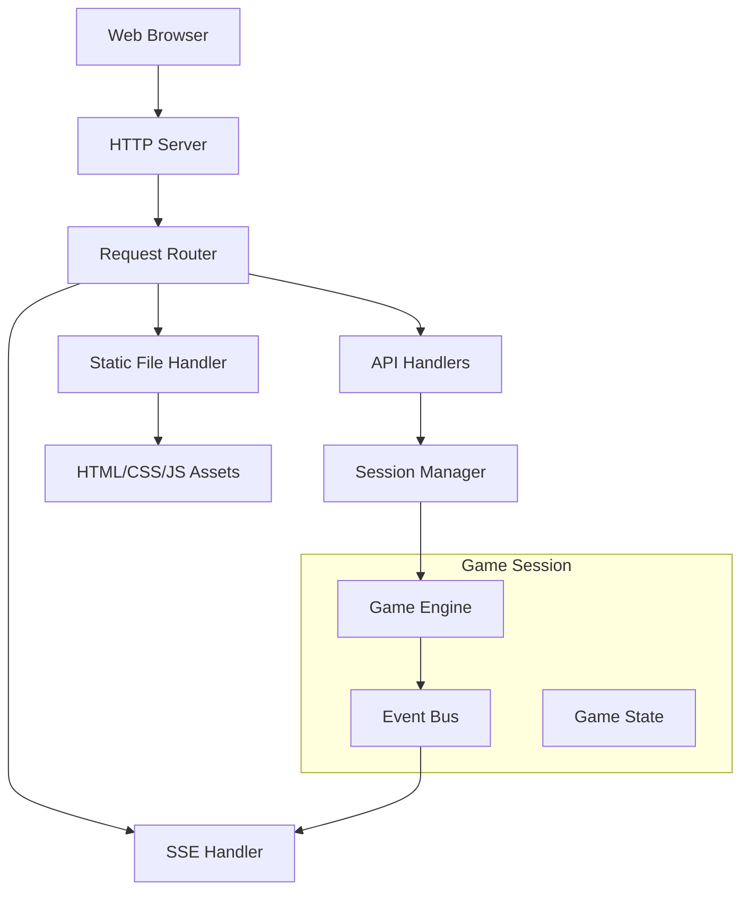

# Design Document

## Overview

The rust/web component provides a local HTTP server that serves an interactive poker game interface using HTML, CSS, JavaScript, and htmx. The server integrates with the axm-engine to provide real-time poker gameplay through Server-Sent Events (SSE) and RESTful API endpoints. The design follows a modular architecture that separates concerns between HTTP handling, game session management, and real-time event broadcasting.

## Architecture

### High-Level Architecture



### Component Layers

1. **HTTP Layer**: Handles incoming HTTP requests and routing
2. **Session Management Layer**: Manages game sessions and state
3. **Game Integration Layer**: Interfaces with the axm-engine
4. **Event Broadcasting Layer**: Manages real-time updates via SSE
5. **Static Asset Layer**: Serves HTML, CSS, JavaScript, and other assets

## Components and Interfaces

### HTTP Server (`server.rs`)

**Responsibilities:**
- Bind to configurable port (default 8080)
- Route HTTP requests to appropriate handlers
- Serve static files efficiently
- Handle graceful shutdown

**Key Types:**
```rust
pub struct WebServer {
    addr: SocketAddr,
    session_manager: Arc<SessionManager>,
    static_handler: StaticHandler,
}

pub struct ServerConfig {
    pub port: u16,
    pub host: String,
    pub static_dir: PathBuf,
}
```

**API:**
```rust
impl WebServer {
    pub fn new(config: ServerConfig) -> Result<Self, ServerError>;
    pub async fn start(&self) -> Result<(), ServerError>;
    pub async fn shutdown(&self) -> Result<(), ServerError>;
}
```

### Session Manager (`session.rs`)

**Responsibilities:**
- Create and manage game sessions
- Maintain session state and configuration
- Coordinate between HTTP requests and game engine
- Handle session cleanup

**Key Types:**
```rust
pub struct SessionManager {
    sessions: Arc<RwLock<HashMap<SessionId, GameSession>>>,
    event_bus: Arc<EventBus>,
}

pub struct GameSession {
    id: SessionId,
    engine: Engine,
    config: GameConfig,
    state: GameSessionState,
    created_at: Instant,
}

pub struct GameConfig {
    pub seed: Option<u64>,
    pub level: u8,
    pub opponent_type: OpponentType,
}

#[derive(Debug, Clone)]
pub enum OpponentType {
    Human,
    AI(String), // AI strategy name
}
```

**API:**
```rust
impl SessionManager {
    pub fn new(event_bus: Arc<EventBus>) -> Self;
    pub async fn create_session(&self, config: GameConfig) -> Result<SessionId, SessionError>;
    pub async fn get_session(&self, id: &SessionId) -> Option<Arc<GameSession>>;
    pub async fn process_action(&self, session_id: &SessionId, action: PlayerAction) -> Result<GameEvent, SessionError>;
    pub async fn cleanup_expired_sessions(&self);
}
```

### Event Bus (`events.rs`)

**Responsibilities:**
- Broadcast game events to connected clients
- Manage SSE connections
- Transform engine events to web-friendly format
- Handle connection lifecycle

**Key Types:**
```rust
pub struct EventBus {
    subscribers: Arc<RwLock<HashMap<SessionId, Vec<EventSender>>>>,
}

pub type EventSender = tokio::sync::mpsc::UnboundedSender<GameEvent>;

#[derive(Debug, Clone, Serialize)]
pub enum GameEvent {
    GameStarted { session_id: SessionId, players: Vec<PlayerInfo> },
    HandStarted { hand_id: String, button_player: usize },
    CardsDealt { player_id: usize, cards: Option<Vec<Card>> }, // None for opponent
    CommunityCards { cards: Vec<Card>, street: Street },
    PlayerAction { player_id: usize, action: PlayerAction },
    HandCompleted { result: HandResult },
    GameEnded { winner: Option<usize>, reason: String },
    Error { message: String },
}

#[derive(Debug, Clone, Serialize)]
pub struct PlayerInfo {
    pub id: usize,
    pub stack: u32,
    pub position: Position,
    pub is_human: bool,
}
```

**API:**
```rust
impl EventBus {
    pub fn new() -> Self;
    pub async fn subscribe(&self, session_id: SessionId) -> EventReceiver;
    pub async fn broadcast(&self, session_id: &SessionId, event: GameEvent);
    pub async fn unsubscribe(&self, session_id: &SessionId, subscriber_id: usize);
}
```

### API Handlers (`handlers/`)

#### Game API Handler (`handlers/game.rs`)

**Endpoints:**
- `POST /api/sessions` - Create new game session
- `GET /api/sessions/{id}` - Get session info
- `POST /api/sessions/{id}/actions` - Submit player action
- `GET /api/sessions/{id}/state` - Get current game state
- `DELETE /api/sessions/{id}` - End session

**Key Types:**
```rust
#[derive(Deserialize)]
pub struct CreateSessionRequest {
    pub seed: Option<u64>,
    pub level: Option<u8>,
    pub opponent_type: Option<OpponentType>,
}

#[derive(Serialize)]
pub struct SessionResponse {
    pub session_id: SessionId,
    pub config: GameConfig,
    pub state: GameStateResponse,
}

#[derive(Deserialize)]
pub struct PlayerActionRequest {
    pub action: PlayerAction,
}
```

#### SSE Handler (`handlers/sse.rs`)

**Endpoints:**
- `GET /api/sessions/{id}/events` - SSE endpoint for real-time updates

**Implementation:**
```rust
pub async fn handle_sse(
    session_id: SessionId,
    session_manager: Arc<SessionManager>,
    event_bus: Arc<EventBus>,
) -> Result<impl Reply, Rejection> {
    // Establish SSE connection
    // Subscribe to event bus
    // Stream events to client
}
```

### Static Handler (`static_handler.rs`)

**Responsibilities:**
- Serve HTML, CSS, JavaScript files
- Handle MIME types and caching headers
- Serve card images and other assets
- Return appropriate 404 responses

**Key Types:**
```rust
pub struct StaticHandler {
    root_dir: PathBuf,
    cache_headers: HeaderMap,
}
```

### Game Engine Integration (`engine_adapter.rs`)

**Responsibilities:**
- Adapt engine events to web events
- Handle engine lifecycle
- Manage AI opponent integration
- Ensure thread safety

**Key Types:**
```rust
pub struct EngineAdapter {
    engine: Engine,
    event_sender: EventSender,
    ai_opponent: Option<Box<dyn AIOpponent>>,
}

pub trait AIOpponent: Send + Sync {
    fn get_action(&self, game_state: &GameState) -> PlayerAction;
    fn name(&self) -> &str;
}
```

## Data Models

### Session Management

```rust
pub type SessionId = String; // UUID v4

#[derive(Debug, Clone)]
pub enum GameSessionState {
    WaitingForPlayers,
    InProgress,
    HandInProgress { 
        hand_id: String,
        current_player: usize,
        street: Street,
    },
    Completed { winner: Option<usize> },
    Error { message: String },
}
```

### Game State Representation

```rust
#[derive(Debug, Clone, Serialize)]
pub struct GameStateResponse {
    pub session_id: SessionId,
    pub players: Vec<PlayerStateResponse>,
    pub board: Vec<Card>,
    pub pot: u32,
    pub current_player: Option<usize>,
    pub available_actions: Vec<AvailableAction>,
    pub hand_id: Option<String>,
    pub street: Option<Street>,
}

#[derive(Debug, Clone, Serialize)]
pub struct PlayerStateResponse {
    pub id: usize,
    pub stack: u32,
    pub position: Position,
    pub hole_cards: Option<Vec<Card>>, // Only for human player
    pub is_active: bool,
    pub last_action: Option<PlayerAction>,
}

#[derive(Debug, Clone, Serialize)]
pub struct AvailableAction {
    pub action_type: String, // "fold", "call", "bet", "raise", "check", "all_in"
    pub min_amount: Option<u32>,
    pub max_amount: Option<u32>,
}
```

## Error Handling

### Error Types

```rust
#[derive(Debug, thiserror::Error)]
pub enum ServerError {
    #[error("Failed to bind to address: {0}")]
    BindError(#[from] std::io::Error),
    #[error("Configuration error: {0}")]
    ConfigError(String),
    #[error("Session error: {0}")]
    SessionError(#[from] SessionError),
}

#[derive(Debug, thiserror::Error)]
pub enum SessionError {
    #[error("Session not found: {0}")]
    NotFound(SessionId),
    #[error("Invalid action: {0}")]
    InvalidAction(String),
    #[error("Game engine error: {0}")]
    EngineError(String),
    #[error("Session expired: {0}")]
    Expired(SessionId),
}
```

### Error Response Format

```rust
#[derive(Serialize)]
pub struct ErrorResponse {
    pub error: String,
    pub code: String,
    pub details: Option<serde_json::Value>,
}
```

## Testing Strategy

### Unit Tests

1. **Session Manager Tests**
   - Session creation and lifecycle
   - Action processing
   - Session cleanup
   - Concurrent access handling

2. **Event Bus Tests**
   - Event broadcasting
   - Subscription management
   - Connection handling
   - Event serialization

3. **API Handler Tests**
   - Request/response validation
   - Error handling
   - Authentication (if added)
   - Rate limiting (if added)

4. **Engine Adapter Tests**
   - Event transformation
   - AI opponent integration
   - Thread safety
   - Error propagation

### Integration Tests

1. **End-to-End Game Flow**
   - Complete game session from start to finish
   - Multiple concurrent sessions
   - SSE event delivery
   - Static asset serving

2. **Error Scenarios**
   - Invalid actions
   - Network disconnections
   - Server shutdown during games
   - Malformed requests

3. **Performance Tests**
   - Concurrent session handling
   - SSE connection limits
   - Memory usage under load
   - Static asset serving performance

### Test Data and Mocks

```rust
pub struct MockAIOpponent {
    actions: VecDeque<PlayerAction>,
}

pub struct TestEventBus {
    events: Arc<Mutex<Vec<GameEvent>>>,
}

pub fn create_test_session_config() -> GameConfig {
    GameConfig {
        seed: Some(12345),
        level: 1,
        opponent_type: OpponentType::AI("test".to_string()),
    }
}
```

## Technology Stack

### Core Dependencies

```toml
[dependencies]
# Web framework
warp = "0.3"
tokio = { version = "1.0", features = ["full"] }
serde = { version = "1.0", features = ["derive"] }
serde_json = "1.0"

# Game engine integration
axm-engine = { path = "../engine" }

# Utilities
uuid = { version = "1.0", features = ["v4"] }
thiserror = "1.0"
tracing = "0.1"
tracing-subscriber = "0.3"

# Async utilities
futures-util = "0.3"
tokio-stream = "0.1"
```

### Static Assets

- **HTML**: Semantic markup with htmx attributes
- **CSS**: Modern CSS with CSS Grid and Flexbox for layout
- **JavaScript**: Minimal vanilla JS for enhanced interactions
- **htmx**: For AJAX requests and real-time updates
- **Card Images**: SVG or PNG assets for playing cards

## Deployment Considerations

### Configuration

```rust
#[derive(Debug, Deserialize)]
pub struct WebConfig {
    pub server: ServerConfig,
    pub game: GameDefaults,
    pub logging: LoggingConfig,
}

#[derive(Debug, Deserialize)]
pub struct GameDefaults {
    pub default_level: u8,
    pub session_timeout_minutes: u64,
    pub max_concurrent_sessions: usize,
}
```

### Logging and Monitoring

- Structured logging with tracing
- Request/response logging
- Game event logging
- Performance metrics
- Error tracking

### Security Considerations

- Input validation and sanitization
- Rate limiting for API endpoints
- CORS configuration for development
- Static asset security headers
- Session token security (if authentication added)

### Resource Management

- Session cleanup and timeout handling
- Memory usage monitoring
- Connection limit management
- Graceful shutdown procedures