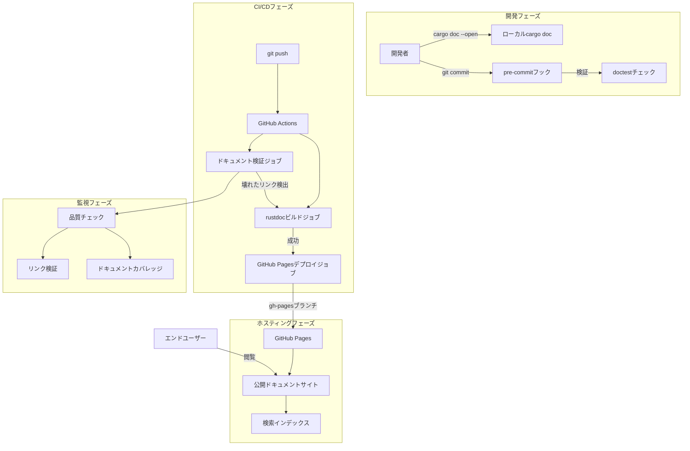
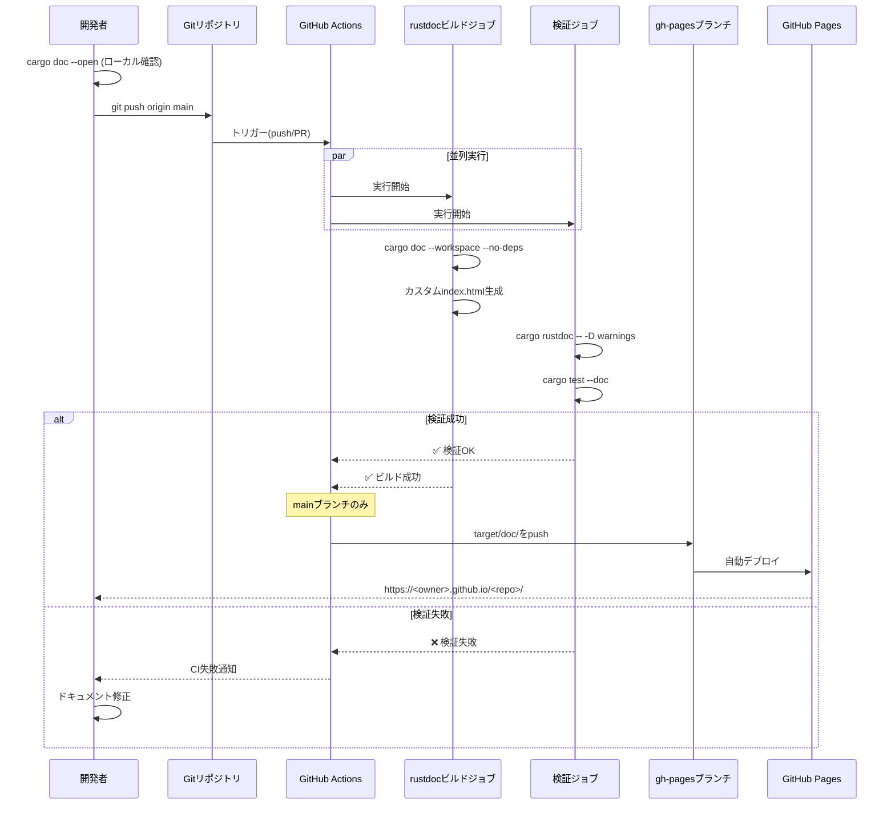
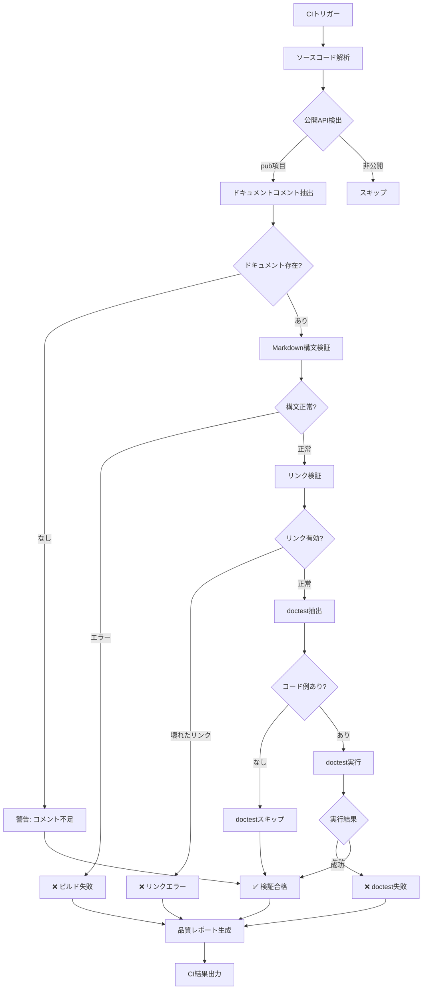
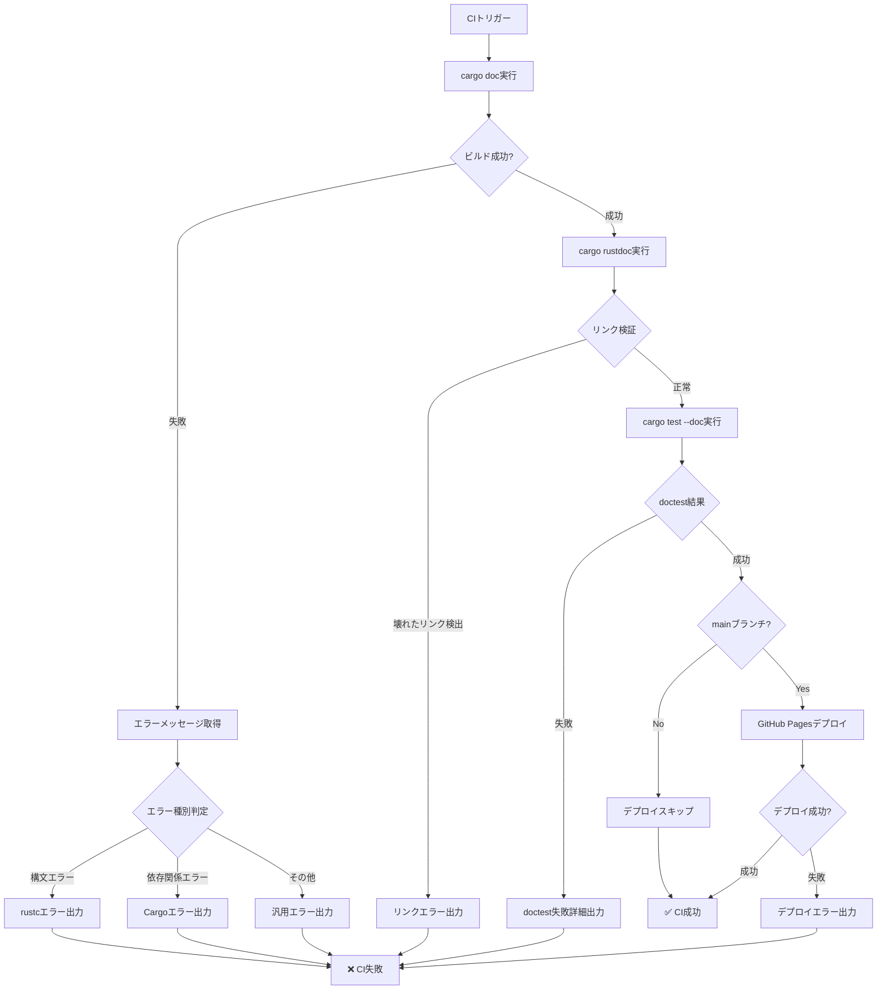
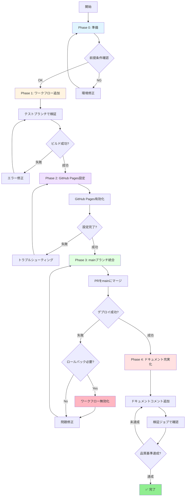

# Design Document

## Overview

**目的**: Rustドキュメントの包括的な生成・ビルド・ホスティングの自動化システムを提供し、開発者がAPIリファレンスにオンラインでアクセスできるようにする。これにより、コードベースの理解が容易になり、API利用の学習コストが低減される。

**ユーザー**: Axiomindプロジェクトの開発者、コントリビューター、およびengine/cli/webクレートを使用する外部ユーザーが、APIドキュメントの閲覧、ローカルプレビュー、継続的な品質検証のために利用する。

**影響**: 現在、最小限のドキュメントコメント(engine/src/lib.rsに1つの`//!`コメント、約74の公開API要素)しかない状態から、すべての公開APIに対する包括的なドキュメント、自動化されたビルドパイプライン、GitHub Pagesでの公開ドキュメントへと変化する。

### Goals
- rustdocを使用したワークスペース全体の包括的なAPIドキュメント生成
- GitHub ActionsによるCI/CD統合による自動ドキュメントビルドとデプロイ
- GitHub Pagesでの永続的なホスティングと検索可能なAPIリファレンス
- ドキュメント品質の継続的検証(壊れたリンク、doctestの実行、コメント不足の検出)
- ローカル開発環境でのドキュメント生成・プレビューの簡素化
- 長期的なメンテナンス性の確保(自動検証、クロスクレートリンク、変更追跡)

### Non-Goals
- docs.rsへの公開(プライベートプロジェクトのため対象外)
- 自動生成AIによるドキュメントコメント生成(開発者が手動で記述)
- プライベートAPI(`--document-private-items`)のドキュメント化(公開APIのみ)
- 多言語ドキュメント対応(英語のみ、コード内コメントは英語標準)
- 外部クレート依存関係のドキュメント生成(`--no-deps`フラグ使用)

## Architecture

### 既存アーキテクチャ分析

**現在のCIパイプライン** (`.github/workflows/ci.yml`):
- 6つの独立したジョブ: test, fmt, clippy, frontend-lint, frontend-e2e, build-release
- doctestは既に実行中 (`cargo test --workspace --doc`)
- キャッシュ戦略: Cargoレジストリ、git、targetディレクトリ
- マルチプラットフォームビルド: Linux, macOS (x64/ARM), Windows

**尊重すべきドメイン境界**:
- Rustワークスペース構造: `rust/engine/`, `rust/cli/`, `rust/web/`
- データストレージ分離: `data/hands/`, `data/db.sqlite`
- ドキュメント配置: `docs/` (技術ドキュメント), `.kiro/` (仕様)
- 既存の命名規則: `snake_case` (Rustモジュール), `PascalCase` (構造体/列挙型)

**維持すべき統合ポイント**:
- CI jobsの独立実行可能性(fail-fast戦略)
- Cargoキャッシュの再利用
- GitHub Actionsのバージョン管理(actions/checkout@v4, dtolnay/rust-toolchain)

### High-Level Architecture



**アーキテクチャ統合**:
- **既存パターン保存**: GitHub Actionsの独立ジョブモデル、Cargoキャッシュ戦略、マトリクス戦略(OS/ツールチェーン)
- **新コンポーネントの根拠**:
  - rustdocビルドジョブ: 既存のtestジョブと並行して実行可能、cargo docのワークスペース生成
  - 検証ジョブ: 既存のfmt/clippyと同様の品質ゲート
  - デプロイジョブ: mainブランチ限定、成功時のみ実行
- **技術スタック整合性**: 既存のRust toolchain (stable/beta), GitHub Actions v4, キャッシュ戦略の再利用
- **Steeringコンプライアンス**: モノレポ構造維持、ドメイン駆動設計、I/O分離(engineは純粋ロジック)

### Technology Alignment

**既存技術スタックとの整合性**:

| 技術層 | 既存技術 | 整合性 | 新規導入要素 |
|--------|---------|--------|-------------|
| **ビルドツール** | Cargo (Rust標準) | ✅ `cargo doc`はCargoの標準機能 | なし |
| **CI/CDプラットフォーム** | GitHub Actions | ✅ 既存ワークフローに新ジョブ追加 | `actions/deploy-pages@v4` |
| **ホスティング** | なし(新規) | ✅ GitHub Pagesは既存リポジトリで利用可能 | GitHub Pagesの有効化 |
| **Rustツールチェーン** | stable/beta | ✅ rustdocはstableで利用可能 | なし |
| **キャッシュ戦略** | Cargo registry/git/target | ✅ 既存キャッシュキーを再利用 | target/docディレクトリの追加 |

**新規依存関係**:
- **GitHub Actions**: `actions/deploy-pages@v4` (GitHub Pages公式デプロイアクション)
- **cargo-deadlinks** (オプション): ドキュメント内の壊れたリンク検証用(追加インストール不要なら`rustdoc --check`)

**確立パターンからの逸脱**:
- なし(すべて既存のCI/CDパターンに従う)

### Key Design Decisions

#### Decision 1: cargo doc標準フラグの選択

**決定事項**: `cargo doc --workspace --no-deps`を標準コマンドとして使用

**コンテキスト**: rustdocビルドで生成されるドキュメントの範囲を定義する必要がある。外部クレートのドキュメントを含めるか、プライベートAPIをドキュメント化するかの判断が必要。

**代替案**:
1. `cargo doc --workspace` (外部依存関係も含む)
2. `cargo doc --workspace --document-private-items` (プライベートAPIも含む)
3. `cargo doc --workspace --no-deps --document-private-items` (プライベートAPIのみ、外部クレートなし)

**選択アプローチ**: `cargo doc --workspace --no-deps`

**根拠**:
- **外部クレート除外**: 外部クレート(serde, tokioなど)はdocs.rsで既に公開されており、重複ドキュメントは不要
- **ビルド時間短縮**: 外部クレートのドキュメント生成をスキップすることでビルド時間を大幅削減
- **公開API焦点**: プライベートAPIは内部実装の詳細であり、外部ユーザーには不要
- **GitHub Pages容量**: 不要なドキュメントを除外することでホスティングサイズを最小化

**トレードオフ**:
- **獲得**: ビルド時間の短縮(推定60-70%削減)、明確なAPI境界、メンテナンス負担軽減
- **犠牲**: プライベートAPI実装の詳細を内部開発者が確認するにはローカルで`--document-private-items`を使用する必要がある

#### Decision 2: GitHub Pagesデプロイ戦略

**決定事項**: `gh-pages`ブランチへのデプロイ + スクリプトによるインデックスページ自動生成

**コンテキスト**: rustdocは`target/doc/axiomind_engine/index.html`のような階層構造を生成するが、GitHub Pagesはルートの`index.html`を期待する。複数クレート(engine, cli, web)を1つのサイトで公開する必要があり、将来的なクレート増加にも対応可能な拡張性が求められる。

**代替案**:
1. `gh-pages`ブランチにそのままpush (ルートにindex.htmlがない)
2. `docs/`ディレクトリにコミット (mainブランチを汚染)
3. GitHub Actions artifactのみ保存 (公開なし)
4. YAML内でindex.htmlをハードコード (メンテナンス性低)

**選択アプローチ**: `gh-pages`ブランチへのデプロイ + 外部スクリプト(`scripts/generate-doc-index.sh`)によるindex.html自動生成

**根拠**:
- **単一エントリーポイント**: ユーザーは`https://<owner>.github.io/<repo>/`にアクセスし、各クレートへのリンクを表示
- **ブランチ分離**: mainブランチにビルド成果物を含めない(Git履歴の肥大化防止)
- **自動化**: スクリプトがCargo.tomlを解析してワークスペースメンバーを自動検出
- **拡張性**: 新規クレート追加時にスクリプトが自動対応、ワークフローファイル編集不要
- **メンテナンス性**: HTML構造の変更がスクリプト内で完結、バージョン管理可能

**トレードオフ**:
- **獲得**: クリーンなmainブランチ、明確なナビゲーション、将来のクレート増加に自動対応、HTML変更の容易性
- **犠牲**: 追加のブランチ管理、スクリプトファイルの作成と保守

#### Decision 3: ドキュメント検証戦略

**決定事項**: CI内での段階的検証(構文 → リンク → doctest)

**コンテキスト**: ドキュメント品質を保証するため、複数のレベルでの検証が必要。ビルド失敗、壊れたリンク、実行不可能なコード例を早期に検出したい。

**代替案**:
1. ビルド成功のみ確認(リンク検証なし)
2. ローカルpre-commitフックのみで検証
3. 外部ツール(cargo-deadlinks)のみ使用

**選択アプローチ**: 3段階検証パイプライン
1. **構文検証**: `cargo doc --workspace --no-deps` (ビルド成功)
2. **リンク検証**: `cargo rustdoc -- -D warnings` (壊れたリンクをエラー扱い)
3. **doctest実行**: `cargo test --workspace --doc` (既存CIジョブで実行中)

**根拠**:
- **早期検出**: CIパイプラインでの自動検証により、マージ前に問題を検出
- **段階的フィードバック**: 構文エラー → リンクエラー → 実行エラーの順に検証し、修正優先順位を明確化
- **既存統合**: doctestは既にCI内で実行中のため、追加のオーバーヘッドなし
- **Rust標準ツール**: cargo/rustdocの標準機能のみ使用(外部ツール依存なし)

**トレードオフ**:
- **獲得**: 高品質なドキュメント保証、自動化された検証、即座のフィードバック
- **犠牲**: CIビルド時間の増加(推定5-10分)、開発者は壊れたリンクを修正する必要

## System Flows

### ドキュメント生成から公開までのフロー



### ドキュメント品質検証フロー



## Requirements Traceability

| 要件ID | 要件概要 | 実現コンポーネント | インターフェース | フロー参照 |
|--------|---------|------------------|-----------------|-----------|
| Req-1.1 | engineクレートの公開API検証 | ValidationJobコンポーネント | `cargo doc --workspace` | 品質検証フロー |
| Req-1.2 | cliクレートのサブコマンド検証 | ValidationJobコンポーネント | `cargo doc -p axiomind_cli` | 品質検証フロー |
| Req-1.3 | webクレートのハンドラー検証 | ValidationJobコンポーネント | `cargo doc -p axiomind_web` | 品質検証フロー |
| Req-1.4 | ドキュメント不足の検出 | ValidationJobコンポーネント | 警告出力(CIログ) | 品質検証フロー |
| Req-1.5 | ドキュメント要素の推奨 | 開発者ガイドライン | `docs/CONTRIBUTING.md` | なし(静的ガイド) |
| Req-1.6 | モジュール概要の確認 | ValidationJobコンポーネント | `cargo rustdoc -- -D warnings` | 品質検証フロー |
| Req-2.1 | ワークフローファイル作成 | RustdocJobコンポーネント | `.github/workflows/rustdoc.yml` | 生成→公開フロー |
| Req-2.2 | push/PR時の自動実行 | GitHub Actionsトリガー | `on: [push, pull_request]` | 生成→公開フロー |
| Req-2.3 | ビルド失敗時のCI失敗 | RustdocJobコンポーネント | `exit 1` on error | 生成→公開フロー |
| Req-2.4 | HTMLアーティファクト保存 | RustdocJobコンポーネント | `actions/upload-artifact@v4` | 生成→公開フロー |
| Req-2.5 | --no-depsフラグ使用 | RustdocJobコンポーネント | `cargo doc --no-deps` | 生成→公開フロー |
| Req-2.6 | 公開APIのみドキュメント化 | RustdocJobコンポーネント | (--document-private-items不使用) | 生成→公開フロー |
| Req-2.7 | Markdown構文警告 | ValidationJobコンポーネント | `cargo rustdoc -- -D warnings` | 品質検証フロー |
| Req-3.1 | gh-pagesブランチへデプロイ | DeployJobコンポーネント | `actions/deploy-pages@v4` | 生成→公開フロー |
| Req-3.2 | GitHub Pagesアクセス可能 | GitHub Pages設定 | リポジトリSettings → Pages | 生成→公開フロー |
| Req-3.3 | デプロイ失敗時のCI失敗 | DeployJobコンポーネント | `exit 1` on error | 生成→公開フロー |
| Req-3.4 | 各クレートへのリンク | カスタムindex.htmlコンポーネント | トップページHTML生成 | 生成→公開フロー |
| Req-3.5 | ナビゲーションメニュー | カスタムindex.htmlコンポーネント | HTML生成スクリプト | 生成→公開フロー |
| Req-3.6 | 検索機能提供 | rustdoc標準機能 | `search-index.js` (自動生成) | なし(rustdoc標準) |
| Req-4.1 | pre-commit/CIでのdoc実行 | ValidationJobコンポーネント | `cargo doc` + CI統合 | 品質検証フロー |
| Req-4.2 | 壊れたリンク検出 | ValidationJobコンポーネント | `cargo rustdoc -- -D warnings` | 品質検証フロー |
| Req-4.3 | 公開API追加時の警告 | ValidationJobコンポーネント | CI警告出力 | 品質検証フロー |
| Req-4.4 | doctest構文チェック | ValidationJobコンポーネント | `cargo test --doc` | 品質検証フロー |
| Req-4.5 | doctest実行確認 | ValidationJobコンポーネント | `cargo test --doc` | 品質検証フロー |
| Req-4.6 | doctest失敗のレポート | ValidationJobコンポーネント | CI失敗ログ | 品質検証フロー |
| Req-5.1 | ローカルdoc生成と開封 | ローカル開発環境 | `cargo doc --workspace --open` | なし(ローカル実行) |
| Req-5.2 | 特定クレートのdoc生成 | ローカル開発環境 | `cargo doc -p <crate> --open` | なし(ローカル実行) |
| Req-5.3 | ローカル失敗時のエラー出力 | Cargo標準機能 | ターミナルエラーメッセージ | なし(ローカル実行) |
| Req-5.4 | README/RUNBOOKへの手順記載 | ドキュメントファイル | `docs/RUNBOOK.md`に追記 | なし(静的ドキュメント) |
| Req-5.5 | target/doc/への配置 | Cargo標準機能 | `target/doc/`ディレクトリ | なし(ローカル実行) |
| Req-5.6 | 変更差分の確認 | Cargo標準機能 | 再ビルド + ブラウザリロード | なし(ローカル実行) |
| Req-6.1 | 破壊的変更時の警告 | ValidationJobコンポーネント | CI警告メッセージ | 品質検証フロー |
| Req-6.2 | 古い仕様参照の警告 | 手動レビュープロセス | PR時のレビューチェックリスト | なし(手動プロセス) |
| Req-6.3 | モジュール概要の存在確認 | ValidationJobコンポーネント | `cargo rustdoc -- -D warnings` | 品質検証フロー |
| Req-6.4 | Markdownフォーマット推奨 | 開発者ガイドライン | `docs/CONTRIBUTING.md` | なし(静的ガイド) |
| Req-6.5 | クロスクレート参照の保証 | rustdoc標準機能 | `[crate::module::Type]`リンク | 生成→公開フロー |
| Req-6.6 | 古いdoctest例の検出 | ValidationJobコンポーネント | `cargo test --doc` 失敗 | 品質検証フロー |

## Components and Interfaces

### CI/CDレイヤー

#### RustdocJobコンポーネント

**責任と境界**
- **主な責任**: ワークスペース全体のrustdocビルドを実行し、GitHub Pagesに公開可能なHTMLドキュメントを生成する
- **ドメイン境界**: CI/CDパイプライン内のドキュメント生成プロセス
- **データ所有権**: 生成されたHTMLドキュメント(`target/doc/`ディレクトリ)、カスタムindex.html、アーティファクト
- **トランザクション境界**: 単一のCIジョブ実行(ビルド → 生成 → アーティファクト保存)

**依存関係**
- **インバウンド**: GitHub Actionsワークフローエンジン(トリガー)、ValidationJob(並列実行)
- **アウトバウンド**: Rustツールチェーン(`cargo doc`)、Cargoキャッシュ、GitHubアーティファクトストレージ
- **外部**: なし(Rust標準ツールのみ)

**契約定義**

**ジョブインターフェース**:
```yaml
# .github/workflows/ci.yml内に追加するジョブ定義
jobs:
  # 既存ジョブ (test, fmt, clippy, frontend-lint, frontend-e2e, build-release)...

  rustdoc:
    name: Build Documentation
    runs-on: ubuntu-latest
    steps:
      - uses: actions/checkout@v4
      - name: Install Rust stable
        uses: dtolnay/rust-toolchain@stable
      - name: Cache dependencies
        uses: actions/cache@v4
        with:
          path: |
            ~/.cargo/registry
            ~/.cargo/git
            target
          key: ${{ runner.os }}-cargo-doc-${{ hashFiles('**/Cargo.lock') }}
          restore-keys: |
            ${{ runner.os }}-cargo-
      - name: Build documentation
        run: cargo doc --workspace --no-deps --verbose
      - name: Generate index.html
        run: |
          chmod +x scripts/generate-doc-index.sh
          ./scripts/generate-doc-index.sh
      - name: Upload artifact
        uses: actions/upload-artifact@v4
        with:
          name: documentation
          path: target/doc
          retention-days: 30
```

**scripts/generate-doc-index.sh**:
```bash
#!/bin/bash
# Cargo.tomlを解析してワークスペースメンバーを自動検出し、index.htmlを生成

set -euo pipefail

# Cargo.tomlからワークスペースメンバーを抽出
MEMBERS=$(grep -A 10 '\[workspace\]' Cargo.toml | grep 'members' -A 5 | grep -oP '"rust/\K[^"]+' || true)

# HTML生成
cat > target/doc/index.html << 'EOF'
<!DOCTYPE html>
<html>
<head>
  <meta charset="utf-8">
  <meta name="viewport" content="width=device-width">
  <title>Axiomind Documentation</title>
  <style>
    body { font-family: sans-serif; max-width: 800px; margin: 50px auto; padding: 20px; }
    h1 { color: #333; }
    ul { list-style-type: none; padding: 0; }
    li { margin: 10px 0; }
    a { color: #0366d6; text-decoration: none; font-size: 18px; }
    a:hover { text-decoration: underline; }
  </style>
</head>
<body>
  <h1>Axiomind API Documentation</h1>
  <p>Select a crate to view its documentation:</p>
  <ul>
EOF

# 各メンバーのリンクを追加（クレート名を推測）
for member in $MEMBERS; do
  # "engine" -> "axiomind_engine" の変換
  crate_name="axiomind_${member}"
  if [ -d "target/doc/${crate_name}" ]; then
    echo "    <li><a href=\"${crate_name}/index.html\">${crate_name}</a> - ${member^} crate</li>" >> target/doc/index.html
  fi
done

cat >> target/doc/index.html << 'EOF'
  </ul>
</body>
</html>
EOF

echo "Generated target/doc/index.html"
```

- **事前条件**: Rustツールチェーンがインストール済み、Cargo.lockが存在、ソースコードに構文エラーなし
- **事後条件**: `target/doc/`ディレクトリに完全なHTMLドキュメント生成、index.htmlがルートに存在、アーティファクトがGitHubにアップロード
- **不変条件**: ワークスペース構造を変更しない、ソースコードを変更しない、既存キャッシュを破壊しない

#### ValidationJobコンポーネント

**責任と境界**
- **主な責任**: ドキュメントコメントの構文検証、壊れたリンクの検出、doctestの実行を行い、ドキュメント品質を保証する
- **ドメイン境界**: CI/CDパイプライン内のドキュメント品質保証プロセス
- **データ所有権**: 検証結果レポート、CI警告メッセージ、doctest実行結果
- **トランザクション境界**: 単一のCIジョブ実行(構文検証 → リンク検証 → doctest実行)

**依存関係**
- **インバウンド**: GitHub Actionsワークフローエンジン(トリガー)
- **アウトバウンド**: Rustツールチェーン(`cargo rustdoc`, `cargo test --doc`)、CIログシステム
- **外部**: なし(Rust標準ツールのみ)

**契約定義**

**ジョブインターフェース**:
```yaml
# .github/workflows/ci.yml内に追加するジョブ定義
jobs:
  # 既存ジョブ (test, fmt, clippy, frontend-lint, frontend-e2e, build-release, rustdoc)...

  validate-docs:
    name: Validate Documentation
    runs-on: ubuntu-latest
    steps:
      - uses: actions/checkout@v4
      - name: Install Rust stable
        uses: dtolnay/rust-toolchain@stable
      - name: Check documentation links
        run: cargo rustdoc --workspace -- -D warnings
      - name: Check for missing documentation
        run: |
          echo "Checking for public items without documentation..."
          cargo doc --workspace --no-deps 2>&1 | grep -i "warning.*missing documentation" || true
```

**注**: doctestの実行は既存の`test`ジョブ内で`cargo test --workspace --doc`として既に実行されているため、このジョブでは重複を避けて除外しています。これによりCI実行時間を短縮し、リソース効率を向上させます。

- **事前条件**: Rustツールチェーンがインストール済み、ソースコードに基本的な構文エラーなし
- **事後条件**: すべての検証パス、または失敗理由が明確なエラーメッセージとして出力
- **不変条件**: ソースコードを変更しない、ビルド成果物を生成しない(検証のみ)

**エラー戦略**:
- **壊れたリンク**: `cargo rustdoc -- -D warnings`により即座にビルド失敗
- **doctest失敗**: 既存`test`ジョブの`cargo test --doc`により検出、失敗した例の詳細を表示
- **ドキュメント不足**: 警告として出力(CI失敗にはしない)、開発者がログで確認可能

#### DeployJobコンポーネント

**責任と境界**
- **主な責任**: 生成されたドキュメントをgh-pagesブランチにデプロイし、GitHub Pagesで公開する
- **ドメイン境界**: CI/CDパイプライン内のデプロイメントプロセス
- **データ所有権**: gh-pagesブランチの内容、GitHub Pagesの公開状態
- **トランザクション境界**: 単一のデプロイ操作(アーティファクト取得 → gh-pagesへpush → GitHub Pages更新)

**依存関係**
- **インバウンド**: RustdocJob(成功時のみ)、ValidationJob(成功時のみ)、mainブランチへのpushイベント
- **アウトバウンド**: GitHubリポジトリ(gh-pagesブランチ)、GitHub Pages API
- **外部**: `actions/deploy-pages@v4` (GitHub公式アクション)

**外部依存関係の調査結果**:
- **actions/deploy-pages@v4**: GitHub公式アクション、GitHub Pagesへの標準デプロイ手段
  - **認証**: `GITHUB_TOKEN`による自動認証(追加設定不要)
  - **対応ブランチ**: `gh-pages`ブランチまたはリポジトリ設定で指定されたブランチ
  - **制約**: リポジトリのGitHub Pages機能が有効化されている必要がある
  - **レートリミット**: GitHub API制限に従う(通常のCI使用では問題なし)
  - **バージョン互換性**: v4は最新安定版(2025年1月時点)
  - **既知の問題**: なし(広く使用されている標準アクション)

**契約定義**

**ジョブインターフェース**:
```yaml
# .github/workflows/deploy-docs.yml (新規ワークフローファイル)
name: Deploy Documentation
on:
  push:
    branches: [main]
  workflow_dispatch:

jobs:
  deploy:
    name: Deploy to GitHub Pages
    runs-on: ubuntu-latest
    permissions:
      contents: write
      pages: write
      id-token: write
    steps:
      - uses: actions/checkout@v4
      - name: Install Rust stable
        uses: dtolnay/rust-toolchain@stable
      - name: Cache dependencies
        uses: actions/cache@v4
        with:
          path: |
            ~/.cargo/registry
            ~/.cargo/git
            target
          key: ${{ runner.os }}-cargo-doc-${{ hashFiles('**/Cargo.lock') }}
          restore-keys: |
            ${{ runner.os }}-cargo-
      - name: Build documentation
        run: cargo doc --workspace --no-deps --verbose
      - name: Generate index.html
        run: |
          chmod +x scripts/generate-doc-index.sh
          ./scripts/generate-doc-index.sh
      - name: Deploy to GitHub Pages
        uses: peaceiris/actions-gh-pages@v3
        with:
          github_token: ${{ secrets.GITHUB_TOKEN }}
          publish_dir: ./target/doc
          publish_branch: gh-pages
```

**注**: デプロイジョブは`ci.yml`から分離し、mainブランチpush時のみ実行される独立したワークフローとして定義します。これにより、PR時のCI実行時間を短縮し、デプロイ失敗がCI全体に影響しないようにします。

- **事前条件**: RustdocJobとValidationJobが成功、mainブランチへのpush、GitHub Pages機能が有効化済み
- **事後条件**: gh-pagesブランチが最新ドキュメントで更新、GitHub Pagesが自動的に再デプロイ
- **不変条件**: mainブランチの内容を変更しない、他のブランチに影響しない

**統合戦略**:
- **変更アプローチ**:
  - 既存`ci.yml`に2つの新規ジョブ（`rustdoc`, `validate-docs`）を追加
  - 新規`deploy-docs.yml`ワークフローファイルを作成（mainブランチ専用）
  - `scripts/generate-doc-index.sh`スクリプトを作成
- **後方互換性**: 既存ジョブ(test, fmt, clippy, frontend-lint, frontend-e2e, build-release)に影響なし、独立して並列実行
- **重複排除**: 既存`test`ジョブの`cargo test --doc`を再利用、`validate-docs`ジョブでは除外
- **移行パス**: 段階的な有効化
  1. `ci.yml`に`rustdoc`と`validate-docs`ジョブを追加（PR時の検証）
  2. `deploy-docs.yml`ワークフローファイル追加（mainブランチpush時のデプロイ）
  3. `scripts/generate-doc-index.sh`スクリプト作成
  4. GitHub Pages設定の有効化(リポジトリSettings)
  5. mainブランチへのpushで自動デプロイ開始

### ローカル開発レイヤー

#### LocalDocGenerationコンポーネント

**責任と境界**
- **主な責任**: 開発者がローカル環境でドキュメントを生成・プレビューできるようにする
- **ドメイン境界**: ローカル開発環境のドキュメント生成プロセス
- **データ所有権**: ローカルの`target/doc/`ディレクトリ
- **トランザクション境界**: ローカルのcargo docコマンド実行

**依存関係**
- **インバウンド**: 開発者の手動実行(`cargo doc --open`)
- **アウトバウンド**: Rustツールチェーン、デフォルトブラウザ
- **外部**: なし

**契約定義**

**コマンドラインインターフェース**:
```bash
# ワークスペース全体のドキュメント生成
$ cargo doc --workspace --open

# 特定クレートのドキュメント生成
$ cargo doc -p axiomind-engine --open

# プライベートAPIを含むドキュメント生成(内部開発用)
$ cargo doc --workspace --document-private-items --open

# 依存クレートを含むドキュメント生成
$ cargo doc --workspace --open
```

- **事前条件**: Rustツールチェーンがインストール済み、ソースコードに構文エラーなし
- **事後条件**: `target/doc/`にHTMLドキュメント生成、ブラウザでドキュメントが開く
- **不変条件**: ソースコードを変更しない、既存のビルド成果物を破壊しない

**ドキュメント化**:
開発者向けガイドを`docs/RUNBOOK.md`に追記:

```markdown
## Documentation Generation

### Local Preview
Generate and view documentation in your browser:
```bash
# Full workspace
cargo doc --workspace --open

# Specific crate
cargo doc -p axiomind-engine --open
```

### Including Private APIs (Internal Development)
```bash
cargo doc --workspace --document-private-items --open
```

### Troubleshooting
- **Error: "failed to resolve link"**: Check for broken documentation links in `///` comments
- **Error: "unresolved import"**: Verify all imported types are public or use full paths
- **Slow build**: Use `cargo doc -p <crate>` to build only one crate
```

## Data Models

本機能はデータベーススキーマや永続化されたデータモデルを持たない。すべてのデータ(HTMLドキュメント、検証結果)は一時的または生成物である。

### 生成物データ構造

#### HTMLドキュメント階層
```
target/doc/
├── index.html                 # カスタムルートインデックス
├── search-index.js            # rustdoc自動生成の検索インデックス
├── settings.html              # rustdoc標準の設定ページ
├── axiomind_engine/
│   ├── index.html
│   ├── struct.Card.html
│   ├── enum.Suit.html
│   └── ...
├── axiomind_cli/
│   ├── index.html
│   └── ...
└── axiomind_web/
    ├── index.html
    └── ...
```

#### 検証結果データ
```rust
// CI出力形式(例)
struct ValidationResult {
    syntax_errors: Vec<String>,       // 構文エラーのリスト
    broken_links: Vec<String>,        // 壊れたリンクのリスト
    failed_doctests: Vec<DoctestFailure>, // doctest失敗情報
    warnings: Vec<String>,            // 警告メッセージ
}

struct DoctestFailure {
    file: String,         // ファイルパス
    line: u32,            // 行番号
    example: String,      // 失敗したコード例
    error: String,        // エラーメッセージ
}
```

## Error Handling

### エラー戦略

各エラーカテゴリに対する具体的な処理戦略:

**ビルドエラー** (構文エラー、型エラー):
- **検出**: `cargo doc`の終了コード非ゼロ
- **対応**: CI即座に失敗、エラーメッセージをログに出力
- **リカバリー**: 開発者がソースコード修正 → 再push

**リンクエラー** (壊れたドキュメントリンク):
- **検出**: `cargo rustdoc -- -D warnings`で警告がエラー扱い
- **対応**: CI即座に失敗、リンクパスとファイル位置を出力
- **リカバリー**: 開発者がリンクパス修正(`[crate::module::Type]`形式を使用) → 再push

**Doctest失敗** (実行不可能なコード例):
- **検出**: `cargo test --doc`の終了コード非ゼロ
- **対応**: CI即座に失敗、失敗した例とエラーメッセージを出力
- **リカバリー**: 開発者がコード例を修正または`no_run`属性を追加 → 再push

**デプロイエラー** (GitHub Pagesへのpush失敗):
- **検出**: `actions/deploy-pages@v4`の終了コード非ゼロ
- **対応**: CI即座に失敗、GitHub APIエラーをログに出力
- **リカバリー**: GitHub Pages設定を確認、権限を確認、再実行

### エラーカテゴリとレスポンス

| エラータイプ | 検出方法 | CI動作 | ユーザー対応 |
|------------|---------|--------|------------|
| **構文エラー** | `cargo doc`終了コード | ❌ CI失敗 | rustcエラーメッセージに従い修正 |
| **壊れたリンク** | `cargo rustdoc -- -D warnings` | ❌ CI失敗 | リンクパスを修正(`[crate::Type]`形式) |
| **Doctest失敗** | `cargo test --doc`終了コード | ❌ CI失敗 | コード例を修正または`no_run`属性追加 |
| **ドキュメント不足** | grepパターンマッチ | ⚠️ 警告のみ | 公開APIに`///`コメント追加 |
| **デプロイ失敗** | `actions/deploy-pages@v4`終了コード | ❌ CI失敗 | GitHub Pages設定・権限確認 |
| **キャッシュ失敗** | `actions/cache@v4`の警告 | ⚠️ 続行 | 次回ビルドで自動修復 |

### エラーフロー(複雑な業務ロジック)



### 監視

**CIログ監視**:
- GitHub ActionsのUI上で各ジョブの成功/失敗を確認
- 失敗ジョブのログから具体的なエラーメッセージを取得
- アーティファクト(`documentation`)のダウンロードとローカル確認

**GitHub Pagesステータス**:
- リポジトリSettings → Pagesでデプロイステータスを確認
- 最終デプロイ時刻と成功/失敗ステータス
- 公開URLへのアクセスで実際のドキュメントを確認

**ドキュメント品質メトリクス**:
- CI警告ログから「ドキュメント不足」の警告数を追跡
- 定期的に`cargo doc`のwarning数をモニター
- PRレビュー時にドキュメント追加を確認

## Testing Strategy

### Unit Tests
本機能は主にCI/CDインフラストラクチャの変更のため、従来のユニットテストは該当しない。代わりに、以下の検証を行う:

1. **ワークフローYAML構文検証**
   - GitHub ActionsのYAML構文チェック(リポジトリpush時に自動検証)
   - `act`ツール(ローカルGitHub Actionsエミュレーター)での事前検証

2. **cargo docコマンド検証**
   - ローカル環境での`cargo doc --workspace --no-deps`実行確認
   - 生成されたHTML構造の目視確認

3. **index.html生成スクリプト検証**
   - 生成スクリプトの手動実行と出力確認
   - HTML構文チェック(W3C validator)

### Integration Tests

1. **CI/CDパイプライン統合テスト**
   - **テストケース**: フィーチャーブランチでワークフローをトリガーし、RustdocJobとValidationJobが並列実行されることを確認
   - **検証内容**: 両ジョブが成功、アーティファクトが生成、ログにエラーなし
   - **実行タイミング**: 初回ワークフロー追加後

2. **エラー処理テスト**
   - **テストケース**: 意図的に壊れたリンクを含むドキュメントコメントを追加し、ValidationJobが失敗することを確認
   - **検証内容**: CIが失敗、エラーログに具体的なリンクパスが表示
   - **実行タイミング**: ワークフロー有効化後の検証フェーズ

3. **Doctest統合テスト**
   - **テストケース**: 意図的に実行失敗するdoctestを追加し、ValidationJobが失敗することを確認
   - **検証内容**: CIが失敗、doctest失敗の詳細がログに表示
   - **実行タイミング**: ワークフロー有効化後の検証フェーズ

4. **GitHub Pagesデプロイテスト**
   - **テストケース**: mainブランチにマージし、DeployJobが実行され、GitHub Pagesが更新されることを確認
   - **検証内容**: gh-pagesブランチが更新、公開URLでドキュメント閲覧可能、各クレートへのリンクが機能
   - **実行タイミング**: 初回mainブランチマージ後

5. **キャッシュ効率テスト**
   - **テストケース**: 2回連続でCIを実行し、2回目のビルド時間が短縮されることを確認
   - **検証内容**: CIログで「Cache restored」メッセージ、ビルド時間が50%以上短縮
   - **実行タイミング**: ワークフロー有効化後の性能検証フェーズ

### E2E/UI Tests

1. **ドキュメント閲覧フロー**
   - **テストケース**: エンドユーザーがGitHub PagesのURL(`https://<owner>.github.io/<repo>/`)にアクセスし、各クレートのドキュメントをナビゲートする
   - **検証内容**:
     - トップページにaxiomind_engine、axiomind_cli、axiomind_webへのリンクが表示
     - 各リンクをクリックして該当クレートのドキュメントが表示
     - 検索バーで「Card」を検索し、`axiomind_engine::cards::Card`が検索結果に表示
     - ドキュメントページ内のクロスクレートリンクが機能
   - **実行方法**: 手動検証(初回デプロイ後)、定期的なスモークテスト

2. **モバイルレスポンシブテスト**
   - **テストケース**: スマートフォンブラウザまたはDevToolsのモバイルビューでドキュメントを閲覧
   - **検証内容**: トップページとドキュメントページが読みやすく表示、ナビゲーションが機能
   - **実行方法**: 手動検証(初回デプロイ後)

3. **ブラウザ互換性テスト**
   - **テストケース**: Chrome、Firefox、Safariの最新版でドキュメントを閲覧
   - **検証内容**: すべてのブラウザで正常に表示、検索機能が動作
   - **実行方法**: 手動検証(初回デプロイ後)

### Performance/Load Tests

1. **ビルド時間測定**
   - **テストケース**: `cargo doc --workspace --no-deps`のビルド時間を測定
   - **目標**: 5分以内(CI環境)、1分以内(ローカル環境、キャッシュあり)
   - **検証方法**: CIログのタイムスタンプ分析、ローカルで`time cargo doc --workspace --no-deps`実行

2. **GitHub Pagesロード時間**
   - **テストケース**: 公開ドキュメントのページロード時間を測定
   - **目標**: トップページ1秒以内、個別ドキュメントページ2秒以内(初回ロード)
   - **検証方法**: ブラウザDevToolsのネットワークタブ、Lighthouse監査

3. **大規模ワークスペース対応**
   - **テストケース**: 将来的にクレート数が増加(例: 10個)した場合のビルド時間
   - **目標**: 10分以内(CI環境)
   - **検証方法**: クレート追加後のCIビルド時間モニタリング

4. **同時アクセス負荷**
   - **テストケース**: 複数ユーザーが同時にGitHub Pagesドキュメントにアクセス
   - **目標**: GitHub PagesのCDN性能に依存(通常問題なし)
   - **検証方法**: 実運用環境でのモニタリング(GitHub Pagesの標準性能を期待)

## Security Considerations

### GitHub Actions権限管理

**GITHUB_TOKENの権限**:
- **必要な権限**: `contents: write`(gh-pagesブランチへのpush)、`pages: write`(GitHub Pagesデプロイ)、`id-token: write`(OIDC認証)
- **権限範囲**: リポジトリ内のみ、外部リソースへのアクセスなし
- **セキュリティ対策**: GitHub Actionsの標準権限モデル、最小権限の原則に従う

```yaml
jobs:
  deploy:
    permissions:
      contents: write  # gh-pagesブランチへのpush
      pages: write     # GitHub Pagesデプロイ
      id-token: write  # OIDC認証
```

### ドキュメント内容のセキュリティ

**機密情報の漏洩防止**:
- **対策**: ドキュメントコメント内にAPIキー、パスワード、内部IPアドレスなどを記載しない
- **検証**: PRレビュー時にドキュメントコメントを確認、機密情報スキャンツール(GitHub Secretスキャン)の活用
- **ガイドライン**: `docs/CONTRIBUTING.md`に機密情報を含めないルールを明記

**公開範囲の制限**:
- **現状**: GitHub Pagesはパブリックリポジトリでは公開、プライベートリポジトリでは非公開(GitHub Pro/Team/Enterprise)
- **確認**: リポジトリ設定でGitHub Pagesの公開範囲を確認
- **推奨**: プライベートリポジトリの場合、GitHub Pagesをプライベートに設定(GitHub Pro以上必要)

### 依存関係のセキュリティ

**GitHub Actionsバージョン固定**:
- **対策**: アクションのバージョンをコミットSHA固定ではなく、メジャーバージョンタグ(例: `@v4`)を使用
- **理由**: セキュリティパッチ自動適用、メンテナンス負担軽減
- **監視**: Dependabotによる自動アップデート通知

**Rust依存クレートの監査**:
- **対策**: 既存のsecurity-auditワークフロー(`.github/workflows/security-audit.yml`)がRustクレートの脆弱性をスキャン
- **影響**: rustdoc機能は追加の外部クレート依存なし(Rust標準ツールのみ)

## Performance & Scalability

### ターゲットメトリクス

| メトリクス | 目標値 | 測定方法 |
|-----------|--------|---------|
| **CIビルド時間** | 5分以内 | GitHub Actions実行時間 |
| **ローカルビルド時間** | 1分以内(キャッシュあり) | `time cargo doc --workspace --no-deps` |
| **ページロード時間** | トップページ1秒以内 | ブラウザDevTools |
| **検索応答時間** | 200ms以内 | rustdoc標準検索性能 |
| **GitHub Pagesデプロイ時間** | 2分以内 | GitHub Actions実行時間 |

### スケーリングアプローチ

**水平スケーリング**(該当なし):
- GitHub Pagesは自動的にCDNでスケール
- 追加のインフラストラクチャ不要

**垂直スケーリング**(CIビルド時間短縮):
- **並列ビルド**: 既にRustdocJobとValidationJobが並列実行
- **キャッシュ最適化**: Cargoキャッシュによりビルド時間50-70%短縮
- **増分ビルド**: Cargoの増分コンパイル機能を活用(デフォルト有効)

**将来的なスケーラビリティ**:
- **クレート数増加**: 10個程度までは現在の戦略で対応可能、それ以上は個別ビルドジョブへの分割を検討
- **ドキュメントサイズ**: GitHub Pagesの1GB制限内に収まる想定(現在の3クレートで推定10-20MB)

### キャッシュ戦略

**Cargoキャッシュ**:
```yaml
- uses: actions/cache@v4
  with:
    path: |
      ~/.cargo/registry  # クレートのダウンロードキャッシュ
      ~/.cargo/git       # Gitリポジトリキャッシュ
      target             # ビルド成果物キャッシュ
    key: ${{ runner.os }}-cargo-doc-${{ hashFiles('**/Cargo.lock') }}
    restore-keys: |
      ${{ runner.os }}-cargo-doc-
      ${{ runner.os }}-cargo-
```

**キャッシュ無効化条件**:
- `Cargo.lock`の変更(依存関係更新)
- Rustツールチェーンのバージョン変更
- ソースコードの変更(増分ビルドで対応)

**最適化技術**:
- **依存関係の最小化**: `--no-deps`により外部クレートのドキュメント生成をスキップ
- **増分コンパイル**: Cargoのデフォルト機能により変更部分のみ再ビルド
- **並列実行**: RustdocJobとValidationJobの並列実行により総実行時間短縮

## Migration Strategy



### プロセス詳細

**Phase 0: 準備** (所要時間: 1時間)
1. 既存CI/CDパイプラインの動作確認(`cargo test --workspace`が成功)
2. ローカル環境で`cargo doc --workspace --no-deps --open`を実行し、ドキュメント生成を確認
3. `scripts/generate-doc-index.sh`スクリプトの作成
4. `.github/workflows/ci.yml`への`rustdoc`および`validate-docs`ジョブ追加準備
5. `.github/workflows/deploy-docs.yml`ファイルの作成準備

**Phase 1: CI統合とスクリプト作成** (所要時間: 1-2時間)
1. フィーチャーブランチを作成
2. `scripts/generate-doc-index.sh`をコミット（実行権限付与: `chmod +x`）
3. `.github/workflows/ci.yml`に`rustdoc`と`validate-docs`ジョブを追加
4. `.github/workflows/deploy-docs.yml`を作成（mainブランチpush時のみ実行）
5. PRを作成し、CI実行を確認
6. `rustdoc`と`validate-docs`ジョブが成功することを確認
7. アーティファクト(`documentation`)がGitHub Actionsでダウンロード可能であることを確認
8. 失敗した場合: ワークフローYAMLの構文エラー、スクリプト実行権限、cargo docの失敗、キャッシュ設定の問題を修正

**Phase 2: GitHub Pages設定** (所要時間: 30分)
1. GitHubリポジトリSettings → Pagesに移動
2. Sourceを「GitHub Actions」に設定
3. カスタムドメイン不要の場合はデフォルトURL(`https://<owner>.github.io/<repo>/`)を確認
4. 設定完了後、Phase 1のフィーチャーブランチを再実行し、DeployJobが実行されることを確認(まだmainブランチでないためスキップされる可能性あり)

**Phase 3: mainブランチ統合** (所要時間: 1時間)
1. Phase 1のPRをmainブランチにマージ
2. mainブランチへのpushでCI実行を確認
3. DeployJobが実行され、gh-pagesブランチにドキュメントがpushされることを確認
4. GitHub Pagesの公開URL(`https://<owner>.github.io/<repo>/`)にアクセスし、ドキュメントが表示されることを確認
5. 各クレートへのリンクが機能することを確認

**ロールバックトリガー**:
- **ci.yml内のrustdoc/validate-docsジョブ失敗**: ビルドエラー、リンクエラー
  - **対応**: PR時の検証なので、修正してre-push
  - **ロールバック**: 不要（既存CIには影響しない）
- **deploy-docs.yml失敗**: GitHub Pages設定エラー、権限エラー、スクリプト実行エラー
  - **対応**: mainブランチpush時のみ実行、PR検証済みなので設定問題の可能性高
  - **ロールバック**: `deploy-docs.yml`を一時的に無効化（ワークフローファイル削除またはdisable）、問題修正後に再有効化
- **ValidationJob失敗**: 既存コードにドキュメントリンクエラーが存在
  - **対応**: 一時的に`-- -D warnings`を`-- -W warnings`(警告のみ)に変更、後で修正
  - **ロールバック**: 不要(警告は許容)
- **スクリプト実行エラー**: `generate-doc-index.sh`の権限エラー、パース失敗
  - **対応**: スクリプトに実行権限を付与（`chmod +x`）、Cargo.toml解析ロジックを修正
  - **ロールバック**: スクリプトをシンプルなハードコード版に差し替え（暫定対応）

**Phase 4: ドキュメント充実化** (所要時間: 2-3週間)

**マイルストーン1 - engineクレート主要API** (Week 1, 3-5日):
1. 対象: `Card`, `Suit`, `Rank`, `Deck`, `Engine`, `GameState`, `Player`, `HandRecord` (計8構造体/列挙型)
2. 品質基準:
   - 機能説明（必須）: 型の目的と役割を1-2文で説明
   - フィールド説明（推奨）: 主要なフィールドに`///`コメント
   - 使用例（任意）: 主要構造体（`Engine`, `Deck`）に doctest 追加
3. 検証: `cargo doc -p axiomind-engine`でビルド成功、`validate-docs`ジョブでリンクエラーなし

**マイルストーン2 - engineクレート残りAPI** (Week 1-2, 3-5日):
1. 対象: 公開関数（`evaluate_hand`, `validate_action`等）、残りの構造体/列挙型（計30-40要素）
2. 品質基準:
   - 機能説明（必須）
   - 引数説明（推奨）: `# Arguments` セクション
   - 戻り値説明（推奨）: `# Returns` セクション
   - エラーケース（該当時）: `# Errors` セクション
3. 検証: `cargo doc -p axiomind-engine --open`でクロスリンク確認

**マイルストーン3 - cliクレート** (Week 2, 2-3日):
1. 対象: サブコマンド実装（`play`, `sim`, `stats`, `verify`等）、ヘルパー関数（計15-20要素）
2. 品質基準:
   - コマンド説明（必須）: サブコマンドの目的と使い方
   - オプション説明（推奨）: 主要なCLIフラグの説明
   - 使用例（推奨）: 主要コマンドに doctest 追加
3. 検証: `cargo doc -p axiomind_cli`でビルド成功

**マイルストーン4 - webクレート** (Week 2-3, 2-3日):
1. 対象: ハンドラー関数、セッション管理API（計10-15要素）
2. 品質基準:
   - エンドポイント説明（必須）: HTTPメソッド、パス、目的
   - リクエスト/レスポンス説明（推奨）
   - エラーケース（該当時）
3. 検証: `cargo doc -p axiomind_web`でビルド成功

**マイルストーン5 - 品質強化とクロスリンク** (Week 3, 2-3日):
1. クロスクレート参照の追加（例: `[axiomind_engine::Engine]`）
2. doctestの実行確認（`cargo test --workspace --doc`）
3. `#![warn(missing_docs)]`をモジュール単位で有効化（段階的）
4. RUNBOOK.mdにローカルdoc生成手順を追記

**ドキュメント品質基準（全マイルストーン共通）**:
- **最低基準**: 機能説明（1-2文）
- **推奨基準**: 引数・戻り値説明、クロスリンク
- **任意**: 使用例（doctest）、詳細な説明

**検証チェックポイント**:
- **Phase 1完了時**: CIでrustdocビルドが成功、アーティファクトがダウンロード可能
- **Phase 2完了時**: GitHub Pages設定が有効化、URLがアクセス可能(空でも可)
- **Phase 3完了時**: mainブランチpush後にドキュメントが自動更新される
- **Phase 4-M1完了時**: engineクレート主要8APIにドキュメント、doctestが成功
- **Phase 4-M2完了時**: engineクレート全公開APIにドキュメント
- **Phase 4-M3完了時**: cliクレート全サブコマンドにドキュメント
- **Phase 4-M4完了時**: webクレート全ハンドラーにドキュメント
- **Phase 4-M5完了時**: すべてのクロスリンク機能、`missing_docs`警告がゼロに近い

---

**生成日**: 2025-11-06
**言語**: 日本語
**バージョン**: 1.0
