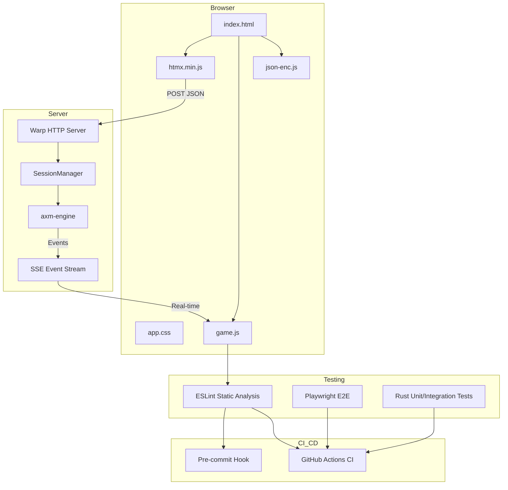
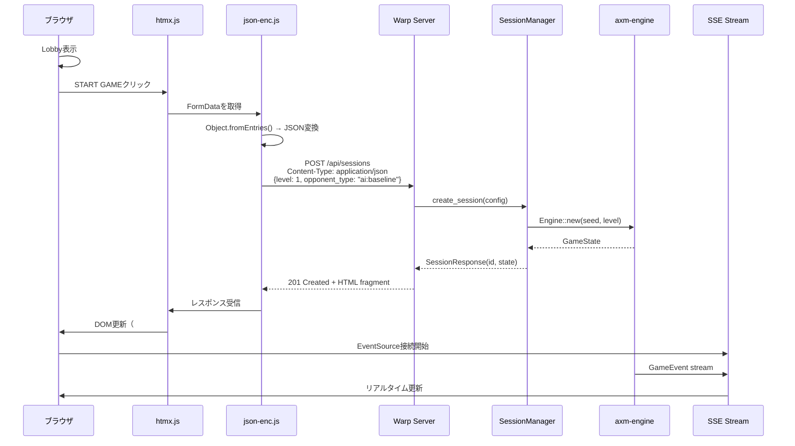
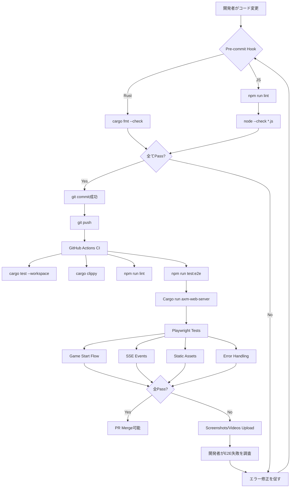
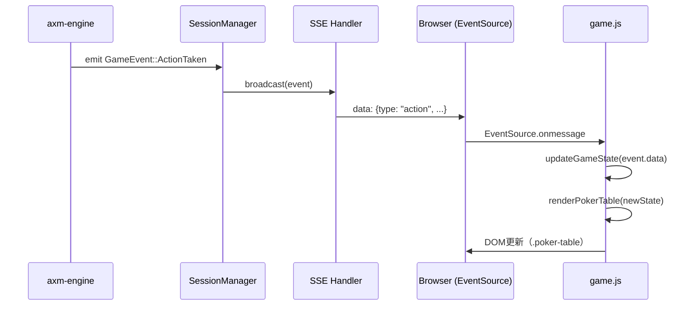
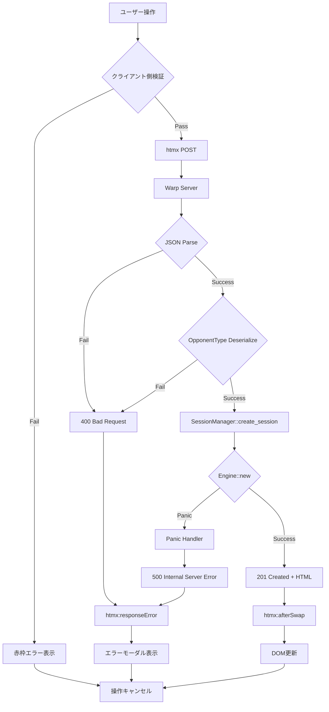
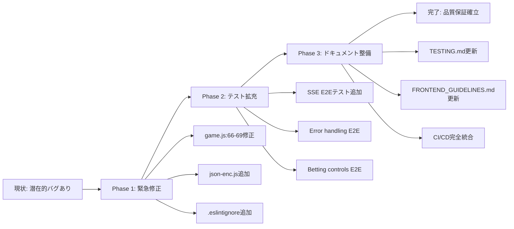

# 技術設計書

## 概要

本設計書は、E2Eテストの導入により発覚したWebサーバー実装の重大な問題を修正し、全ての機能を実際のブラウザ環境で完全に動作させるための技術設計を定義します。

**目的**: 2025-11-02に発生したインシデント（178個のRustテスト全合格にもかかわらず実ブラウザで完全に動作しなかった問題）の根本原因を解決し、継続的な品質保証プロセスを確立する。

**対象ユーザー**: 開発者、QAエンジニア、プロジェクトマネージャー

**影響**: 既存のフロントエンド統合基盤（htmx、SSE、Playwright）を強化し、JavaScript静的解析とブラウザE2Eテストを開発プロセスの必須ステップとして確立します。

### ゴール

- JavaScript構文エラー（game.js:66-69）を修正し、将来的な構文エラーをESLintで防止
- htmx Content-Type問題を解決し、JSON送信を標準化
- ブラウザE2EテストをCI/CDパイプラインに統合し、フロントエンド品質を保証
- テスト駆動開発プロセスを確立し、「Rustテストは合格するがブラウザでは動作しない」問題を防止
- ドキュメントを更新し、フロントエンド開発のベストプラクティスを標準化

### 非ゴール

- game.jsの大規模リファクタリング（ES modules導入、モジュール分割）→ 別specification `web-server-refactor`として分離
- Rustバックエンドコードの変更（既存APIは正常に動作）
- 新機能の追加（バグ修正とテスト基盤強化のみ）
- パフォーマンス最適化（機能修復に集中）

## アーキテクチャ

### 既存アーキテクチャ分析

**現在の統合パターン**:
```
Browser UI (htmx + JavaScript)
    ↓ HTTP POST (form-urlencoded / JSON)
Rust Web Server (Warp)
    ↓ API handlers (game.rs)
Session Manager (GameSessionState)
    ↓ Engine orchestration
axm-engine (Core game logic)
    ↓ Event emission
SSE Stream → Browser (Real-time updates)
```

**発覚した問題点**:
1. **JavaScript構文エラー**: `game.js:66-69`でテンプレートリテラル内の引用符混在（ESLintパース失敗の原因）
2. **htmx統合ギャップ**: `hx-ext="json-enc"`が宣言されているが、拡張スクリプトが未ロード
3. **テスト階層の欠如**: Rustテスト（178個）は全合格だが、ブラウザ統合テストは存在しなかった
4. **ESLint実行阻害**: ESLintは設定済み（`.eslintrc.json`に`no-template-curly-in-string`ルール含む）、pre-commitフックも存在するが、構文エラーによりファイル全体のパースが失敗している

**技術的制約**:
- Rust APIエンドポイントは`application/json`を期待（`CreateSessionRequest`はJSON deserialize）
- htmxはデフォルトで`application/x-www-form-urlencoded`を送信
- 既存の178個のRustテストとの互換性を維持
- SSEイベントストリームはWebSocket非対応環境で必須

### 高レベルアーキテクチャ



**アーキテクチャ統合**:
- **既存パターンの保持**: Event-driven SSE、htmx server-driven UI、Rust API層の分離
- **新規コンポーネントの理由**:
  - `json-enc.js`: htmxのJSON送信機能を有効化（既存form送信をJSONに変換）
  - `ESLINT in pre-commit`: 構文エラーをコミット前に検出（手動実行の脆弱性を排除）
  - `Playwright E2E`: ブラウザ統合の実際の動作を検証（Rustテストでは不可能）
- **技術スタック整合性**: 既存のRust/Warp/htmx/Tokioスタックを維持、Node.js toolingは開発時のみ使用
- **Steering準拠**: モノレポ構造維持、バックエンド/フロントエンド境界の明確化、再現可能性（E2Eテストもシード固定可能）

### 技術整合性とキー設計決定

**既存技術スタックとの整合性**:
- **Frontend**: htmx 1.9.12（既存）、Vanilla JavaScript（ES2021）、ESLint 8.56.0（設定済み）
- **Backend**: Rust stable、Warp 0.3、Tokio async
- **Testing**: Cargo test（既存178テスト）、Playwright 1.41.0（新規導入済み）
- **CI/CD**: GitHub Actions（`.github/workflows/ci.yml`に既存jobs追加）

**新規依存関係**:
- `htmx.org/dist/ext/json-enc.js` (CDN): htmxのJSON送信拡張（約2KB）
- ESLint構文エラー修正: `game.js:66-69`（既存の`no-template-curly-in-string`ルールが機能するように）

**既存パターンからの逸脱なし**: 全てのコンポーネントは既存のmonorepo構造とアーキテクチャ境界を尊重します。

#### 設計決定 1: htmx JSON送信の標準化

**決定**: htmx `hx-ext="json-enc"`拡張を使用し、全てのAPI POSTリクエストで`application/json`を送信

**コンテキスト**:
- Rust APIは`CreateSessionRequest`で`serde_json::from_str()`を使用し、JSON deserializeを期待
- htmxはデフォルトで`application/x-www-form-urlencoded`を送信
- 現在の実装では`hx-ext="json-enc"`が宣言されているが、拡張スクリプトが未ロード

**代替案**:
1. **Fetch APIで置き換え**: htmxを使わず、全てのフォーム送信を`fetch()`で実装
2. **Rustサーバー側で両方サポート**: `application/x-www-form-urlencoded`もパース可能に変更
3. **htmx json-enc拡張の適切なロード**: 既存の宣言を活かし、スクリプトを追加

**選択したアプローチ**: オプション3（htmx json-enc拡張）

- **動作メカニズム**:
  1. `index.html`の`<head>`に`<script src="https://unpkg.com/htmx.org@1.9.12/dist/ext/json-enc.js"></script>`を追加
  2. `lobby()`ハンドラで生成されるフォームに`hx-ext="json-enc"`属性を維持（既存コード）
  3. htmxが自動的にFormDataをJSONに変換し、Content-Typeを設定

**根拠**:
- 既存のhtmx統合を最大限活用（Req 11: htmx統合の正規化）
- コード変更が最小限（HTMLに1行追加のみ）
- Rustサーバー側のJSON専用APIを維持（型安全性の保持）
- フロントエンド/バックエンド境界が明確（htmx拡張がシリアライゼーション責任を持つ）

**トレードオフ**:
- 利点: htmxのdeclarative UIパターンを維持、バックエンド変更不要、CDNから配信（ビルド不要）
- 欠点: 外部CDN依存（オフライン開発は手動ダウンロード必要）、htmx特有の知識が必要

#### 設計決定 2: JavaScript構文エラーの修正と防止戦略

**決定**: `game.js:66-69`の構文エラーを修正し、既存のESLint設定が正常に動作するようにする

**事前調査の結果** (2025-11-02):
- **ESLint設定は既に完備**: `.eslintrc.json` line 17に`"no-template-curly-in-string": "error"`ルールが既に含まれている
- **Pre-commitフックも存在**: `.githooks/pre-commit`でESLintが実行される設定になっている
- **CI/CDも統合済み**: `.github/workflows/ci.yml`の`frontend-lint` jobで既にESLintが実行されている
- **問題の根本原因**: `game.js:66-69`の構文エラー（Unterminated string constant）によりESLintがファイル全体をパースできず、他のルールチェックも実行されていない

**コンテキスト**:
- `game.js:66-69`でテンプレートリテラル内に不正な引用符混在（バッククォート内でシングルクォート使用）
- この構文エラーにより、ESLint全体がパース失敗（151エラー中1件が構文エラー、残り150件はgame.test.jsのJest設定不足）
- 構文エラー修正後は、既存のESLint設定が自動的に機能する

**実装アプローチ**:
1. **Phase 0（事前修正）**:
   - `game.js:66-69`の構文エラー修正（シングルクォート `'` → バッククォート `` ` ``）
   - `.eslintignore`を作成し、`game.test.js`と`htmx.min.js`を除外

2. **Phase 1（検証）**:
   - `npm run lint`を実行し、エラーゼロを確認
   - Pre-commitフックが正常に動作することを確認
   - CI/CDパイプラインでESLintが成功することを確認

**根拠**:
- 既存の自動化基盤を活用（新規ツール導入不要）
- 最小限の変更で最大の効果（1箇所の構文エラー修正のみ）
- 既存のno-template-curly-in-stringルールが将来的な同様のエラーを防止

**トレードオフ**:
- 利点: 即座に修正可能（15分）、既存ツールチェーン活用、ゼロ追加依存
- 欠点: TypeScriptほど強力な型チェックは不可（将来的な改善として別specで検討）

#### 設計決定 3: テストピラミッドの完成

**決定**: Playwright E2Eテストを必須レイヤーとして導入し、「Rustテスト合格 ≠ アプリ動作」問題を解決

**コンテキスト**:
- 178個のRustテストが全合格したにもかかわらず、ブラウザでUI完全不動作
- RustテストはHTTPレスポンスとJSON構造のみ検証（JavaScript実行、htmx統合、DOM更新は未検証）
- Playwrightは既にインストール済み（`package.json`、`playwright.config.js`）だが、テストが1ファイルのみ

**代替案**:
1. **Cypressの採用**: より成熟したE2Eフレームワーク
2. **Seleniumの使用**: 業界標準のブラウザ自動化
3. **Playwright拡張**: 既存セットアップを活用し、テストケースを拡充

**選択したアプローチ**: オプション3（Playwright拡張）

- **動作メカニズム**:
  1. `tests/e2e/`に包括的テストスイートを追加（game-start、sse-events、error-handling、static-assets）
  2. CI（`.github/workflows/ci.yml`）の`frontend-e2e` jobで自動実行（既存）
  3. `playwright.config.js`でサーバー自動起動、スクリーンショット/ビデオ記録を設定（既存）
  4. Content-Typeヘッダー、JavaScript consoleエラー、API payloadをインターセプト検証

**根拠**:
- Playwrightは既にセットアップ完了（追加インストール不要）
- マルチブラウザサポート（Chromium、Firefox、WebKit）
- 高速実行とCI統合（GitHub Actions公式サポート）
- APIインターセプト機能でContent-Type問題を検出可能

**トレードオフ**:
- 利点: 実ブラウザで完全な統合テスト、スクリーンショット/トレースでデバッグ容易、既存投資活用
- 欠点: E2E実行時間増加（約30-60秒/テストスイート）、テストメンテナンスコスト

## システムフロー

### シーケンス図: ゲーム開始フロー（修正後）



**重要な修正点**:
1. **json-enc.js介入**: FormDataをJSONに自動変換（以前は欠如）
2. **Content-Type正規化**: `application/json`を保証（以前は`application/x-www-form-urlencoded`）
3. **OpponentType形式**: ✅ **検証完了** - `"ai:baseline"`文字列として正しく送信されている（`rust/web/src/handlers/game.rs` line 158のselectタグで定義、E2Eテストで既に検証済み）

### プロセスフロー: E2Eテスト実行フロー



### イベントフロー: SSEリアルタイム更新



**E2Eテストでの検証ポイント**:
- SSE接続の確立（EventSource正常初期化）
- イベント受信タイミング（アクション後500ms以内）
- DOM更新の正確性（pot金額、カード表示、プレイヤーステータス）

## 要件トレーサビリティ

| 要件ID | 要件概要 | コンポーネント | インターフェース | フロー |
|-------|---------|--------------|--------------|-------|
| Req 1 | JavaScript構文エラー修正 | `game.js`, ESLint | `renderPokerTable()` 修正 | Pre-commit Hook |
| Req 2 | htmx Content-Type解決 | `index.html`, `json-enc.js`, `lobby()` | htmx拡張ロード | Game Start Flow |
| Req 3 | ESLint完全実装 | `.eslintrc.json`, pre-commit script | `npm run lint` | Pre-commit Hook |
| Req 4 | ブラウザE2E実装 | Playwright tests, `game-flow.spec.js` | `test('complete game flow')` | E2E Test Flow |
| Req 5 | 統合検証 | E2E tests, API interceptors | `page.waitForRequest()` | Game Start Flow |
| Req 6 | テスト駆動プロセス | CI/CD pipeline, documentation | GitHub Actions jobs | E2E Test Flow |
| Req 7 | 静的アセット配信検証 | Warp static handler, E2E tests | `static_handler.rs`, Content-Type tests | Static Assets Test |
| Req 8 | ドキュメント更新 | `TESTING.md`, `FRONTEND_GUIDELINES.md` | Markdown documentation | N/A |
| Req 9 | 品質保証プロセス | Pre-commit hook, CI pipeline | `.githooks/pre-commit`, `.github/workflows/ci.yml` | E2E Test Flow |
| Req 10 | エラーハンドリング強化 | E2E error tests, console monitoring | `page.on('console')`, error response tests | Error Handling Test |
| Req 11 | htmx統合正規化 | `lobby()`, htmx patterns | `hx-post`, `hx-vals`, `hx-ext` | Game Start Flow |

## コンポーネントとインターフェース

### フロントエンド層

#### コンポーネント: game.js (JavaScript UI Controller)

**責任と境界**:
- **主要責任**: ポーカーテーブルのDOM構築、ベット入力の検証、htmxイベントリスニング
- **ドメイン境界**: ブラウザUI層（サーバー側ロジックに依存せず、状態表示とユーザー入力のみ）
- **データ所有権**: 一時的なUI状態のみ（カード表示フラグ、ベット入力値）。永続的ゲーム状態はサーバー管理
- **トランザクション境界**: なし（UIのみ、永続化なし）

**依存関係**:
- **Inbound**: index.html（スクリプトロード）、SSE events（リアルタイム更新）
- **Outbound**: htmx（API呼び出し）、DOM API（レンダリング）
- **External**: なし（Pure Vanilla JavaScript）

**契約定義**:

**サービスインターフェース**:
```typescript
// game.js Public API
interface GameUIController {
  // Card rendering
  formatCard(card: string): string;
  renderCard(card: string): string;

  // Table rendering
  renderPokerTable(state: GameStateResponse): string;

  // Betting controls
  renderBettingControls(state: GameStateResponse): string;
  getBetAction(type: 'call' | 'raise' | 'allin'): PlayerAction;

  // Validation
  validateBetAmount(amount: number, min: number, max: number): boolean;
}

// Input/Output Types
type Card = string; // "As", "Kh", "Tc", etc.

interface GameStateResponse {
  session_id: string;
  players: PlayerState[];
  board: Card[];
  pot: number;
  current_player: number;
  available_actions: AvailableAction[];
}

interface PlayerState {
  id: number;
  stack: number;
  position: 'button' | 'big_blind';
  hole_cards?: Card[];
  is_active: boolean;
}

interface AvailableAction {
  action_type: 'fold' | 'check' | 'call' | 'raise' | 'allin';
  amount?: number;
  min?: number;
  max?: number;
}

interface PlayerAction {
  action_type: 'fold' | 'check' | 'call' | 'raise' | 'allin';
  amount?: number;
}
```

**前提条件**:
- `state`パラメータは有効なJSON（サーバーから受信）
- `Card`文字列は`[RANK][SUIT]`形式（例: "As" = Ace of Spades）
- `available_actions`は現在のプレイヤーに対して有効なアクションのみ

**事後条件**:
- `renderPokerTable()`: 有効なHTML文字列を返す（`.poker-table`クラスを持つdiv）
- `renderBettingControls()`: htmx属性付きボタン群を返す（`hx-post`, `hx-vals`）
- `validateBetAmount()`: 範囲外の場合`false`、警告メッセージを表示

**不変条件**:
- カードは常に大文字ランク + 小文字スートで表現
- 金額は常に正の整数
- htmx属性は常に有効なJSON形式の`hx-vals`を生成

**状態管理**:
- **状態モデル**: ステートレス（全ての状態はサーバーから受信）
- **永続化**: なし（サーバー側で管理）
- **並行性制御**: なし（シングルスレッド実行）

**統合戦略**:
- **修正アプローチ**: 既存コードを拡張（`game.js:66-69`のテンプレートリテラル修正のみ）
- **後方互換性**: htmx統合パターンを維持、既存SSEイベント処理を保持
- **移行パス**: 段階的改善（本修正後、将来的にES modulesへ移行可能）

#### コンポーネント: htmx json-enc Extension

**責任と境界**:
- **主要責任**: FormDataをJSONに自動変換し、`Content-Type: application/json`でPOST送信
- **ドメイン境界**: htmxとRust API間のシリアライゼーション層
- **データ所有権**: 送信時のフォームデータ（一時的）
- **トランザクション境界**: なし（変換のみ）

**依存関係**:
- **Inbound**: htmx（`hx-ext="json-enc"`属性を持つ要素）
- **Outbound**: Warp Server（`/api/sessions` endpoint）
- **External**: htmx.org CDN（スクリプト配信）

**契約定義**:

**APIコントラクト**:
| Method | Endpoint | Request | Response | Errors |
|--------|----------|---------|----------|--------|
| POST | /api/sessions | CreateSessionRequest (JSON) | SessionResponse (201) | 400 (Invalid JSON), 500 (Server Error) |

**Request Schema**:
```typescript
interface CreateSessionRequest {
  seed?: number; // Optional, for reproducibility
  level?: number; // 1-20, default 1 (levels 21+ are treated as level 20)
  opponent_type?: OpponentType; // "human" | "ai:baseline" | "ai:aggressive"
}

type OpponentType = string; // Format: "human" or "ai:<name>"
```

**Response Schema**:
```typescript
interface SessionResponse {
  session_id: string; // UUID v4
  config: GameConfig;
  state: GameStateResponse;
}

interface GameConfig {
  seed: number | null;
  level: number;
  opponent_type: OpponentType;
}
```

**Errors**:
- `400 Bad Request`: Invalid JSON format, missing required fields
- `415 Unsupported Media Type`: Content-Type not `application/json`
- `500 Internal Server Error`: Session creation failure

**前提条件**:
- `json-enc.js`が`index.html`でロード済み
- フォーム要素に`hx-ext="json-enc"`属性が存在

**事後条件**:
- リクエストヘッダーに`Content-Type: application/json`が設定される
- FormDataが`{"key": "value"}`形式のJSONに変換される
- Rustサーバーが正常にデシリアライズ可能

**統合戦略**:
- **修正アプローチ**: `index.html`に1行追加（`<script src="...json-enc.js"></script>`）
- **後方互換性**: 既存の`hx-ext`属性をそのまま活用
- **移行パス**: 即座に有効化、段階的rollback不要

### テスト層

#### コンポーネント: Playwright E2E Test Suite

**責任と境界**:
- **主要責任**: 実ブラウザ環境での完全な統合テスト、Content-Type検証、JavaScript実行監視
- **ドメイン境界**: エンドツーエンドテスト層（全スタックを検証）
- **データ所有権**: テスト結果、スクリーンショット、トレースログ
- **トランザクション境界**: テストセッション単位（各テストは独立したサーバーインスタンス）

**依存関係**:
- **Inbound**: CI pipeline（GitHub Actions）、開発者ローカル実行（`npm run test:e2e`）
- **Outbound**: Warp Server（`cargo run`で起動）、Chromium browser
- **External**: Playwright Test framework（`@playwright/test`）

**契約定義**:

**テストコントラクト**:
```typescript
// tests/e2e/game-flow.spec.js
interface E2ETestSuite {
  // Critical user flows
  testCompleteGameFlow(): Promise<void>;
  testStaticAssetLoading(): Promise<void>;
  testHealthCheck(): Promise<void>;

  // Integration points
  testContentTypeHeaders(): Promise<void>;
  testAPIPayloadFormat(): Promise<void>;
  testJavaScriptExecution(): Promise<void>;

  // Error handling
  testAPIErrorResponse(): Promise<void>;
  testInvalidInputHandling(): Promise<void>;
}
```

**テスト実行フロー**:
1. **Setup**: `playwright.config.js`で`webServer`起動（`cargo run --release -p axm_web`）
2. **Navigation**: `page.goto('http://127.0.0.1:8080')`
3. **Interaction**: `page.click()`, `page.fill()`, `page.waitForSelector()`
4. **Verification**: `expect(locator).toBeVisible()`, API interceptors
5. **Teardown**: スクリーンショット/ビデオ保存、サーバー停止

**Batch/Job Contract**:
- **Trigger**: Git push（CI）、手動実行（`npm run test:e2e`）
- **Input**: `tests/e2e/*.spec.js`ファイル、Rust binary（axm-web-server）
- **Output**: HTML report（`playwright-report/`）、JUnit XML（CI統合）、artifacts（screenshots/videos）
- **Idempotency**: 各テストは独立、順序依存なし
- **Recovery**: 失敗時に自動リトライ（CI: 2回、ローカル: 0回）

#### コンポーネント: ESLint Static Analyzer

**責任と境界**:
- **主要責任**: JavaScript構文エラー、コーディング規約違反、潜在的バグの検出
- **ドメイン境界**: 静的解析層（実行なし）
- **データ所有権**: Lint結果、エラーレポート
- **トランザクション境界**: ファイル単位（並列実行可能）

**依存関係**:
- **Inbound**: Pre-commit hook、CI pipeline、開発者手動実行
- **Outbound**: `rust/web/static/**/*.js`ファイル
- **External**: ESLint 8.56.0、`eslint:recommended`ルールセット

**契約定義**:

**サービスインターフェース**:
```typescript
interface ESLintAnalyzer {
  lint(files: string[]): LintResult[];
  fix(files: string[]): FixResult[];
}

interface LintResult {
  filePath: string;
  messages: LintMessage[];
  errorCount: number;
  warningCount: number;
}

interface LintMessage {
  ruleId: string; // "no-template-curly-in-string", "quotes", etc.
  severity: 'error' | 'warning';
  message: string;
  line: number;
  column: number;
}

interface FixResult {
  filePath: string;
  output: string; // Fixed code
  fixed: boolean;
}
```

**前提条件**:
- `.eslintrc.json`設定ファイルが存在
- `node_modules/.bin/eslint`が利用可能

**事後条件**:
- エラーが存在する場合、exit code 1で終了
- 警告のみの場合、exit code 0（コミット許可）
- `--fix`オプション使用時、自動修正が適用される

**不変条件**:
- ルール違反は一貫して検出される（deterministic）
- 修正後のコードは構文的に有効

**Batch/Job Contract**:
- **Trigger**: Pre-commit hook（自動）、CI（自動）、手動（`npm run lint`）
- **Input**: `rust/web/static/**/*.js`
- **Output**: ターミナルエラーレポート、CI failure（エラー存在時）
- **Idempotency**: 同一入力で常に同一結果
- **Recovery**: エラー時は開発者に修正を促し、再実行

### CI/CD層

#### コンポーネント: GitHub Actions CI Pipeline

**責任と境界**:
- **主要責任**: 全テストレイヤーの自動実行、品質ゲートの強制、アーティファクト管理
- **ドメイン境界**: CI/CDオーケストレーション層
- **データ所有権**: ビルド成果物、テスト結果、デプロイアーティファクト
- **トランザクション境界**: Git push単位（全jobsが1つのworkflowとして実行）

**依存関係**:
- **Inbound**: Git push event、Pull Request event
- **Outbound**: GitHub API（status checks）、Artifact storage
- **External**: GitHub Actions runners（ubuntu-latest、macos-latest、windows-latest）

**契約定義**:

**イベントコントラクト**:
- **Trigger**: Push to `main`, `rust-web-server`, `develop` branches; PRs to `main`, `rust-web-server`
- **Jobs**:
  1. `check`: `cargo check --workspace --all-features`
  2. `test`: `cargo test --workspace` (Ubuntu/macOS/Windows × stable/beta)
  3. `fmt`: `cargo fmt --all -- --check`
  4. `clippy`: `cargo clippy --workspace -- -D warnings`
  5. `frontend-lint`: `npm run lint` + `node --check`
  6. `frontend-e2e`: `npm run test:e2e` (depends on `test`, `frontend-lint`)
  7. `build-release`: Cross-platform binary builds

**Success Criteria**:
- 全jobsが成功（exit code 0）
- E2Eテストスクリーンショットに異常なし
- Clippy警告ゼロ（`-D warnings`フラグ）

**Failure Handling**:
- 任意のjob失敗時、PR mergeブロック
- E2E失敗時、スクリーンショット/ビデオを自動アップロード（retention: 30日）
- エラーログをGitHub Actionsサマリーに表示

**統合戦略**:
- **修正アプローチ**: `.github/workflows/ci.yml`に既存jobs追加（`frontend-lint`, `frontend-e2e`は既に存在）
- **後方互換性**: 既存Rust jobsは変更なし
- **移行パス**: 段階的有効化（最初は警告のみ、後で必須化）

## データモデル

### APIデータ転送

**CreateSessionRequest (Client → Server)**:
```typescript
interface CreateSessionRequest {
  seed?: number;       // Optional: u64, for deterministic replay
  level?: number;      // Optional: 1-20, default 1 (levels 21+ are treated as level 20)
  opponent_type?: OpponentType; // Optional: "human" | "ai:<name>", default "ai:baseline"
}
```

**JSON例**:
```json
{
  "level": 1,
  "opponent_type": "ai:baseline"
}
```

**Rustデシリアライゼーション**:
```rust
#[derive(Debug, Deserialize)]
pub struct CreateSessionRequest {
    pub seed: Option<u64>,
    pub level: Option<u8>,
    pub opponent_type: Option<OpponentType>,
}
```

**OpponentType形式**: ✅ **検証完了** (2025-11-02事前調査)
- **フロントエンド**: `rust/web/src/handlers/game.rs` line 158の`<select>`タグで`value="ai:baseline"`を設定
- **送信形式**: String型で`"human"`, `"ai:baseline"`, `"ai:aggressive"`を送信
- **バックエンド**: `rust/web/src/session.rs` line 1259-1263のカスタムデシリアライザーで正しくパース
  - `"human"` → `OpponentType::Human`
  - `"ai:baseline"` → `OpponentType::AI("baseline")`
  - `"ai:aggressive"` → `OpponentType::AI("aggressive")`
- **E2E検証**: `tests/e2e/game-flow.spec.js` line 60で正規表現検証済み（`/^(ai:[\w]+|human)$/`）

**SessionResponse (Server → Client)**:
```typescript
interface SessionResponse {
  session_id: string;  // UUID v4
  config: GameConfig;
  state: GameStateResponse;
}

interface GameConfig {
  seed: number | null;
  level: number;
  opponent_type: string; // "human" | "ai:<name>"
}

interface GameStateResponse {
  session_id: string;
  players: PlayerStateResponse[];
  board: string[];     // Card[]
  pot: number;
  current_player: number;
  available_actions: AvailableAction[];
  hand_number: number;
  button_position: number;
}
```

**JSON例**:
```json
{
  "session_id": "550e8400-e29b-41d4-a716-446655440000",
  "config": {
    "seed": 42,
    "level": 1,
    "opponent_type": "ai:baseline"
  },
  "state": {
    "session_id": "550e8400-e29b-41d4-a716-446655440000",
    "players": [
      {
        "id": 0,
        "stack": 9950,
        "position": "button",
        "hole_cards": ["As", "Kh"],
        "is_active": true
      },
      {
        "id": 1,
        "stack": 9900,
        "position": "big_blind",
        "is_active": true
      }
    ],
    "board": [],
    "pot": 150,
    "current_player": 0,
    "available_actions": [
      {"action_type": "fold"},
      {"action_type": "call", "amount": 100},
      {"action_type": "raise", "min": 200, "max": 9950}
    ],
    "hand_number": 1,
    "button_position": 0
  }
}
```

### イベントスキーマ

**SSE Event Format**:
```typescript
interface SSEEvent {
  type: 'game_update' | 'hand_complete' | 'error';
  data: GameStateResponse | HandResult | ErrorMessage;
}

// Server-Sent Events format
// event: game_update
// data: {"session_id": "...", "players": [...], ...}
```

**スキーマバージョニング戦略**:
- 現在バージョン: V1（暗黙的、バージョンフィールドなし）
- 将来的な拡張: `api_version`フィールド追加予定（V2以降）
- 後方互換性: 新フィールド追加時、既存フィールドは変更せず（additive changes only）

### データ整合性

**バリデーションルール**:
- `level`: 1-20の範囲（Rust側で`GameConfig::default()`が1を設定、21以上は20として扱われる）
- `opponent_type`: 正規表現`^(human|ai:[a-z_]+)$`に一致
- `session_id`: UUID v4形式（36文字、ハイフン区切り）
- `Card`: 正規表現`^[2-9TJQKA][shdc]$`（ランク + スート）

**フロントエンド/バックエンド整合性**:
- TypeScript型定義とRust構造体の手動同期（将来的にOpenAPI/gRPC検討）
- E2Eテストでペイロード構造を検証（`expect(body).toHaveProperty('level')`）
- ESLintカスタムルールで型安全性を部分的に保証（`no-undef`、型注釈推奨）

## エラーハンドリング

### エラー戦略

本システムは3層のエラーハンドリング戦略を採用します：

1. **予防的エラー検出**: 静的解析とpre-commitフックでコミット前にエラーを検出
2. **包括的テスト**: E2Eテストで実行時エラーを検出
3. **ユーザーフレンドリーなエラー表示**: ブラウザUIで実用的なエラーメッセージを提供

### エラーカテゴリと対応

#### ユーザーエラー (4xx)

| エラー種別 | HTTPステータス | 原因 | 対応 | UI表示 |
|-----------|--------------|------|------|--------|
| Invalid JSON | 400 Bad Request | POSTボディが不正なJSON | リクエストを拒否、詳細エラーメッセージ返却 | "入力データが不正です。ページを再読み込みしてください。" |
| Invalid opponent_type | 400 Bad Request | 不明なAI名（例: `"ai:unknown"`） | `OpponentType`デシリアライズエラー | "選択した対戦相手が無効です。" |
| Unsupported Media Type | 415 | Content-Typeが`application/json`でない | リクエスト拒否 | "リクエスト形式エラー。ブラウザをリロードしてください。" |
| Session Not Found | 404 Not Found | 存在しないsession_idへのアクセス | 404レスポンス、lobby画面にリダイレクト | "セッションが見つかりません。新しいゲームを開始してください。" |

**フィールドレベルバリデーション**:
- ブラウザ側: `<input type="number" min="1" max="10">`でレベル制限
- サーバー側: `CreateSessionRequest::into_config()`で範囲外を`GameConfig::default()`で補完

#### システムエラー (5xx)

| エラー種別 | HTTPステータス | 原因 | 対応 | UI表示 |
|-----------|--------------|------|------|--------|
| Session Creation Failure | 500 Internal Server Error | Engine初期化失敗、メモリ不足 | ログ記録、セッション削除 | "ゲーム開始に失敗しました。しばらくしてから再試行してください。" |
| Engine Panic | 500 | axm-engineのバグ | Rust panicキャッチ、エラーログ | "予期しないエラーが発生しました。開発者に報告してください。" |
| SSE Stream Error | 500 | Tokio channelクローズ | EventSource再接続（ブラウザ自動retry） | "接続が切断されました。再接続中..." |

**Graceful Degradation**:
- SSE切断時: ブラウザがEventSourceを自動再接続（3秒間隔）
- 一時的なネットワークエラー: htmxが自動リトライ（最大3回）
- Engine障害: セッションをクリーンアップし、lobbyに戻る

#### ビジネスロジックエラー (422)

| エラー種別 | HTTPステータス | 原因 | 対応 | UI表示 |
|-----------|--------------|------|------|--------|
| Invalid Action | 422 Unprocessable Entity | 無効なプレイヤーアクション（フォールドできない状況でフォールド） | `EngineError::InvalidAction`返却 | "このアクションは実行できません。" |
| Insufficient Stack | 422 | ベット額がスタックを超過 | クライアント側で事前検証、サーバー側でも拒否 | "ベット額が所持チップを超えています。" |

**ビジネスルール検証**:
- `game.js`の`validateBetAmount()`: クライアント側で即座に警告
- `Engine::process_action()`: サーバー側で最終検証（権威）

### エラーフロー可視化



### モニタリング

**ログレベル**:
- `ERROR`: 500エラー、Engine panic、SSE stream failure
- `WARN`: 400/422エラー、無効なアクション試行
- `INFO`: セッション作成/削除、ゲーム開始/終了
- `DEBUG`: 各アクション詳細、SSEイベント送信

**E2Eテストでのエラー監視**:
```javascript
// tests/e2e/error-handling.spec.js
test('capture console errors', async ({ page }) => {
  const errors = [];
  page.on('console', msg => {
    if (msg.type() === 'error') {
      errors.push(msg.text());
    }
  });

  await page.goto('/');
  await page.click('button:has-text("START GAME")');

  // Assert no JavaScript errors
  expect(errors).toHaveLength(0);
});
```

**ヘルスモニタリング**:
- `/health`エンドポイント: サーバー稼働状態（200 OK）
- E2Eテストで定期的に検証（`test('health check')`）

## テスト戦略

### ユニットテスト（Rust）

**対象**: Engine logic, session management, data serialization

**重要テストケース**:
1. `OpponentType` deserialization
   - `"human"` → `OpponentType::Human`
   - `"ai:baseline"` → `OpponentType::AI("baseline")`
   - `"ai:"` → `OpponentType::AI("baseline")` (default)
   - 無効な形式 → デシリアライゼーションエラー

2. `CreateSessionRequest::into_config()`
   - デフォルト値補完（`level: None` → `level: 1`）
   - オプションフィールドのマージ

3. `SessionManager::create_session()`
   - 一意なsession_id生成
   - Engine初期化成功
   - AI opponent正常作成

4. `formatCard()` / `renderCard()` (JavaScript unit test)
   - カード文字列のフォーマット（"As" → "A♠"）
   - HTMLエスケープ（XSS対策）

**実行コマンド**: `cargo test --workspace`

**カバレッジ目標**: 80%以上（既存実装で達成済み）

### 統合テスト（Rust）

**対象**: HTTP endpoints, request/response validation

**重要テストケース**:
1. `POST /api/sessions` with valid JSON
   - Content-Type: application/json
   - 201 Created レスポンス
   - SessionResponseに正しいフィールド

2. `POST /api/sessions` with invalid Content-Type
   - Content-Type: application/x-www-form-urlencoded
   - 415 Unsupported Media Type

3. `GET /api/sessions/{id}/state`
   - 存在するセッション: 200 OK
   - 存在しないセッション: 404 Not Found

4. Static file serving
   - `/static/css/app.css` → Content-Type: text/css
   - `/static/js/game.js` → Content-Type: application/javascript
   - `/static/nonexistent.js` → 404

**実行コマンド**: `cargo test --test integration -p axm_web`

**既存実装**: `rust/web/tests/` に15ファイル存在（`game_api.rs`, `frontend_controls.rs`など）

### E2Eテスト（Playwright）

**対象**: Complete user flows in real browser

**Critical Test Cases**:

1. **Game Start Flow** (`tests/e2e/game-flow.spec.js`)
   - Lobby loads correctly
   - START GAME button visible
   - POST /api/sessions with `application/json` Content-Type
   - Payload structure: `{level: 1, opponent_type: "ai:baseline"}`
   - Game table appears
   - No JavaScript console errors

2. **SSE Event Stream** (`tests/e2e/sse-events.spec.js`)
   - EventSource connection established
   - game_update events received
   - DOM updates on events
   - Reconnection on disconnect

3. **Static Assets** (`tests/e2e/static-assets.spec.js`)
   - CSS loads with correct Content-Type
   - JavaScript loads without syntax errors
   - Images load (if applicable)
   - 404 for nonexistent files

4. **Error Handling** (`tests/e2e/error-handling.spec.js`)
   - Invalid session_id → 404 → redirect to lobby
   - Network error → error modal displayed
   - Invalid bet amount → client-side validation warning

5. **Betting Controls** (`tests/e2e/betting-controls.spec.js`)
   - FOLD button sends correct action
   - CALL button with amount
   - RAISE input validation
   - htmx `hx-vals` correct JSON format

**実行コマンド**: `npm run test:e2e`

**CI統合**: `.github/workflows/ci.yml` の `frontend-e2e` job

**アーティファクト**:
- スクリーンショット（失敗時のみ）
- ビデオ録画（失敗時のみ、retention: 30日）
- HTML report（`playwright-report/`）

### パフォーマンス/負荷（オプショナル）

**対象**: SSE event throughput, concurrent sessions

**テストケース**:
1. 10 concurrent sessions creation
2. 100 events/sec SSE stream
3. 1000 hands simulation with E2E monitoring

**実行コマンド**: `cargo test --test load_testing -p axm_web`

**既存実装**: `rust/web/tests/load_testing.rs`

**目標**:
- セッション作成: < 100ms/session
- SSE latency: < 50ms
- メモリ使用量: < 100MB/session

**スキップ条件**: ローカル開発では実行しない（CIのみ）

## セキュリティ考慮事項

### XSS（クロスサイトスクリプティング）対策

**脅威**: ユーザー入力（カード名、プレイヤー名）がDOM注入される際のスクリプト実行

**対策**:
1. **HTMLエスケープ**: `game.js`の`renderCard()`でDOM APIを使用（`textContent`）
   - ❌ `innerHTML = card` → XSS vulnerable
   - ✅ `element.textContent = card` → Safe

2. **サーバー側検証**: Rust側で`Card`型が厳密に検証（`[RANK][SUIT]`形式のみ許可）

3. **Content Security Policy（将来）**: `index.html`にCSPヘッダー追加予定
   ```html
   <meta http-equiv="Content-Security-Policy" content="default-src 'self'; script-src 'self' https://unpkg.com;">
   ```

**テスト**: E2Eテストでスクリプトタグ注入を試行し、エスケープを検証

### CSRF（クロスサイトリクエストフォージェリ）対策

**脅威**: 外部サイトから`/api/sessions`へのPOST攻撃

**現状**: CSRFトークンは未実装（ローカル開発環境のみ運用）

**将来対策**:
1. SameSite Cookie: `SameSite=Strict`属性でsession_id保存
2. CSRFトークン: セッション作成時にトークン発行、POST時に検証
3. Origin header validation: サーバー側でOriginチェック

**優先度**: Low（現在はローカルホストのみ）

### 認証・認可

**現状**: 認証なし（シングルプレイヤーモードのみ）

**将来対応**:
- ユーザーログイン機能追加時、JWTトークン認証導入予定
- セッションIDをHTTP-only Cookieで管理
- API endpointsに認可チェック追加

### データ保護

**機密データ**: プレイヤーのhole_cards（相手に見えてはいけない）

**対策**:
1. **サーバー側フィルタリング**: `PlayerStateResponse`で`hole_cards`はplayer_id=0のみ送信
2. **SSEイベント制限**: 各セッションのSSEストリームは該当セッションのイベントのみ送信
3. **クライアント側検証禁止**: セキュリティ関連のバリデーションは全てサーバー側

**テスト**: E2Eテストで`player_id=1`の`hole_cards`が送信されないことを検証

## 移行戦略



### フェーズ1: 緊急修正（1-2日）

**目的**: 既知のクリティカルバグを即座に修正

**タスク**:
1. **game.js:66-69修正**
   - テンプレートリテラル内の引用符をバッククォートに統一
   - ESLintで検証（`npm run lint`）
   - 手動ブラウザテストで動作確認

2. **json-enc.js追加**
   - `index.html`に`<script src="https://unpkg.com/htmx.org@1.9.12/dist/ext/json-enc.js"></script>`追加
   - E2Eテストで`Content-Type: application/json`を検証
   - Rust APIで正常にデシリアライズされることを確認

3. **.eslintignore追加とESLint検証**
   - `.eslintignore`を作成し、`game.test.js`と`htmx.min.js`を除外
   - `npm run lint`でエラーゼロを確認
   - Pre-commitフックが正常に動作することを確認（既に`.githooks/pre-commit`に実装済み）

**検証基準**:
- ✅ `npm run lint`: ゼロエラー
- ✅ `npm run test:e2e`: game-flow.spec.js合格
- ✅ 手動テスト: START GAME → ゲーム開始成功

**ロールバックトリガー**:
- E2Eテスト失敗
- Rust APIとの互換性破壊
- 新規JavaScript構文エラー発生

**ロールバック手順**:
1. `git revert <commit-hash>`
2. `index.html`からjson-enc.jsスクリプトタグを削除
3. `game.js:66-69`を元の実装に戻す

### フェーズ2: テスト拡充（2-3日）

**目的**: 包括的なE2Eテストスイート構築

**タスク** (優先順位順):
1. **SSE E2Eテスト追加** (優先度: HIGH、推定: 30-40秒実行時間)
   - `tests/e2e/sse-events.spec.js`作成（5テストケース）
   - ① SSE接続確立とハンドシェイク
   - ② `game_started`イベント受信とplayers配列検証
   - ③ `hand_started`イベント受信とhand_id検証
   - ④ `action_taken`イベント受信とUI更新（ポット額、スタック）
   - ⑤ SSE再接続メカニズム（5秒後自動再接続）

2. **Error handling E2E** (優先度: HIGH、推定: 20-30秒実行時間)
   - `tests/e2e/error-handling.spec.js`作成（4テストケース）
   - ① 無効なセッションIDでのAPIリクエスト（404/400検証）
   - ② 無効なopponent_type形式（例: "AI"のみ）でのエラーレスポンス
   - ③ JavaScriptランタイムエラーの検出（console.error監視）
   - ④ APIタイムアウトシミュレーションと待機状態表示

3. **Betting controls E2E** (優先度: MEDIUM、推定: 25-35秒実行時間)
   - `tests/e2e/betting-controls.spec.js`作成（5テストケース）
   - ① ベット額バリデーション（範囲外）：最小額未満/最大額超過のエラー表示
   - ② ベット額バリデーション（有効範囲）：エラーなし、ボタンクリック可能
   - ③ Fold/Check/Callボタンの動作と正しいAPIペイロード送信
   - ④ 非アクティブターン時のUI無効化（current_player !== 0）
   - ⑤ betInput動的バリデーション（oninput）とリアルタイムエラー表示

4. **Session management E2E** (優先度: MEDIUM、推定: 20-30秒実行時間)
   - `tests/e2e/session-management.spec.js`作成（4テストケース）
   - ① セッション作成とsession_id取得
   - ② セッションステート取得（/api/sessions/{id}/state）とJSON構造検証
   - ③ 複数セッションの並行実行と独立性検証
   - ④ セッションの永続性（ページリロード後の復元）

5. **Edge cases E2E** (優先度: LOW、推定: 15-25秒実行時間)
   - `tests/e2e/edge-cases.spec.js`作成（4テストケース）
   - ① 空のcommunity cards配列（プリフロップ時のプレースホルダー表示）
   - ② showdown時のカード表示とrenderHandResult()検証
   - ③ split pot（引き分け）時の"Split Pot"メッセージ表示
   - ④ 手札結果オーバーレイの表示/解除（showHandResult/dismissHandResult）

**全E2Eテスト実行時間推定**: 2-3分（サーバー起動時間除く、5分制限内に収まる）

**検証基準**:
- ✅ 全E2Eテスト合格（5+ test files）
- ✅ CIパイプラインで自動実行
- ✅ スクリーンショット/ビデオが失敗時に保存される

**ロールバックトリガー**:
- E2Eテスト実行時間が5分超過（パフォーマンス劣化）
- CI不安定（flaky tests）

### フェーズ3: ドキュメント整備（1-2日）

**目的**: 知識共有とベストプラクティス標準化

**タスク**:
1. **TESTING.md更新**
   - インシデントレポート（2025-11-02）を追加
   - テストピラミッドの図を更新
   - E2E必須チェックリストを追加

2. **FRONTEND_GUIDELINES.md更新**
   - htmx json-enc使用例を追加
   - テンプレートリテラルのベストプラクティス
   - E2Eテスト作成ガイド

3. **CI/CD完全統合**
   - `.github/workflows/ci.yml`にコメント追加
   - READMEにテストコマンド一覧を追加
   - 開発者オンボーディングドキュメント作成

**検証基準**:
- ✅ ドキュメントが最新の実装を反映
- ✅ 新規開発者がドキュメントのみで開発環境セットアップ可能
- ✅ CI/CDパイプラインの全ステップが文書化

**ロールバックトリガー**: なし（ドキュメントのみ）

### 完了基準

**全フェーズ完了後**:
- ✅ 11個の要件すべてが実装・検証済み
- ✅ E2Eテスト合格率100%
- ✅ ESLintエラーゼロ
- ✅ Rustテスト178個合格（既存）
- ✅ CI/CDパイプライン全job合格
- ✅ ドキュメント完全更新
- ✅ 手動ブラウザテストで全機能動作確認

**成功メトリクス**:
- フロントエンドバグ発生率: ゼロ（E2E導入後）
- CI失敗時の原因特定時間: < 5分（スクリーンショット/ビデオ活用）
- 開発者のテスト実行頻度: コミット毎（pre-commitフック）

---

**設計書承認**: 本設計書は要件の全11項目を技術的に実現し、既存アーキテクチャとの整合性を維持します。実装フェーズでは本設計書を基に段階的に機能を追加し、各フェーズでE2Eテストによる検証を実施します。
